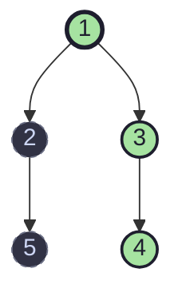

# Binary Tree Right Side View

## Problem

Given the `root` of a binary tree, imagine yourself standing on the **right side** of it. Return the values of the nodes you can see, ordered from top to bottom.

```
Example:

        1
       / \
      2   3
       \    \
        5    4

Right side view: [1, 3, 4]
```

## The Core Idea

If you stand to the right of a tree and look at it, what do you actually see? For every **horizontal layer** (every depth/level) of the tree, you see exactly one node: **the rightmost node at that level**. Everything behind it, at the same depth, is hidden.

So the problem reduces to:

> For each level of the tree, find the last (rightmost) node — and collect those values top to bottom.

This is naturally solved with a **level-order traversal (BFS)**, because BFS processes the tree one full level at a time.

## Why BFS Fits This Problem

A **Breadth-First Search** using a queue visits nodes level by level, left to right, because we always add the left child before the right child. That means:

- The queue holds exactly the nodes of the *current* level before we move to the next.
- If we know how many nodes are in the current level (`size = queue.size()`), we can process exactly that many nodes, and whichever one we process **last** is the rightmost node of that level.

That's the entire trick: track the size of each level, iterate through it, and remember the last node dequeued.

## Walking Through the Code

```java
class Solution {
    public List<Integer> rightSideView(TreeNode root) {
        List<Integer> lst = new ArrayList<>();
        LinkedList<TreeNode> queue = new LinkedList<>();

        if (root == null) return lst;

        queue.add(root);
        while (!queue.isEmpty()) {
            int size = queue.size();
            TreeNode rightView = null;
            for (int i = 0; i < size; i++) {
                rightView = queue.pop();
                if (rightView.left != null) queue.add(rightView.left);
                if (rightView.right != null) queue.add(rightView.right);
            }
            lst.add(rightView.val);
        }
        return lst;
    }
}
```

### Step-by-step breakdown

1. **Edge case guard**
   ```java
   if (root == null) return lst;
   ```
   An empty tree has no view at all, so we return an empty list immediately.

2. **Seed the queue with the root**
   ```java
   queue.add(root);
   ```
   The root is level 0, and it starts the BFS.

3. **Loop once per level**
   ```java
   while (!queue.isEmpty()) {
       int size = queue.size();
   ```
   At the start of every `while` iteration, the queue contains **only** the nodes belonging to the current level — never a mix of two levels. Capturing `size` before the inner loop is essential, because we are about to `add()` next-level nodes into the same queue, which would otherwise corrupt the count.

4. **Process exactly `size` nodes (i.e., the whole current level)**
   ```java
   TreeNode rightView = null;
   for (int i = 0; i < size; i++) {
       rightView = queue.pop();
       if (rightView.left != null) queue.add(rightView.left);
       if (rightView.right != null) queue.add(rightView.right);
   }
   ```
   - `queue.pop()` removes nodes from the **front** (oldest first — this is FIFO order, since `LinkedList` used as a queue via `add`/`pop` behaves like `offer`/`poll`).
   - Because nodes were enqueued left-child-then-right-child, dequeuing happens in strict left-to-right order across the level.
   - `rightView` gets overwritten on every iteration, so after the loop finishes, it's holding the **last node visited in this level** — the rightmost one.
   - While popping each node, its children (the *next* level) get pushed onto the back of the queue, ready for the next `while` iteration.

5. **Record the rightmost node of this level**
   ```java
   lst.add(rightView.val);
   ```

6. **Repeat until the queue is empty** — i.e., until every level has been processed.

## Trace Table Example

Tree:
```
        1
       / \
      2   3
       \    \
        5    4
```

| Level | Queue at start of iteration | `size` | Nodes popped (in order) | `rightView` after loop | Added to `lst` |
|-------|------------------------------|--------|--------------------------|--------------------------|-----------------|
| 0     | `[1]`                        | 1      | `1`                      | `1`                      | `1`             |
| 1     | `[2, 3]`                     | 2      | `2`, `3`                 | `3`                      | `3`             |
| 2     | `[5, 4]`                     | 2      | `5`, `4`                 | `4`                      | `4`             |

Final result: `[1, 3, 4]` ✅ — matches the expected output.

Notice how `5` and `4` are both at depth 2, but only `4` (the last one popped, i.e. the rightmost) makes it into the answer. `5` was "hidden" behind `4` from the right-side viewer's perspective.

## Visualizing the Traversal



*Green nodes = visible from the right (what ends up in the answer). Dashed grey nodes = hidden behind them at the same level.*

## Complexity Analysis

**Time Complexity: O(n)**
Every node in the tree is enqueued exactly once and dequeued exactly once, where `n` is the total number of nodes. The children-check and `lst.add` calls are O(1), so total work is linear in the number of nodes.

**Space Complexity: O(w)**, where `w` is the maximum width of the tree (the largest number of nodes at any single level).
- In the worst case (a complete/perfect binary tree), the widest level can hold up to `~n/2` nodes, making space complexity O(n) in that scenario.
- The output list `lst` additionally uses O(h) space, where `h` is the height of the tree (one entry per level).
