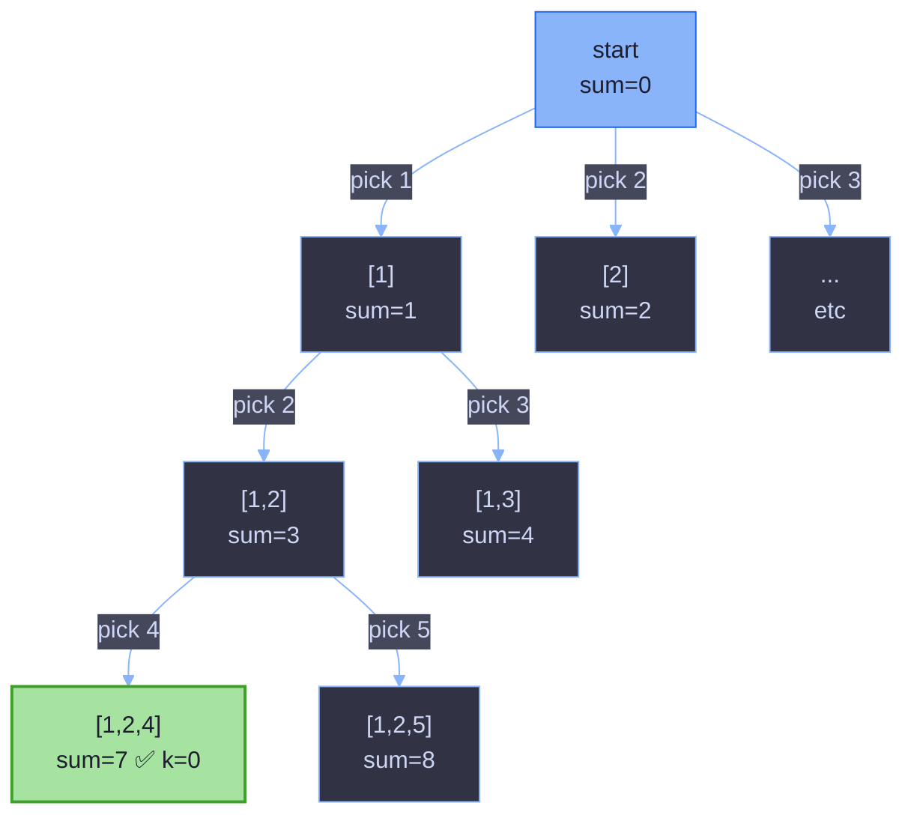

# Combination Sum III — Backtracking Explained

## 1. Problem Statement

Find all valid combinations of **`k`** numbers that sum up to **`n`** such that:

- Only numbers **1 through 9** are used.
- Each number is used **at most once** in a combination.
- The combination is returned as a **list of unique combinations** (no duplicates, order within a combination doesn't matter, but by convention we output them in increasing order).

**Example**

```
Input:  k = 3, n = 7
Output: [[1,2,4]]

Input:  k = 3, n = 9
Output: [[1,2,6],[1,3,5],[2,3,4]]

Input:  k = 4, n = 1
Output: []
```

---

## 2. The Core Idea

This is a classic **backtracking (DFS with undo)** problem. Think of it as building a combination **one digit at a time**, and at every step you have two choices:

1. **Include** the current digit in your combination and move on.
2. **Skip** it and try the next digit.

You explore *include* first, go as deep as possible, and when you hit a dead end (or a solution), you **backtrack** — undo the last choice — and try the next possibility. This systematically explores every valid combination without ever repeating one, because digits are only ever considered in increasing order.

Visually, the search forms a tree:



Every root-to-node path is a partial combination. Green = a valid answer (`k` numbers used, sum equals `n`).

---

## 3. Walking Through the Code

```java
class Solution {

    List<Integer> stack = new ArrayList<>();      // the combination being built
    List<List<Integer>> res = new ArrayList<>();  // all valid combinations found

    public List<List<Integer>> combinationSum3(int k, int n) {
        dfs(1, k, n, 0);
        return res;
    }

    void dfs(int i, int k, int n, int sum) {
        if (k == 0) {                    // used k numbers already
            if (sum == n) {               // and they add up to n → valid!
                res.add(new ArrayList<>(stack));
            }
            return;                       // either way, stop going deeper
        }

        for (int ii = i; ii < 10; ii++) { // try every remaining digit 1..9
            stack.add(ii);                 // CHOOSE
            dfs(ii + 1, k - 1, n, ii + sum); // EXPLORE
            stack.remove(stack.size() - 1); // UN-CHOOSE (backtrack)
        }
    }
}
```

### 3.1 What each variable means

| Variable | Meaning |
|---|---|
| `stack` | The combination currently being built, e.g. `[1, 2]`. Shared across all recursive calls — it's a single list that grows and shrinks as we recurse. |
| `res` | The final answer: a list of all complete, valid combinations. |
| `i` | The smallest digit allowed to be picked *next*. This is what prevents duplicates like `[1,2]` and `[2,1]` from both appearing — we never look "backwards". |
| `k` | How many **more** numbers we still need to pick. It counts *down* to 0. |
| `n` | The **target sum** — this never changes throughout the recursion (it's just carried along). |
| `sum` | The running total of numbers already placed in `stack`. |

### 3.2 The base case

```java
if (k == 0) {
    if (sum == n) {
        res.add(new ArrayList<>(stack));
    }
    return;
}
```

`k == 0` means we've already chosen exactly `k` numbers (the required count). At that point there are only two possibilities:
- Their sum happens to equal `n` → this is a genuine answer, so we save a **copy** of `stack`.
- Their sum does not equal `n` → this path is a dead end, discard it silently.

Either way, we `return` immediately — there's no reason to keep picking more numbers once we already have `k` of them.

> **Why `new ArrayList<>(stack)` and not just `stack`?**
> `stack` is one mutable object that keeps getting modified (`add`/`remove`) as the recursion continues. If we stored a reference to `stack` itself, every entry in `res` would actually point to the *same* list, and later backtracking would silently corrupt every "saved" answer. Copying freezes a snapshot of its current contents.

### 3.3 The recursive case — choose / explore / un-choose

```java
for (int ii = i; ii < 10; ii++) {
    stack.add(ii);                      // 1. CHOOSE
    dfs(ii + 1, k - 1, n, ii + sum);    // 2. EXPLORE
    stack.remove(stack.size() - 1);     // 3. UN-CHOOSE
}
```

This loop tries every digit from `i` up to `9` as the *next* number to add. For each candidate `ii`:

1. **Choose** — tentatively add `ii` to the combination.
2. **Explore** — recurse, but now:
   - the next call may only pick digits `≥ ii + 1` (never reuse `ii`, never go backwards),
   - `k - 1` fewer numbers are still needed,
   - `sum` is updated to `ii + sum`.
3. **Un-choose (backtrack)** — remove `ii` from `stack` so that the *next* iteration of the loop (trying `ii + 1`, `ii + 2`, …) starts from a clean combination, as if `ii` had never been picked.

This "add → recurse → remove" pattern is the heartbeat of every backtracking algorithm. It lets you reuse a single `stack` object to represent every path in the tree, rather than allocating a new list at every recursive call.

---

## 4. Why It Works

Three properties of the code guarantee correctness:

1. **No duplicate combinations.** Because the loop always starts at `i` (the digit *after* whatever was just picked) and passes `ii + 1` downward, digits are only ever chosen in strictly increasing order. `[1,2,4]` can be built, but `[2,1,4]` or `[4,2,1]` never can — they're the same combination anyway, so this correctly avoids counting it twice.

2. **Exhaustiveness.** The `for` loop at every recursion level tries *every* remaining valid digit (`i` through `9`), not just one. Combined with recursion going arbitrarily deep until `k == 0`, every possible increasing sequence of `k` digits from `1..9` is eventually visited exactly once.

3. **Correct restoration via backtracking.** The `stack.remove(...)` after each recursive call guarantees that trying digit `ii+1` in the loop sees the combination exactly as it was *before* `ii` was tried — no leftover state leaks between sibling branches. This is what makes it safe to reuse one `stack` object instead of copying lists everywhere.

### 4.1 Implicit pruning (why it's efficient despite no explicit "pruning" code)

Even without extra `if` checks, the search is naturally bounded:

- The loop `ii < 10` caps digits at 9 — the search space is at most digits `1..9`, so recursion depth is at most 9.
- Once `k` numbers have been chosen (`k == 0`), we stop immediately — we never explore combinations longer than `k`.
- Once `i` exceeds `9`, the `for` loop simply doesn't execute, ending that branch.

You could add explicit pruning for extra speed (e.g., stop early if `sum > n`, or if the remaining digits can't possibly reach `n`), but because the digit range is fixed at `1..9`, the search space is already tiny (at most 2⁹ = 512 subsets), so it's fast without it.

---

## 5. Step-by-Step Trace

Let's trace `k = 3, n = 7` completely.

| Call | `i` | `k` | `sum` | `stack` before loop | Action |
|---|---|---|---|---|---|
| dfs(1,3,7,0) | 1 | 3 | 0 | `[]` | loop `ii=1..9` |
| → pick 1 | | | | `[1]` | dfs(2,2,7,1) |
| → → pick 2 | | | | `[1,2]` | dfs(3,1,7,3) |
| → → → pick 3 | | | | `[1,2,3]` | dfs(4,0,7,6) → `k==0`, sum=6≠7 → discard |
| → → → pick 4 | | | | `[1,2,4]` | dfs(5,0,7,7) → `k==0`, sum=7=7 → **save `[1,2,4]`** ✅ |
| → → → pick 5 | | | | `[1,2,5]` | sum would reach 8+ eventually → no valid completion |
| → → → …9 | | | | | none complete with sum=7 |
| → → pick 3 | | | | `[1,3]` | dfs(4,1,7,4) → tries 4..9, none sum to 7 with one more digit (4+4=8 already too big... etc.) → no answer |
| → → pick 4..8 | | | | | similarly explored, none complete |
| → pick 2 | | | | `[2]` | dfs(3,2,7,2) → best remaining pairs summing to 5 using digits ≥3: 3+... none work (smallest pair 3+4=7≠5) → no answer |
| → pick 3..7 | | | | | remaining combinations can't reach exactly 7 with 3 increasing digits ≥3 |

**Result:** `res = [[1,2,4]]`, matching the expected output.

---

## 6. Complexity Analysis

### Time Complexity

- Digits are drawn only from `1..9`, so the total search space is bounded by choosing any subset of these 9 digits: **C(9, k)** combinations are actually completed, but the DFS also visits partial (failed) paths.
- In the worst case the algorithm explores on the order of **O(C(9,k) × k)** work — `C(9,k)` combinations, each costing `O(k)` to copy into `res`, plus a bounded amount of wasted exploration on dead-end branches (still bounded by the same constant since the digit range never exceeds 9).
- Because the digit range is fixed and small, this is effectively **O(1)-ish in practice** (constant relative to input size), though formally it's expressed relative to `k` and the fixed range `[1,9]`.

### Space Complexity

- **O(k)** for the recursion call stack (depth is at most `k`, bounded further by 9).
- **O(k)** for the `stack` list holding the current combination.
- Output storage for `res` is **not** counted against auxiliary space in most conventions, since it's part of the required output.
