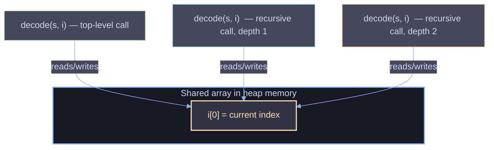
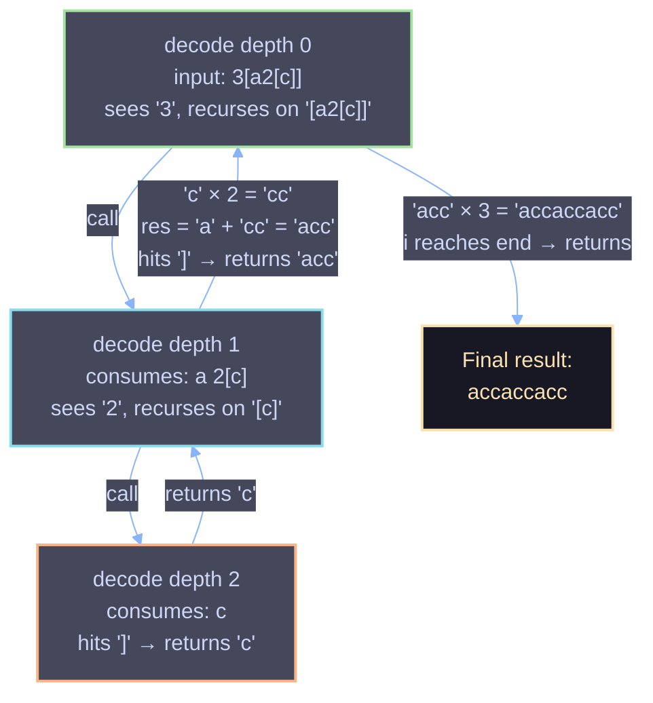

# Decode String — Recursive Solution

## Problem Statement

Given an encoded string, return its decoded string.

The encoding rule is:

```
k[encoded_string]
```

The `encoded_string` inside the square brackets is repeated exactly `k` times. Note that `k` is guaranteed to be a positive integer.

You may assume that the input string is always valid — no extra white spaces, square brackets are well-formed, etc. Furthermore, you may assume that the original data does not contain any digits and that digits are only for those repeat numbers, `k`. For example, there will not be input like `3a` or `2[4]`.

**Example 1**
```
Input:  s = "3[a]2[bc]"
Output: "aaabcbc"
```

**Example 2**
```
Input:  s = "3[a2[c]]"
Output: "accaccacc"
```

**Example 3**
```
Input:  s = "2[abc]3[cd]ef"
Output: "abcabccdcdcdef"
```

---

## The Code

```java
class Solution {
    public String decodeString(String s) {
        return decode(s, new int[]{0});
    }

    public String decode(String s, int i[]) {
        StringBuilder res = new StringBuilder();
        while (i[0] < s.length() && s.charAt(i[0]) != ']') {
            if (Character.isDigit(s.charAt(i[0]))) {
                int count = 0;
                while (Character.isDigit(s.charAt(i[0]))) {
                    count = count * 10 + (s.charAt(i[0]) - '0');
                    i[0]++;
                }
                i[0]++;                      // skip '['
                String chunk = decode(s, i);  // recurse into the bracket
                i[0]++;                      // skip ']'
                for (int j = 0; j < count; j++) res.append(chunk);
            } else {
                res.append(s.charAt(i[0]));
                i[0]++;
            }
        }
        return res.toString();
    }
}
```

---

## Core Idea

Square brackets are a **nested, recursive structure** — a `[...]` block can contain another `k[...]` block inside it, which can contain another, and so on. Any time you see "nested structure with matching open/close delimiters," that's a strong signal to reach for either:

1. **Recursion** (let the call stack track the nesting), or
2. **An explicit stack** (simulate the call stack yourself with a `Stack<>`).

This solution takes the recursive route. Every time the parser encounters `k[`, it doesn't try to figure out where the *matching* `]` is with index arithmetic — instead it just calls itself, and lets that recursive call consume characters until *it* hits a `]`. When that inner call returns, the outer call knows the whole bracketed chunk has been consumed, because the shared position pointer has already moved past it.

This mirrors exactly how you'd read the string out loud: "3 of [ a and 2 of [ c ] ]" — you naturally pause at each `[`, mentally solve what's inside, then come back out and multiply.

---

## Why a Shared Mutable Index (`int[] i`) Instead of a Normal `int`?

This is the trickiest design choice in the code, and it's worth understanding deeply.

In Java, primitives (`int`, `char`, etc.) are passed **by value**. If `decode` took a plain `int i` parameter, every recursive call would get its **own private copy** of `i`. When a recursive call finished consuming characters and returned, the caller's copy of `i` would be completely unaffected — the caller wouldn't know how far the recursive call had advanced through the string, and it would have no way to resume parsing from the right place.

Wrapping the index in a **single-element array** (`int[] i`) sidesteps this. Arrays are objects, and object references *are* passed by value too — but that value is a reference to the *same underlying array* in memory. So every recursive call, no matter how deep, is reading and writing `i[0]` on the exact same array. It behaves like a pointer or a reference parameter (the kind you'd get "for free" in C++ with `int&` or in Python by using a mutable container).

Think of it as a **shared bookmark** that every recursive call — parent, child, grandchild — reads from and advances together. There is only ever one bookmark for the whole parse, no matter how deep the nesting goes.



If you tried this with a plain `int` instead of `int[]`, the code would infinite-loop or produce garbage output, because the outer call would keep re-reading from wherever *it* left off, oblivious to how far the inner call actually advanced.

---

## Step-by-Step Walkthrough of `decode`

Each call to `decode` is responsible for consuming characters **until it hits either the end of the string or a `]`**, and building up the decoded text for that segment. The loop body handles two cases per character:

### Case 1 — Digit encountered → a repeat block is starting

```java
if (Character.isDigit(s.charAt(i[0]))) {
    int count = 0;
    while (Character.isDigit(s.charAt(i[0]))) {
        count = count * 10 + (s.charAt(i[0]) - '0');
        i[0]++;
    }
    i[0]++;                       // skip '['
    String chunk = decode(s, i);  // recurse
    i[0]++;                       // skip ']'
    for (int j = 0; j < count; j++) res.append(chunk);
}
```

1. **Parse the full multi-digit number.** The inner `while` loop keeps consuming digits so that `12[...]` is read as `count = 12`, not misread as `1` followed by `2`. This is why `count = count * 10 + digit` is used instead of a single digit read.
2. **Skip the `[`.** After the digits, the pointer is guaranteed to be sitting on `[` (the input is well-formed), so `i[0]++` just steps past it.
3. **Recurse.** The call `decode(s, i)` dives in to decode *everything inside these brackets*, including any nested `k[...]` blocks. Because `i` is shared, this recursive call will stop the instant it hits the matching `]` for *this* bracket pair — it can't accidentally run past it, because any nested brackets it encounters are fully consumed by their own recursive sub-calls first.
4. **Skip the `]`.** When the recursive call returns, `i[0]` is sitting exactly on the `]` that closed this bracket group (that's the loop's exit condition). So `i[0]++` steps past it.
5. **Repeat and append.** `chunk` is now the fully decoded inner string (e.g. `"ac"`), and it gets appended `count` times to `res`.

### Case 2 — Regular letter encountered

```java
} else {
    res.append(s.charAt(i[0]));
    i[0]++;
}
```

Plain letters are just copied straight into the result, and the pointer advances by one.

### Loop termination

```java
while (i[0] < s.length() && s.charAt(i[0]) != ']')
```

The loop stops when either:
- The end of the string is reached (this only happens for the **outermost** call — the top-level string can't be inside brackets), or
- A `]` is encountered — this is what tells a **recursive** call "I'm done, this bracket group is fully decoded; hand control back to my caller."

This dual exit condition is what lets a single method double as both the "parse the whole string" driver and the "parse one bracketed group" worker.

---

## Full Trace: `s = "3[a2[c]]"`

| `i[0]` | Char | Depth | Action | `res` at this depth |
|---|---|---|---|---|
| 0 | `3` | 0 | digit → parse `count = 3`, advance to `1` | — |
| 1 | `[` | 0 | skip, **recurse into depth 1** | — |
| 2 | `a` | 1 | letter → append | `"a"` |
| 3 | `2` | 1 | digit → parse `count = 2`, advance to `4` | `"a"` |
| 4 | `[` | 1 | skip, **recurse into depth 2** | — |
| 5 | `c` | 2 | letter → append | `"c"` |
| 6 | `]` | 2 | **stop condition hit** → return `"c"` to depth 1 | returns `"c"` |
| 6 | `]` | 1 | (back in depth 1) skip the `]` just consumed, append `"c"` × 2 | `"a" + "cc"` = `"acc"` |
| 7 | `]` | 1 | **stop condition hit** → return `"acc"` to depth 0 | returns `"acc"` |
| 7 | `]` | 0 | (back in depth 0) skip the `]`, append `"acc"` × 3 | `"acc"+"acc"+"acc"` = `"accaccacc"` |
| 8 | — | 0 | `i[0] == s.length()` → loop ends | returns `"accaccacc"` |

**Final output:** `"accaccacc"` ✅

Notice the elegant symmetry: **every `[` that triggers a recursive call is paired with exactly one `]` that terminates it.** That pairing is guaranteed by the problem constraints (well-formed input), and it's precisely why the recursion never gets confused about which `]` belongs to which `[` — it doesn't need to track that explicitly at all. The call stack does it implicitly.



---

## Why This Approach Works (The Underlying Invariant)

The correctness of this algorithm rests on one invariant, maintained at every recursive call:

> **When `decode` is called, `i[0]` points to the first character of a segment that should be decoded until either the string ends or an unmatched `]` is found — and by the time it returns, `i[0]` points exactly one past the last character it consumed.**

Because every recursive call fully consumes its own bracket group (digits → `[` → recursive chunk → `]`) before returning, the caller's loop can safely continue from wherever the pointer ended up, with zero risk of double-processing or skipping characters. It's the same principle behind recursive-descent parsers for arithmetic expressions or JSON: **each function call is responsible for exactly one self-contained "unit" of the grammar, and trusts recursion to handle any unit nested inside it.**

---

## Complexity Analysis

**Let `n` = length of the input string, and let `maxK` = the maximum repeat count encountered in the string.**

### Time Complexity: `O(n · maxK)` in the worst case (commonly approximated as `O(n)` for typical inputs)

- Every character in `s` is visited exactly once by the `while` loop across all recursive calls combined — the shared index `i[0]` only ever moves forward, never backward, and never revisits a position. So the *parsing* work alone is `O(n)`.
- However, **building `res`** involves appending `chunk` up to `count` times per bracket group. In pathological cases like `"100000[a]"`, a huge amount of output is produced from a short input, so the total work is bounded by the length of the *decoded output*, not just the input. This is why it's more precise to describe the complexity in terms of output size, or as `O(n · maxK)` when `maxK` is large relative to `n`.

### Space Complexity: `O(n)` in the worst case

Two contributors:
1. **Recursion depth** — in the worst case (e.g. `"2[2[2[2[...a...]]]]"`), brackets are nested as deeply as possible, and the call stack can grow to `O(n)` frames.
2. **`StringBuilder` / `String` storage** — each recursive call builds its own intermediate `res` / `chunk` string, and these get copied into their parent's buffer via `append`. The total size of all these buffers is bounded by the size of the final decoded string.

---

## Edge Cases This Handles Correctly

| Case | Example | Why it works |
|---|---|---|
| No brackets at all | `"abc"` | The `while` loop never sees a digit; every char falls into the `else` branch and is appended directly. |
| Multi-digit repeat counts | `"12[a]"` | The inner digit-parsing `while` loop (`count = count*10 + digit`) accumulates all consecutive digits before treating `count` as final. |
| Nested brackets | `"3[a2[c]]"` | Each `[` triggers a fresh recursive call, so nesting of any depth is handled automatically by the call stack. |
| Multiple sibling groups | `"2[abc]3[cd]ef"` | After a recursive call returns and its `]` is skipped, the *same* `while` loop simply continues — it doesn't return early, so it naturally picks up the next digit or letter that follows. |
| Trailing plain text after brackets | `"3[a]bc"` | Same mechanism as above — the loop keeps consuming characters after a bracket group closes, appending letters normally until the string ends. |
| Text before, after, and between multiple bracket groups | `"xy3[a]z2[bc]w"` | Every character not preceded by a digit falls through to the plain-append branch, regardless of where it sits relative to bracket groups. |

---

## Recursion vs. Stack-Based Alternative (For Context)

This problem is a classic candidate for either approach, and it's worth knowing both exist:

- **Recursive (this solution):** simplest to write and read; relies on the JVM's call stack to implicitly track nesting. Risk: very deep nesting could theoretically cause a `StackOverflowError`, though this isn't a practical concern for typical constraint sizes (`s.length() <= 30` on LeetCode).
- **Explicit stack (`Stack<Integer>` for counts + `Stack<StringBuilder>` for partial strings):** iterative, avoids recursion entirely, and is the go-to if recursion depth is a real concern. It manually pushes a new "frame" onto a stack every time a `[` is seen, and pops it (multiplying and merging into the string below) every time a `]` is seen — functionally simulating exactly what the recursive call stack does automatically here.

Both are `O(n)`-ish in time and conceptually equivalent; the recursive version is simply letting the language's own call stack do the bookkeeping that the iterative version would do by hand.

---

## Summary

- The problem is fundamentally about **matched, nestable delimiters** — a strong signal for recursion.
- The trick that makes single-method recursion work cleanly in Java is the **shared mutable index** (`int[] i`), which lets every recursive call advance and observe the *same* parsing position, unlike a plain `int` which would be copied per call.
- Each call to `decode` handles exactly one self-contained segment: digits → recurse into `[...]` → multiply → repeat, or plain letters → append — and it always leaves the shared pointer in the correct place for its caller to resume from.
- The recursive call stack implicitly tracks bracket nesting, so there's no need for manual bracket-matching logic.