# Delete Node in a BST — Iterative Splice Approach
---

## 1. Problem Recap

Given the root of a Binary Search Tree (BST) and a `key`, delete the node
with that value from the tree and return the (possibly new) root. The
resulting tree must still satisfy the BST property:

> For every node `N`: everything in `N.left`'s subtree is `< N.val`,
> and everything in `N.right`'s subtree is `> N.val`.

There are three shapes the node-to-delete can take, and each needs different
handling:

```mermaid
%%{init: {'theme':'base', 'themeVariables': {
  'background':'#1e1e2e','primaryColor':'#313244','primaryTextColor':'#cdd6f4',
  'primaryBorderColor':'#cba6f7','lineColor':'#89b4fa','secondaryColor':'#45475a',
  'tertiaryColor':'#1e1e2e','fontFamily':'monospace'
}}}%%
flowchart TB
    subgraph L["Case 1 — Leaf node"]
        direction TB
        A1((8)) --> A2((3))
        A1 --> A3((10))
        A2 -.deleted.-> A4((( )))
        style A4 fill:#1e1e2e,stroke:#f38ba8,stroke-dasharray: 4 2
    end
    subgraph M["Case 2 — One child"]
        direction TB
        B1((8)) --> B2((3))
        B1 --> B3((10))
        B3 --> B4((12))
        style B3 fill:#45475a,stroke:#f38ba8,stroke-width:3px
    end
    subgraph R["Case 3 — Two children"]
        direction TB
        C1((8)) --> C2((3))
        C1 --> C3((10))
        C3 --> C4((9))
        C3 --> C5((14))
        style C3 fill:#45475a,stroke:#f38ba8,stroke-width:3px
    end
```



The classic **recursive** textbook solution handles Case 3 by finding the
*in-order successor* (smallest node in the right subtree), copying its value
into the deleted node, then recursively deleting the successor from the
right subtree. That's elegant but it **mutates node values** (not just
pointers) and uses **recursion / extra stack frames**.

The solution in this repo does something different and rather clever: it
solves the two-children case with **pure pointer surgery**, no value
copying, and **no recursion** — everything happens in one `while` loop.

---

## 2. The Core Idea: "Splice, Don't Swap"

When you delete a node `X` that has **both** a left and a right child, you
need to merge its two subtrees into one and hand that merged subtree back
to `X`'s parent. The standard trick (successor copy) rebalances things by
promoting a value. This solution instead **physically relocates the right
subtree** to become the rightmost branch of the left subtree:

```mermaid
%%{init: {'theme':'base', 'themeVariables': {
  'background':'#1e1e2e','primaryColor':'#313244','primaryTextColor':'#cdd6f4',
  'primaryBorderColor':'#cba6f7','lineColor':'#89b4fa','secondaryColor':'#45475a',
  'tertiaryColor':'#1e1e2e','fontFamily':'monospace'
}}}%%
flowchart LR
    subgraph Before["Before deleting X"]
        direction TB
        P1[Parent] --> X((X))
        X --> XL[Left subtree of X]
        X --> XR[Right subtree of X]
        style X fill:#45475a,stroke:#f38ba8,stroke-width:3px
    end
    subgraph After["After deleting X"]
        direction TB
        P2[Parent] --> XL2[Left subtree]
        XL2 -.-> Rightmost((rightmost<br/>node in<br/>XL2))
        Rightmost --> XR2[Right subtree of X<br/>attached here]
        style Rightmost fill:#313244,stroke:#a6e3a1,stroke-width:2px
        style XR2 fill:#1e1e2e,stroke:#89b4fa
    end
    Before -.splice.-> After
```



**Why is this legal for a BST?**

*Every value in `X`'s left subtree is `< X.val`.*
*Every value in `X`'s right subtree is `> X.val`.*
Therefore **every value in the left subtree is smaller than every value in
the right subtree**. That means the entire right subtree can be legally
grafted on as the **right child of the rightmost (maximum) node** of the
left subtree — the rightmost node has no right child yet (by definition of
"rightmost"), and everything below it in the new position is still larger
than it and smaller than everything above, so the BST property holds
everywhere. No value ever moves; only pointers change.

`Parent` then simply points at `X`'s old left subtree instead of at `X`.
`X` itself is discarded (garbage collected).

This same `insertRight` splice trivially also handles **Case 2 (one
child)**: if `X` has no left child, its right subtree just becomes
`Parent`'s new child directly (the "rightmost node of an empty left
subtree" is nothing, so we skip straight to attaching). If `X` has no right
child, there's nothing to splice at all — the left subtree simply takes
`X`'s place. **Case 1 (leaf)** is the degenerate case of both: `X` is
simply replaced by `null`.

So one mechanism — *"promote left child, then hang the right subtree off
its rightmost edge"* — uniformly solves all three cases.

---

## 3. Line-by-Line Walkthrough

```java
class Solution {
    public TreeNode deleteNode(TreeNode root, int key) {
        TreeNode prev = null, head = root;
```
- `head` will always point at the tree's actual root, even after we finish
  — this is what we `return` at the end. It starts as `root`, but if the
  root itself turns out to be the node we delete, `head` gets updated.
- `prev` tracks the parent of the current `root` pointer as we walk down —
  we need it so that once we find the key, we know which side of which
  node to re-link.

```java
        while (root != null) {
            if (root.val == key) {
```
- Standard BST search: walk down, going left or right depending on how
  `key` compares to the current node, until either we fall off the tree
  (`root == null`, key doesn't exist — nothing to delete) or we land on
  the node holding `key`.

```java
                if (prev == null) {
                    head = root.left;
                    TreeNode rightSub = root.right;
                    root = head;
                    if (root != null) insertRight(root, rightSub);
                    else head = rightSub;
                }
```
- **`prev == null` means the node to delete *is* the root itself** — there
  is no parent to re-link, so we must update `head` (the eventual return
  value) directly.
- `head = root.left` — tentatively, the new root is the left child of the
  deleted node.
- `rightSub` stashes the deleted node's right subtree before we lose the
  reference to it.
- `root = head` — just a local rename so the `insertRight` call below reads
  naturally ("insert `rightSub` into `root`'s rightmost slot").
- If that left child exists (`root != null`), call `insertRight` to graft
  `rightSub` onto its rightmost edge (Case 3, two children).
- If it **doesn't** exist (`root == null`, i.e. the deleted root had no
  left child — Case 2 or Case 1), then the right subtree (which may itself
  be `null` for a leaf) simply *becomes* the new head directly.

```java
                else {
                    if (root.val > prev.val) { // update prev.right
                        prev.right = root.left;
                        TreeNode rightSub = root.right;
                        root = root.left;
                        if (root != null) insertRight(root, rightSub);
                        else prev.right = rightSub;
                    } else { // update prev.left
                        prev.left = root.left;
                        TreeNode rightSub = root.right;
                        root = root.left;
                        if (root != null) insertRight(root, rightSub);
                        else prev.left = rightSub;
                    }
                }
                break;
```
- **`prev != null`** means the node to delete has a real parent, so we
  must decide *which* of `prev`'s two child pointers (`.left` or
  `.right`) was pointing at the deleted node — that's what
  `root.val > prev.val` tests: if the deleted node's value is greater than
  its parent's, it must have been reached via `prev.right`, otherwise via
  `prev.left`.
- Whichever branch is taken, the logic is a mirror image of the
  `prev == null` case above, just re-linking `prev.right` (or
  `prev.left`) instead of `head`:
  1. Tentatively point the parent's link at the deleted node's left child.
  2. Stash the deleted node's right subtree.
  3. If that left child exists, splice the right subtree onto its
     rightmost edge.
  4. If it doesn't exist, the parent's link should instead point straight
     at the (possibly `null`) right subtree.
- `break` — the key has been found and deleted, so the search loop is
  done. `head` (updated or not) is now the correct tree root.

```java
            }
            else if (root.val > key) {
                prev = root;
                root = root.left;
            } else {
                prev = root;
                root = root.right;
            }
        }
        return head;
    }
```
- If the current node isn't the target, this is ordinary BST navigation:
  save it as `prev`, then step `root` left or right depending on whether
  `key` is smaller or larger.
- If the loop exits naturally (`root` becomes `null` without ever matching
  `key`), the key simply wasn't in the tree — `head` is unchanged, and we
  return the original tree untouched.
- Finally, `return head` — the (possibly new) root of the tree.

```java
    public void insertRight(TreeNode root, TreeNode rightSub) {
        if (root == null) return;
        if (root.right == null) {
            root.right = rightSub;
            return;
        }
        insertRight(root.right, rightSub);
    }
```
- This is the "splice" helper described in §2: starting at `root` (which
  is the promoted left subtree), walk right, right, right... until you hit
  a node with no right child — that node is the **maximum value** in the
  subtree — and attach `rightSub` there.
- The base case `root == null` is just a defensive guard (in practice
  `insertRight` is only ever called with a non-null `root` from
  `deleteNode`).
- Note: this helper is written recursively, but since it only ever
  recurses along the right spine and does no other work, it's equivalent
  to a simple `while` loop — the overall algorithm is still "iterative" in
  spirit (a single unbounded-recursion-free descent), unlike the classic
  successor-copy solution which recurses through the *whole deletion
  process*.

---

## 4. Full Worked Example

Starting tree (deleting `key = 8`, a two-children case):

```mermaid
%%{init: {'theme':'base', 'themeVariables': {
  'background':'#1e1e2e','primaryColor':'#313244','primaryTextColor':'#cdd6f4',
  'primaryBorderColor':'#cba6f7','lineColor':'#89b4fa','secondaryColor':'#45475a',
  'tertiaryColor':'#1e1e2e','fontFamily':'monospace'
}}}%%
graph TD
    N8((8)) --> N3((3))
    N8 --> N12((12))
    N3 --> N1((1))
    N3 --> N6((6))
    N6 --> N4((4))
    N6 --> N7((7))
    N12 --> N10((10))
    N12 --> N14((14))
    style N8 fill:#45475a,stroke:#f38ba8,stroke-width:3px
```



### Trace of `deleteNode(root=8, key=8)`

| Step | `root` | `prev` | Action |
|---|---|---|---|
| 1 | `8` | `null` | `root.val == key` and `prev == null` → root **is** the target |
| 2 | — | — | `head = root.left` → `head = 3` |
| 3 | — | — | `rightSub = root.right` → `rightSub = 12` (with its whole subtree) |
| 4 | — | — | `root = head` → `root = 3` |
| 5 | — | — | `root != null`, so call `insertRight(3, 12subtree)` |
| 6 | — | — | inside `insertRight`: `3.right = 6` (not null) → recurse into `6` |
| 7 | — | — | inside `insertRight`: `6.right = 7` (not null) → recurse into `7` |
| 8 | — | — | inside `insertRight`: `7.right == null` → **attach**: `7.right = 12subtree` |
| 9 | — | — | `break` out of the main loop |
| 10 | — | — | `return head` → returns node `3` |

Resulting tree:

```mermaid
%%{init: {'theme':'base', 'themeVariables': {
  'background':'#1e1e2e','primaryColor':'#313244','primaryTextColor':'#cdd6f4',
  'primaryBorderColor':'#cba6f7','lineColor':'#89b4fa','secondaryColor':'#45475a',
  'tertiaryColor':'#1e1e2e','fontFamily':'monospace'
}}}%%
graph TD
    N3((3)) --> N1((1))
    N3 --> N6((6))
    N6 --> N4((4))
    N6 --> N7((7))
    N7 --> N12((12))
    N12 --> N10((10))
    N12 --> N14((14))
    style N3 fill:#a6e3a1,stroke:#1e1e2e,color:#1e1e2e,stroke-width:3px
    style N7 fill:#313244,stroke:#f9e2af,stroke-width:2px
```



Notice `7` (the maximum of the old left subtree, i.e. the **in-order
predecessor** of `8`) now points to `12` on its right. The BST property
still holds everywhere: `12 > 7`, `10 > 7` and `10 < 12`, `14 > 12` — every
value from the old right subtree is still greater than everything to its
left, because it was greater than `8`, which was itself greater than
everything in the old left subtree.

---

## 5. Complexity Analysis

| | Complexity | Why |
|---|---|---|
| **Time** | `O(H)` where `H` = height of the tree | The `while` loop descends at most `H` steps to *find* the key. `insertRight` then descends at most `H` steps down the right spine of the promoted left subtree to find where to splice. Both phases are bounded by tree height, so the total is still `O(H)`. |
| — worst case | `O(N)` | For a completely unbalanced (skewed) tree, `H = N`. |
| — average/balanced case | `O(log N)` | For a balanced BST, `H = log N`. |
| **Space** | `O(1)` iterative part, `O(H)` for `insertRight`'s call stack | The search/relinking loop itself uses only a fixed handful of pointers (`prev`, `head`, `root`, `rightSub`) — genuinely `O(1)`. However, `insertRight` is implemented recursively, so it consumes `O(H)` stack frames while walking the right spine. *(If `insertRight` were rewritten as a `while` loop instead, the whole algorithm would be `O(1)` extra space.)* |

Compare this to the classic recursive successor-copy solution, which is
`O(H)` time but also `O(H)` **call stack space for the entire deletion**,
not just for one spine walk — so this iterative approach is a meaningful
space improvement in the two-children case.

---

## 6. Edge Cases Covered

| Edge case | How the code handles it |
|---|---|
| **Empty tree** (`root == null`) | The `while` loop never executes; `head` stays `null`; returns `null`. |
| **Key not in tree** | The loop runs until `root` falls off the tree (`root == null`) without ever matching; `head` is returned unchanged — original tree is untouched. |
| **Deleting a leaf** | `root.left` and `root.right` are both `null`. `head`/`prev.left`/`prev.right` gets set to `root.left` (`null`), and since that's `null`, the `else` branch fires, setting it directly to `rightSub`, which is also `null`. Net effect: the parent's pointer becomes `null`, correctly removing the leaf. |
| **Deleting a node with only a right child** | `root.left` is `null`, so we go straight to the `else` branch, and the parent's link is pointed directly at `rightSub` (the right child) — no splicing needed. |
| **Deleting a node with only a left child** | `root.left` is non-null, `root.right` (`rightSub`) is `null`. `insertRight` is called, immediately walks to the rightmost node and sets `.right = null` — a harmless no-op assignment, since it's already `null`. |
| **Deleting the root** | Detected via `prev == null`. `head` itself is reassigned instead of some `prev.left`/`prev.right`, since there is no parent node to update. |
| **Deleting a node whose left subtree's rightmost node already has no right child** (most common case) | Direct attach — `insertRight` recursion bottoms out in one or two steps. |

---

## 7. Why This Design Works — Summary

1. **One structural invariant makes the whole algorithm correct:** in a
   BST, *all* values in a node's left subtree are less than *all* values in
   its right subtree. That's exactly what makes it safe to graft the right
   subtree onto the rightmost edge of the left subtree — no reordering is
   ever required.
2. **`prev` + comparison (`root.val > prev.val`) replaces the need for
   "is this a left-child or right-child pointer" bookkeeping** that
   recursive solutions get for free via the call stack — since this
   version is iterative, it has to reconstruct that information manually.
3. **`head` exists purely to handle the special case where the deleted
   node is the root** and there's no parent pointer to redirect — every
   other case redirects `prev.left` or `prev.right` instead.
4. **A single helper (`insertRight`) unifies all three deletion cases**
   (leaf, one child, two children) instead of branching into three
   separate code paths, because "splice the right subtree onto the
   rightmost slot of the left subtree" degrades gracefully when either
   subtree is missing.