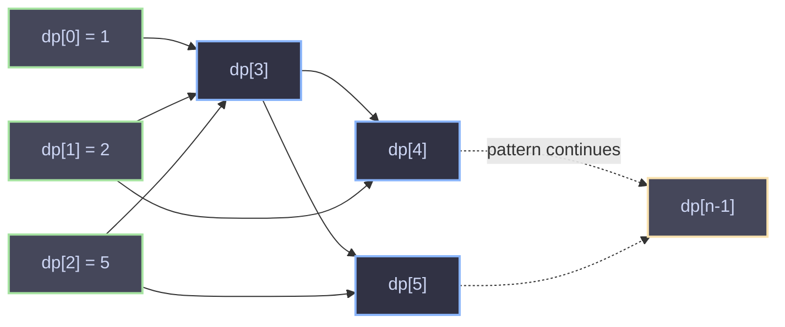

# Domino and Tromino Tiling — `numTilings`

## The Problem

You have a board that is **2 rows tall and `n` columns wide**. You need to fill it completely using two kinds of tiles:

- A **2×1 domino** (can be placed horizontally or vertically)
- An **L-shaped tromino** (covers 3 cells, in any of its 4 rotations)

Count how many distinct ways you can fully tile the board, modulo `1_000_000_007`.

For `n = 3`, there are 5 ways — this is where the base case `dp[3] = 5` comes from.

## Why This Is a Dynamic Programming Problem

The key insight is that tiling a board of width `n` can be built up from smaller boards. Instead of trying to reason about the whole board at once, we ask:

> "If I already know how many ways exist to tile boards of width `1, 2, 3, ..., i-1`, can I use that to figure out width `i`?"

This is the hallmark of DP: **an optimal (or complete) count for a large problem is assembled from counts of smaller subproblems**, rather than recomputed from scratch.

## Deriving the Recurrence

Let `dp[i]` = number of ways to fully tile a `2 × i` board.

Think about the **rightmost column(s)** of a fully tiled `2 × i` board — every valid tiling must end in one of a few possible "shapes":

1. **The last column is filled by a single vertical domino.**
   This means columns `1` to `i-1` form a completely tiled `2 × (i-1)` board on their own.
   → Contributes `dp[i-1]` ways.

2. **The last two columns are filled by two horizontal dominoes** (one on top of the other, stacked).
   This means columns `1` to `i-2` form a completely tiled `2 × (i-2)` board.
   → This case turns out to already be *covered* by combinations of trominoes below, so it isn't counted separately — see the note at the end.

3. **The last few columns are filled using trominoes**, which is where it gets interesting. A tromino sticks out unevenly (covers 2 cells in one column and 1 cell in the adjacent column), so it always creates a "notch." It can be shown (by casework, or by expanding a more general state-based recurrence) that all tromino-involving completions of the last columns collapse into a clean term of `dp[i-3]`, multiplied by 2 (because a tromino notch can point up or down, and each such configuration pairs with a mirrored partner).

Working through the full casework (which is the classic derivation for this exact LeetCode problem, "790. Domino and Tromino Tiling"), everything simplifies to:

```
dp[i] = 2 * dp[i-1] + dp[i-3]
```

### Intuition for *why* it's `2*dp[i-1] + dp[i-3]`, in plain terms

- `dp[i-1]` counted once for "close off the board with one vertical domino."
- `dp[i-1]` counted **again** implicitly, because the horizontal-domino-pair case (case 2 above) and one whole family of tromino cases both end up being expressible in terms of `dp[i-1]` once you unfold the algebra — that's the second copy, giving `2 * dp[i-1]`.
- `dp[i-3]` accounts for the two mirrored ways a tromino "notch" can jut out from a fully-tiled `2 × (i-3)` block.

You don't have to re-derive this casework from first principles to use it — it's a known closed recurrence for this specific tiling problem — but the takeaway is: **every tiling of width `i` can be decomposed by looking at how its rightmost 1–3 columns are closed off**, and those closures only ever depend on smaller, already-solved boards.

## Base Cases

```
dp[0] = 1   // an empty board — exactly 1 way to tile "nothing"
dp[1] = 1   // one vertical domino, only 1 way
dp[2] = 2   // two vertical dominoes, OR two horizontal dominoes
dp[3] = 5   // verified by hand / the recurrence's "seed" case
```

The code handles `n = 1, 2, 3` as direct early returns, then builds everything from `dp[3]` onward using the recurrence.

## Walking Through the Code

```java
class Solution {
    public int numTilings(int n) {
        if (n == 1) return 1;
        if (n == 2) return 2;
        if (n == 3) return 5;

        int[] dp = new int[n];
        dp[0] = 1;
        dp[1] = 2;
        dp[2] = 5;
        for (int i = 3; i < n; i++) {
            dp[i] = (int) ((2L * dp[i - 1] + dp[i - 3]) % 1_000_000_007L);
        }

        return dp[n - 1];
    }
}
```

A couple of implementation details worth noting:

- **Array indexing is shifted by one.** `dp[i]` in the array actually represents the answer for a board of width `i + 1`, because array indices start at 0 but board widths start at 1. So `dp[0] = 1` means "width 1 → 1 way," `dp[2] = 5` means "width 3 → 5 ways," and so on. This is why the loop reads `dp[i] = 2*dp[i-1] + dp[i-3]` (comparing *array* neighbors) even though conceptually it's applying `f(i) = 2*f(i-1) + f(i-3)` in terms of *board width*.
- **`2L * dp[i-1]`** promotes the multiplication to `long` before taking the modulo, so the intermediate value can't silently overflow `int` (dp values can get large before the mod is applied).
- **The modulo `1_000_000_007`** is applied every iteration, not just at the end. This keeps every stored `dp[i]` small and prevents any intermediate value from overflowing, since the raw tiling counts grow exponentially.

## Why It Works — The Big Picture

This is a textbook example of **linear recurrence DP**:

1. Find a way to describe the answer for size `i` purely in terms of a **fixed, small window** of smaller answers (`i-1` and `i-3` here).
2. Solve the smallest cases by hand (or brute force) to seed the recurrence.
3. Build up iteratively from smallest to largest, storing only what you need.

Because `dp[i]` only ever depends on `dp[i-1]` and `dp[i-3]`, each state is computed exactly once in **O(1)** work, giving an overall **O(n)** time solution with **O(n)** space (which could be optimized to O(1) space by keeping only the last 3 values, since nothing further back is ever referenced again).

## Complexity

| | Complexity |
|---|---|
| Time | `O(n)` — one pass, constant work per step |
| Space | `O(n)` as written — but reducible to `O(1)` since only the last 3 `dp` values are ever needed |

## Visualizing the Dependency Chain



Each new value only ever reaches back **one step** (for the `2×` term) and **three steps** (for the `+` term) — never further — which is exactly what makes the O(1)-work-per-step, O(n)-total performance possible.