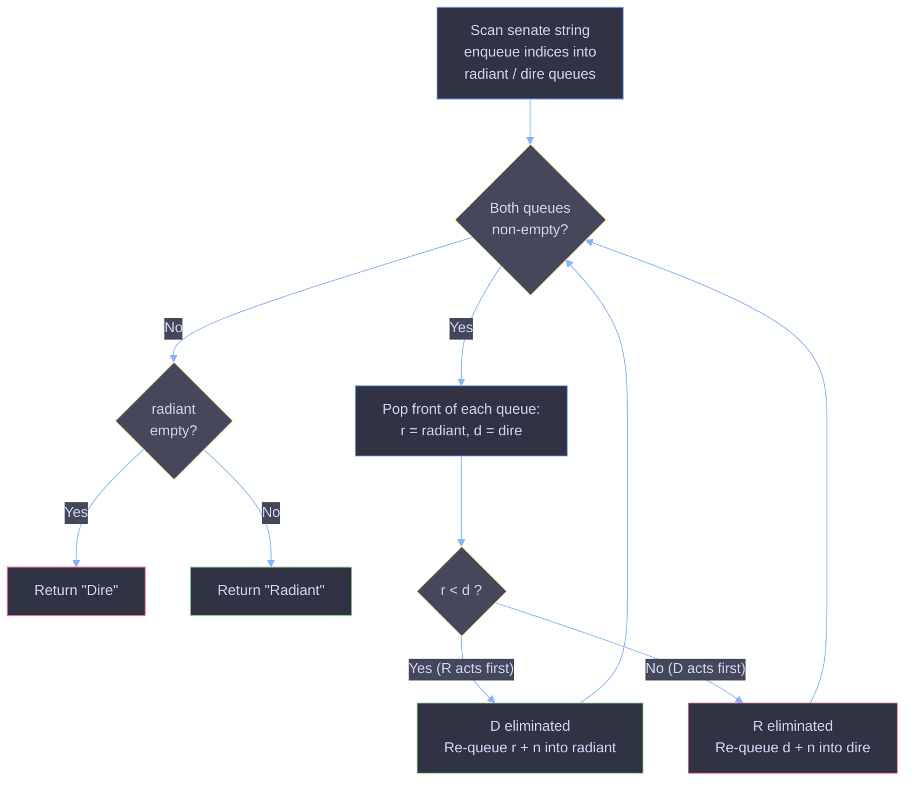

# Dota2 Senate — Predict Party Victory

A greedy simulation solution to LeetCode 649 (*Dota2 Senate*), using two queues to model senators banning each other's voting rights in rounds until one party is eliminated.

## Problem Statement

In the world senate, each senator belongs to one of two parties: `Radiant` (`R`) or `Dire` (`D`). The senate follows this procedure round after round:

1. Each senator can exercise **one** of two rights in turn:
   - **Ban** the right of **one** senator from the other party — that senator can no longer vote in any future round.
   - **Announce victory** — if all remaining senators either belong to their party or have already been banned, they can declare their party the winner and end the vote.

Senators vote in the order given by the input string `senate`, wrapping around to round 2, round 3, etc., until one party has no voting senators left. Given a string `senate` representing the party of each senator by seat index, return which party will win: `"Radiant"` or `"Dire"`.

**Example**

```
Input:  senate = "RDD"
Output: "Radiant"
```

## Code

```java
class Solution {
    public String predictPartyVictory(String senate) {

        LinkedList<Integer> radiant = new LinkedList<>();
        LinkedList<Integer> dire = new LinkedList<>();

        for (int i = 0; i < senate.length(); i++) {
            if (senate.charAt(i) == 'R') radiant.add(i);
            else dire.add(i);
        }

        while (radiant.size() > 0 && dire.size() > 0) {
            int r = radiant.pop();
            int d = dire.pop();

            if (r < d) radiant.add(r + senate.length());
            else dire.add(d + senate.length());
        }

        if (radiant.isEmpty()) return "Dire";
        return "Radiant";
    }
}
```

> Note: `LinkedList.pop()` removes from the **head** of the list. Since elements were added in increasing index order with `add()` (which appends to the tail), `pop()` here behaves like a FIFO dequeue on the front — i.e. it always returns the senator with the **smallest remaining index**, exactly what a `Queue<Integer>` (`poll()`) would give. The code works correctly, but using `ArrayDeque` with `poll()`/`offer()` would communicate the FIFO intent more clearly than `LinkedList` with `pop()`.

## Intuition

Every senator gets to act once per round, in seat order. A senator's best move is always to ban the **nearest upcoming opponent**, because that opponent would otherwise get to act (and ban someone) before this senator's own next turn comes around. There's never a reason to skip an available ban — banning an opponent can only help your party, never hurt it.

So the problem reduces to a simulation: repeatedly let the earliest-acting `R` and earliest-acting `D` face off, and whichever has the **earlier position in the current round** eliminates the other.

## Approach — Two Queues, One Trick

1. **Record seat indices, not just letters.** Two queues, `radiant` and `dire`, store the original indices of each party's senators, in seat order (0, 1, 2, ...). This preserves *whose turn comes first*.

2. **Repeatedly resolve head-to-head matchups.** While both queues are non-empty:
   - Pop the front of each queue: `r` (Radiant's next voter) and `d` (Dire's next voter).
   - Whichever index is smaller acts first in this round, so it bans the other. The loser is discarded (not re-added to any queue); the winner survives to vote again.

3. **The re-queueing trick — push the winner back with `+ senate.length()`.** The surviving senator will vote again, but only in the **next round**, after every other still-alive senator (from both parties) has had a turn in the current round. Adding `senate.length()` to its index encodes exactly this: it's a virtual index guaranteed to be larger than any index left in *this* round (since indices only range up to `senate.length() - 1`), but the `+ senate.length()` offsets preserve relative seat order across rounds, so ties between senators from different future rounds are still broken correctly.

4. **Termination.** The loop ends when one queue is empty — that party has no senators left to vote, so it cannot win.

## Why It Works

- **Greedy is optimal here:** since any ban is unconditionally beneficial (it permanently removes an opponent's future voting power at zero cost), a senator should always ban when able. There's no scenario where "saving" a ban helps — this eliminates the need to explore alternative strategies, which is what makes a direct simulation correct rather than requiring search or DP.
- **Comparing indices reproduces turn order:** because senators act strictly in increasing seat order each round, comparing `r` and `d` correctly determines who reaches their turn first and therefore who gets to ban whom.
- **`+ senate.length()` correctly models "wrap to next round":** it guarantees any senator who survives this round is treated as acting *after* all senators still active in the current round, while still respecting their original relative order against other survivors. This is what allows a single pass with two simple queues to simulate an unbounded number of rounds without ever explicitly tracking "round number" or re-scanning the string.
- **The process is monotonically decreasing:** each iteration of the loop permanently removes exactly one senator, so with `n` total senators, the loop runs at most `n - 1` times before one queue empties.

## Complexity

| Metric | Complexity | Reasoning |
|---|---|---|
| Time | `O(n)` | Each senator is banned at most once; the loop runs at most `n` times, and each iteration is `O(1)` |
| Space | `O(n)` | The two queues together hold at most `n` senator indices at any time |

## Dry Run — `senate = "RDD"`

Initial: `radiant = [0]`, `dire = [1, 2]`

| Round | Pop r | Pop d | Comparison | Result | radiant | dire |
|---|---|---|---|---|---|---|
| 1 | 0 | 1 | `0 < 1` → R wins | D at index 1 banned; R re-queued as `0+3=3` | `[3]` | `[2]` |
| 2 | 3 | 2 | `3 > 2` → D wins | R at index 3 banned; D re-queued as `2+3=5` | `[]` | `[5]` |

`radiant` is empty → **output: `"Radiant"`**

Even though Dire had two senators to Radiant's one, Radiant's senator (seat 0) always acts before either Dire senator can act against it in a given round, letting it ban them one at a time before losing.

## Flow Diagram

