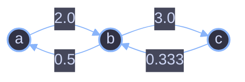
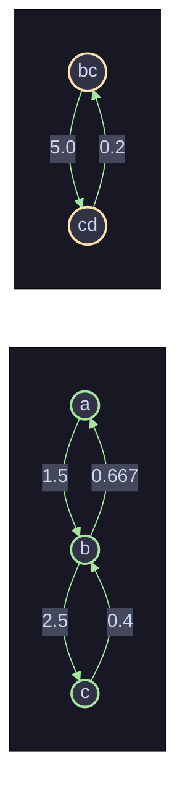

# Evaluate Division — Weighted Graph + DFS

This solves **LeetCode 399. Evaluate Division**: given equations like `a / b = 2.0`, answer queries like `a / c = ?` by chaining known ratios together.

---

## 1. The Core Idea

Every equation `a / b = k` tells us two things at once:

- To go from `a` to `b`, **multiply by `k`**
- To go from `b` to `a`, **multiply by `1/k`**

That's exactly a **directed, weighted graph**:

- Nodes = variables (`a`, `b`, `c`, ...)
- Edge `a → b` with weight `k` means "a is `k` times b"
- Edge `b → a` with weight `1/k` (the reverse relationship)

Once the graph is built, answering `x / y = ?` becomes: **walk from `x` to `y`, multiplying edge weights along the path.** That's a DFS (or BFS) problem, not an algebra problem.

### Why multiplying weights along a path works

If `a/b = 2` and `b/c = 3`, then:

```
a/c = (a/b) * (b/c) = 2 * 3 = 6
```

So any path `x → ... → y` gives `x/y` as the product of the weights on that path. The graph traversal *is* the algebra.

---

## 2. Building the Graph

```java
HashMap<String, List<Pair>> adjList = new HashMap<>();

for (List<String> equ : equations) {
    String v1 = equ.get(0);
    String v2 = equ.get(1);

    List<Pair> lst1 = adjList.getOrDefault(v1, new ArrayList<>());
    List<Pair> lst2 = adjList.getOrDefault(v2, new ArrayList<>());

    lst1.add(new Pair(values[i], v2));       // v1 -> v2 weight = values[i]
    lst2.add(new Pair(1 / values[i], v1));   // v2 -> v1 weight = 1/values[i]

    adjList.putIfAbsent(v1, lst1);
    adjList.putIfAbsent(v2, lst2);
    i++;
}
```

For each equation, **two directed edges** are added — one forward, one reversed with the inverse weight. This is what lets DFS travel in *either* direction through a chain of ratios.

### Example graph

Given:

```
equations = [["a","b"], ["b","c"]]
values    = [2.0, 3.0]
```



Each equation becomes a *pair* of arrows going opposite directions with reciprocal weights.

---

## 3. Answering a Query with DFS

```java
double dfs(adjList, visited, s, t, count) {
    if (!adjList.containsKey(s) || !adjList.containsKey(t)) return -1;  // unknown variable
    if (s.equals(t)) return 1;                                          // same variable, ratio = 1

    visited.add(s);
    for (Pair edge : adjList.get(s)) {
        if (edge.var.equals(t)) {
            return count * edge.weight;              // found target directly
        }
        if (!visited.contains(edge.var)) {
            double ret = dfs(adjList, visited, edge.var, t, count * edge.weight);
            if (ret != -1) return ret;                // propagate a valid path upward
        }
    }
    return -1;  // dead end, no path exists
}
```

`count` is the **running product** of weights along the path taken so far. Each recursive call multiplies in the next edge's weight before moving to the next node.

### Step-by-step trace: query `a / c = ?`

Graph from above. Call `dfs(adjList, visited, "a", "c", 1)`:

| Step | Current node (`s`) | Target (`t`) | `count` so far | Action |
|------|--------------------|--------------|-----------------|--------|
| 1 | `a` | `c` | `1` | `a != c`. Mark `a` visited. Look at `a`'s edges: `a → b` (2.0) |
| 2 | | | | `b != c`, and `b` not visited → recurse: `dfs(b, c, 1 * 2.0 = 2.0)` |
| 3 | `b` | `c` | `2.0` | Mark `b` visited. Look at `b`'s edges: `b → a` (0.5), `b → c` (3.0) |
| 4 | | | | `b → a`: `a` is already visited → **skip** |
| 5 | | | | `b → c`: `c == t` → **found it!** Return `2.0 * 3.0 = 6.0` |
| 6 | `a` | `c` | | The recursive call returns `6.0`, which isn't `-1`, so step 1's loop returns `6.0` immediately |

**Result: `a / c = 6.0`** — matches `(a/b) * (b/c) = 2.0 * 3.0`.

The `visited` set is what stops the search from bouncing back and forth on `a ↔ b` forever (an infinite loop), since the reverse edges exist too.

### Why it returns `-1` for impossible queries

Two failure cases, both handled explicitly:

1. **Unknown variable** — if `x` or `y` never appeared in any equation, `adjList` has no entry for it. Checked immediately at the top of `dfs`.
2. **Disconnected graph** — if `x` and `y` exist but belong to *separate* components (e.g. equations for `a,b,c` and separately `d,e`, then querying `a/e`), DFS exhausts every reachable neighbor from `x` without ever hitting `y`, and the loop falls through to `return -1`.

---

## 4. Full Walkthrough Example

```
equations = [["a","b"], ["b","c"], ["bc","cd"]]
values    = [1.5, 2.5, 5.0]
queries   = [["a","c"], ["c","b"], ["bc","cd"], ["cd","bc"], ["x1","x2"]]
```

Graph built (two components: `{a,b,c}` and `{bc,cd}`):



| Query | Path found | Computation | Result |
|-------|-----------|-------------|--------|
| `a / c` | `a → b → c` | `1.5 * 2.5` | `3.75` |
| `c / b` | `c → b` (reverse edge) | `0.4` | `0.4` |
| `bc / cd` | direct edge | `5.0` | `5.0` |
| `cd / bc` | reverse edge | `0.2` | `0.2` |
| `x1 / x2` | neither node in `adjList` | — | `-1.0` (unknown variables) |

Note that `a / bc` would also return `-1.0` even though both are known variables — they're in different connected components, so no path exists.

---

## 5. Complexity

Let `E` = number of equations, `Q` = number of queries, `V` = number of distinct variables.

- **Building the graph:** `O(E)` — each equation adds two edges.
- **Each query (DFS):** worst case visits every node and edge once → `O(V + E)`.
- **All queries:** `O(Q * (V + E))`.

Space: `O(V + E)` for the adjacency list, plus `O(V)` recursion depth/visited set per query.

---

## 6. Why This Design Works (Summary)

| Requirement | How the solution satisfies it |
|---|---|
| Chain ratios across multiple equations | Path = product of edge weights (graph walk = algebra) |
| Division in both directions (`a/b` and `b/a`) | Two directed edges per equation, with reciprocal weights |
| Avoid infinite loops from bidirectional edges | `visited` set per query |
| Detect unknown variables | Check `adjList.containsKey(...)` before searching |
| Detect no-path (disconnected) cases | DFS naturally returns `-1` when it exhausts all reachable nodes |
| Same variable divided by itself | Base case `s.equals(t) → return 1` |

The `System.out.println` debug statements in the code are purely for tracing execution during development — they can be removed for production/submission without affecting correctness.