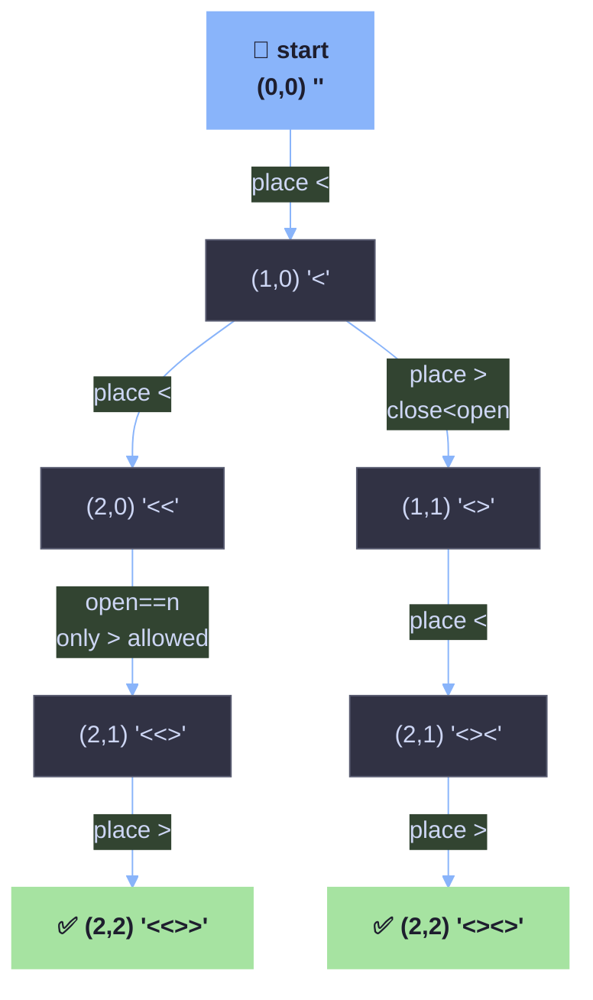

# Generate Angle Bracket Sequences (`< >`)

## 1. Problem Statement

Given a number `n`, generate **all valid sequences** of `n` pairs of angle
brackets (`<` and `>`).

A sequence is **valid** if:
- It has exactly `n` opening brackets `<` and `n` closing brackets `>`.
- At no point while reading it left-to-right does a `>` appear without a
  matching `<` before it (i.e. brackets are properly nested/balanced).

Example, `n = 2`:

```
Valid:   <<>>   <><>
Invalid: >><<   <>>< (unbalanced at some prefix)
```

This is the exact same shape of problem as **"Generate Parentheses"**
(LeetCode 22) — only the characters change. If you've solved that one,
you already understand this one.

---

## 2. The Core Idea — Backtracking with Two Counters

Instead of generating every possible string of `2n` characters and then
*checking* whether it's valid (wasteful — most are invalid), we build the
string **one character at a time**, and only add a character when doing so
**cannot possibly** break validity.

We track two counters as we build the `pattern` string:

| Counter | Meaning                                   |
|---------|--------------------------------------------|
| `open`  | how many `<` we've placed so far           |
| `close` | how many `>` we've placed so far           |

At each step we have **at most two choices**:

1. **Place a `<`** — allowed only if `open < n` (we haven't used up all opens yet).
2. **Place a `>`** — allowed only if `close < open` (there's an unmatched `<` waiting to be closed).

That second rule is the whole trick: a `>` is only legal if it has an
opener to "close". This single guard is what guarantees every generated
string is valid — we never need to check afterwards.

We stop (and record the string) when `open == n && close == n`, meaning
we've placed all `2n` characters.

---

## 3. Why This Works

Think of `open - close` as the number of **currently unclosed brackets**
(like a running balance). The two guard conditions keep this balance
legal at every single step:

- `open < n` → we never place more than `n` opening brackets total.
- `close < open` → we never place a closing bracket unless the balance
  is positive (there's something open to close). This means the balance
  **never goes negative**, which is exactly the definition of a valid
  bracket sequence.

Because both constraints are checked **before** recursing deeper, every
leaf of the recursion tree that reaches `open == n && close == n` is
*guaranteed* valid — there's no need for a separate validation pass.

This is a classic **constrained backtracking** / **DFS over a decision
tree** pattern: at each node you try every legal choice, recurse, and
naturally backtrack when you return (the `pattern + "<"` / `pattern + ">"`
creates a *new* string each call, so no explicit "undo" step is needed —
that's a nice side-effect of Java's `String` immutability).

---

## 4. Annotated Code Walkthrough

```java
class Result {

    static List<String> result = new ArrayList<>();

    public static List<String> generateAngleBracketSequences(int n) {
        bt(0, 0, n, "");   // start with 0 opens, 0 closes, empty pattern
        return result;
    }

    public static void bt(int open, int close, int n, String pattern) {

        // Base case: we've placed n opens AND n closes -> pattern is complete & valid
        if (open == n && close == n) {
            result.add(pattern);
            return;
        }

        // Choice 1: place an opening bracket, if we still have opens left
        if (open < n) {
            bt(open + 1, close, n, pattern + "<");
        }

        // Choice 2: place a closing bracket, only if it has something to close
        if (close < n && close < open) {
            bt(open, close + 1, n, pattern + ">");
        }
    }
}
```

Line-by-line intuition:

- `bt(0, 0, n, "")` — the recursion starts with an empty string and both
  counters at zero.
- The base case is checked **first**. Since `open` and `close` only ever
  increase, and both are capped at `n`, the recursion is guaranteed to
  terminate.
- `if (open < n)` — this branch is *always* attempted before the closing
  branch. That's why brackets in the output tend to lean "open-first"
  (not meaningful for correctness, just how the tree is traversed).
- `if (close < n && close < open)` — the `close < n` check is technically
  redundant here because `close < open <= n` already implies `close < n`,
  but it makes the guard self-documenting and safe against future edits.
- `pattern + "<"` / `pattern + ">"` builds a **new** string each call
  (strings are immutable in Java), so each recursive branch works on its
  own independent copy — no manual backtracking/undo needed.

---

## 5. Diagram — Recursion Tree for `n = 2`

Every node shows `(open, close)` and the pattern built so far. Green
leaves are the two valid results that get added to `result`.



Notice the tree is **pruned** — a branch like `(0,1)` ("start with `>`")
never even appears, because `close < open` (`0 < 0`) is false. That
pruning is precisely why this approach only ever explores valid paths,
instead of generating all `4^n` combinations and filtering.

---

## 6. Dry Run Trace Table (`n = 2`)

| Call # | `open` | `close` | `pattern` | Action taken |
|-------:|:------:|:-------:|:----------|:-------------|
| 1 | 0 | 0 | `""`     | `open<n` → recurse with `<` |
| 2 | 1 | 0 | `"<"`    | `open<n` → recurse with `<` |
| 3 | 2 | 0 | `"<<"`   | `open==n`, `close<open` → recurse with `>` |
| 4 | 2 | 1 | `"<<>"`  | `close<open` → recurse with `>` |
| 5 | 2 | 2 | `"<<>>"` | `open==n && close==n` → **add `"<<>>"`** |
| 6 | 1 | 0 | `"<"`    | backtrack, now try `close<open` (0<1) → recurse with `>` |
| 7 | 1 | 1 | `"<>"`   | `open<n` → recurse with `<` |
| 8 | 2 | 1 | `"<><"`  | `close<open` → recurse with `>` |
| 9 | 2 | 2 | `"<><>"` | `open==n && close==n` → **add `"<><>"`** |

Final `result = ["<<>>", "<><>"]` — matches the two leaves in the diagram above.

---

## 7. Complexity Analysis

- **Time:** `O(4^n / √n)` — this is the **n-th Catalan number**, `Cₙ`,
  which counts exactly how many valid bracket sequences exist for `n`
  pairs. Since we only ever build valid sequences (thanks to the
  pruning), the number of recursive calls is bounded by (a constant
  factor of) `Cₙ`, not by the much larger `4^n` (all possible strings).
- **Space:** `O(n)` for the recursion call stack depth (each call adds
  one character, max depth `2n`), plus `O(Cₙ · n)` to store all the
  output strings in `result` (each of length `2n`).

| n | Valid sequences (Catalan number Cₙ) |
|---|--------------------------------------|
| 1 | 1 |
| 2 | 2 |
| 3 | 5 |
| 4 | 14 |
| 5 | 42 |

---
