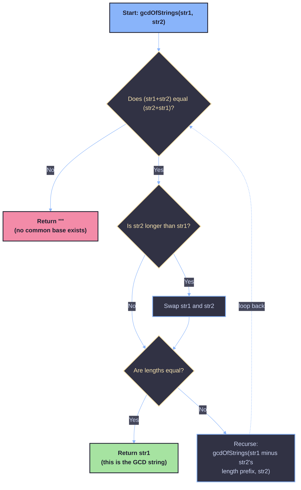

# GCD of Strings

A detailed walkthrough of the classic **"Greatest Common Divisor of Strings"** problem (LeetCode 1071), including the math behind it, a line-by-line explanation of the recursive Java solution, a dry run, and complexity analysis.

---

## 1. Problem Statement

For two strings `s` and `t`, we say `t` **divides** `s` if and only if `s = t + t + t + ... + t` (`t` concatenated with itself one or more times).

Given two strings `str1` and `str2`, return **the largest string `x`** such that `x` divides both `str1` and `str2`. If no such string exists, return an empty string `""`.

**Example 1**
```
Input:  str1 = "ABCABC", str2 = "ABC"
Output: "ABC"
```

**Example 2**
```
Input:  str1 = "ABABAB", str2 = "ABAB"
Output: "AB"
```

**Example 3**
```
Input:  str1 = "LEETCODELEETCODE", str2 = "LEETCODE"
Output: "LEETCODE"
```

**Example 4 (no answer)**
```
Input:  str1 = "ABCDEF", str2 = "ABC"
Output: ""
```

---

## 2. The Core Idea

This problem is a string analogue of the **numeric GCD** problem. If a string `x` divides both `str1` and `str2`, then:

- `len(str1)` must be a multiple of `len(x)`
- `len(str2)` must be a multiple of `len(x)`

That means `len(x)` must be a **common divisor of `len(str1)` and `len(str2)`**, and since we want the *largest* possible `x`, its length must be `gcd(len(str1), len(str2))`.

So the algorithm boils down to two questions:

1. **Do `str1` and `str2` even have a valid common "base" string at all?**
2. **If yes, what is it?** (Answer: the prefix of length `gcd(len(str1), len(str2))`.)

---

## 3. The Key Mathematical Trick

### 3.1 Why check `str1 + str2 == str2 + str1`?

The single most important line in the whole solution is:

```java
if (!(str1 + str2).contains(str2 + str1)) return "";
```

This checks whether `str1` and `str2` are built from repetitions of a **common base string**.

**Claim:** A common divisor string exists for `str1` and `str2` **if and only if**

```
str1 + str2 == str2 + str1
```

#### Intuition behind the claim

If both strings are made of repeated copies of some base string `b`, say:

```
str1 = b * m   (b repeated m times)
str2 = b * n   (b repeated n times)
```

then concatenating them in either order just stacks up more copies of `b`:

```
str1 + str2 = b*m + b*n = b*(m+n)
str2 + str1 = b*n + b*m = b*(m+n)
```

Both sides produce the **exact same string** — `b` repeated `(m + n)` times — regardless of the order. So the equality must hold.

Conversely, it is a well-known string theorem (sometimes called the **Fine and Wilf theorem** / "periodicity lemma") that if `str1 + str2 == str2 + str1`, then `str1` and `str2` are guaranteed to be powers of some common shorter string `b`. In other words, the equation `str1 + str2 == str2 + str1` is a complete test — no counterexamples exist. Two strings commute under concatenation **only when** they share a common base.

#### Why the code uses `contains(...)` instead of `==`

```java
if (!(str1 + str2).contains(str2 + str1)) return "";
```

Since `str1 + str2` and `str2 + str1` always have the **same total length** (`len(str1) + len(str2)` either way), checking whether one string *contains* the other as a substring is logically equivalent to checking exact equality — if a string of length `n` contains another string of length `n`, they must be identical. `.contains()` and `.equals()` behave the same way here; the code just uses `contains` as a stylistic (though slightly misleading) equivalent of `equals`.

If this "commuting" property fails, there is **no** common base string, so the answer is immediately `""`.

---

### 3.2 Why the answer's length is `gcd(len(str1), len(str2))`

Once we know a common base `b` exists, we need to find the **largest** one. Every valid common divisor string must itself be a power of the smallest repeating unit shared between the two strings, and the lengths of all valid divisors are exactly the common divisors of `len(str1)` and `len(str2)`. The largest such divisor's length is, by definition:

```
gcd(len(str1), len(str2))
```

So the final answer is simply the **prefix of `str1` (or `str2`) with length `gcd(len(str1), len(str2))`**.

---

## 4. How the Recursive Code Computes This

Rather than calling `Math.gcd()` directly on the lengths and slicing a substring, the given solution computes the GCD of the **lengths** using the classic **Euclidean algorithm**, but does it by recursing on the **strings themselves**. Let's trace through the code:

```java
class Solution {
    public String gcdOfStrings(String str1, String str2) {

        if (!(str1 + str2).contains(str2 + str1)) return "";

        String tmp;
        if (str2.length() > str1.length()) {
            tmp = str1;
            str1 = str2;
            str2 = tmp;
        }

        if (str2.length() == str1.length()) return str1;

        return gcdOfStrings(str1.substring(str2.length()), str2);
    }
}
```

### Step-by-step breakdown

**Step 1 — Validity check**
```java
if (!(str1 + str2).contains(str2 + str1)) return "";
```
As explained above, this confirms `str1` and `str2` share a common base string. If not, we bail out immediately with `""`.

**Step 2 — Ensure `str1` is the longer (or equal) string**
```java
if (str2.length() > str1.length()) {
    tmp = str1;
    str1 = str2;
    str2 = tmp;
}
```
This just normalizes the order so `str1.length() >= str2.length()`, mirroring how the Euclidean algorithm always subtracts the smaller number from the larger one.

**Step 3 — Base case**
```java
if (str2.length() == str1.length()) return str1;
```
If the two strings are now the same length (and we already know they commute, so they must actually be equal strings), we've found the base string — this is analogous to the Euclidean algorithm's base case `gcd(a, 0) = a` or `gcd(a, a) = a`.

**Step 4 — Recursive reduction**
```java
return gcdOfStrings(str1.substring(str2.length()), str2);
```
This is the string equivalent of the Euclidean step `gcd(a, b) = gcd(a - b, b)` (repeated subtraction, which is what modulo effectively speeds up). We strip the first `len(str2)` characters off of `str1` (since that prefix must equal `str2`, because they share a common base) and recurse with the shorter remainder and `str2`.

Each recursive call shrinks the length of the longer string, exactly like the Euclidean algorithm shrinks the larger number, until the two lengths match — at which point Step 3 returns the answer.

---

## 5. Dry Run Example

Let's trace `str1 = "ABCABCABC"` (length 9), `str2 = "ABCABC"` (length 6):

| Call | str1 | str2 | Commute check | Swap needed? | Equal lengths? | Action |
|---|---|---|---|---|---|---|
| 1 | `"ABCABCABC"` (9) | `"ABCABC"` (6) | ✅ passes | No (str1 already longer) | No | Recurse with `str1.substring(6)` = `"ABC"`, `str2 = "ABCABC"` |
| 2 | `"ABC"` (3) | `"ABCABC"` (6) | ✅ passes | Yes → swap: `str1="ABCABC"`, `str2="ABC"` | No | Recurse with `str1.substring(3)` = `"ABC"`, `str2 = "ABC"` |
| 3 | `"ABC"` (3) | `"ABC"` (3) | ✅ passes | No | **Yes** | Return `"ABC"` |

**Result:** `"ABC"` ✅

This matches `gcd(9, 6) = 3`, and `"ABC"` is indeed the length-3 prefix shared by both original strings.

---

## 6. Visual Overview



---

## 7. Complexity Analysis

### Time Complexity

- **Commute check** `(str1 + str2).contains(str2 + str1)`: string concatenation and substring search on strings of total length `n = len(str1) + len(str2)` costs **O(n)** per call (Java's `contains` uses an efficient substring search, effectively linear here).
- **Recursion depth**: The recursion mirrors the Euclidean algorithm on `len(str1)` and `len(str2)`, so it runs in **O(log(min(len(str1), len(str2))))** recursive calls.
- Since the expensive `O(n)` check re-runs on every recursive call (and string concatenation itself costs `O(n)`), the overall time complexity is:

```
O(n * log(min(len(str1), len(str2))))
```

where `n = len(str1) + len(str2)`.

### Space Complexity

- Each recursive call creates new string objects (via `substring` and `+` concatenation), and the recursion stack itself holds `O(log(min(len(str1), len(str2))))` frames.
- Overall space complexity: **O(n)**, dominated by the temporary concatenated strings created for the validity check.

---

## 8. Why This Approach Works Well

- It elegantly **reuses the Euclidean algorithm's logic**, just operating on strings instead of integers.
- The single `contains` check at the top is a clean, constant-effort way to rule out all invalid cases up front, so the rest of the function can safely assume a common base string exists.
- It avoids manually computing `gcd(len(str1), len(str2))` with a separate helper function — the recursion on the strings *is* the GCD computation, applied directly to the data we care about.

---

## 9. Summary

| Step | Purpose |
|---|---|
| `(str1+str2).contains(str2+str1)` | Confirms `str1` and `str2` share a common base string |
| Swap if needed | Keeps `str1` as the longer string, like the Euclidean algorithm |
| `str2.length() == str1.length()` | Base case — the shared base string has been found |
| `gcdOfStrings(str1.substring(str2.length()), str2)` | Recursive step — same idea as `gcd(a, b) = gcd(a - b, b)` |

**Final Answer:** the largest string `x` that divides both `str1` and `str2`, found by essentially running the Euclidean algorithm directly on the strings.