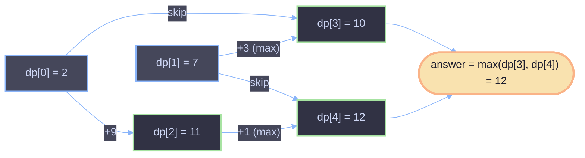

# House Robber — Dynamic Programming Explanation

## The Problem

You're a robber planning to hit a street of houses. Each house `i` holds
`nums[i]` amount of cash. The houses are lined up in a row, and every house
is wired to a security system that connects to its **immediate neighbors**.

> If you rob two houses that are adjacent to each other on the same night,
> the alarm goes off.

Given the cash in each house, find the **maximum amount of money** you can
rob without ever robbing two adjacent houses.

**Example**

```
nums = [2, 7, 9, 3, 1]
Best plan: rob house 0, house 2, house 4  →  2 + 9 + 1 = 12
```

---

## The Code

```java
class Solution {
    public int rob(int[] nums) {
        int n = nums.length;
        if (n == 1) return nums[0];

        int[] dp = new int[n];
        dp[0] = nums[0];
        dp[1] = nums[1];
        for (int i = 2; i < n; i++) {
            if (i > 2) dp[i] = nums[i] + Math.max(dp[i - 2], dp[i - 3]);
            else dp[i] = nums[i] + dp[i - 2];
        }

        return Math.max(dp[n - 1], dp[n - 2]);
    }
}
```

---

## The Key Idea: What Does `dp[i]` Actually Mean?

This is the part that trips people up, because it's *not* the most common
House Robber formulation. Most tutorials define `dp[i]` as "the best score
using the first `i` houses, robbing or not robbing the last one." This
solution defines it differently:

> **`dp[i]` = the maximum money obtainable from houses `0..i`,
> *given that house `i` is definitely robbed*.**

Every entry in `dp` represents a plan that **ends by robbing house `i`**.
That single decision — "always take the current house" — is what makes the
recurrence simple: since house `i` is taken, house `i - 1` is automatically
forbidden (alarm rule), so the previous robbery must have happened at house
`i - 2` or earlier.

---

## Why the Recurrence Works

```
dp[i] = nums[i] + max(dp[i - 2], dp[i - 3])
```

Think of it as answering: *"I'm robbing house `i`. Where did my last robbery
before this one happen?"* There are only two sensible candidates:

- **`dp[i - 2]`** — last robbery was two houses back. That leaves a gap of
  exactly one un-robbed house (`i - 1`), which is the minimum legal gap. No
  money is wasted.
- **`dp[i - 3]`** — last robbery was three houses back, meaning `i - 1` and
  `i - 2` are both skipped.

You never need to check `dp[i - 4]` or further, because `dp[i - 3]` already
represents the *optimal* plan ending at house `i - 3` — if skipping further
back than that were ever beneficial, it would already be baked into how
`dp[i-3]` (and `dp[i-4]`, `dp[i-5]`, ...) were computed. Each `dp` value only
depends on the two entries directly behind the forbidden neighbor, and that
window is enough to guarantee optimality by induction.

**Base cases:**
- `dp[0] = nums[0]` — only one house exists, so robbing it is forced.
- `dp[1] = nums[1]` — if you're forced to rob house 1, there's nothing valid
  before it except "rob nothing," so the plan is just `nums[1]` alone.
- `dp[2] = nums[2] + dp[0]` — the `else` branch. There's no `dp[-1]` to
  compare against, so the only legal predecessor is `dp[0]`.

**Final answer:**
```
return Math.max(dp[n - 1], dp[n - 2]);
```
Since every `dp[i]` *forces* house `i` to be robbed, the true optimum might
not rob the very last house at all. So the answer is the better of:
- the best plan that robs the last house (`dp[n-1]`), or
- the best plan that robs the second-to-last house (`dp[n-2]`), which
  implicitly allows the last house to be skipped.

---

## Walkthrough with `nums = [2, 7, 9, 3, 1]`

| i | nums[i] | Formula                        | dp[i] |
|---|---------|---------------------------------|-------|
| 0 | 2       | base case                       | 2     |
| 1 | 7       | base case                       | 7     |
| 2 | 9       | `nums[2] + dp[0]`                | 9 + 2 = 11 |
| 3 | 3       | `nums[3] + max(dp[1], dp[0])`    | 3 + max(7, 2) = 10 |
| 4 | 1       | `nums[4] + max(dp[2], dp[1])`    | 1 + max(11, 7) = 12 |

```
answer = max(dp[4], dp[3]) = max(12, 10) = 12
```

This matches the optimal plan: rob houses `0, 2, 4` → `2 + 9 + 1 = 12`. ✅

---

## Dependency Diagram

Each `dp[i]` (for `i > 2`) pulls from two candidates two and three steps
behind it — never from `dp[i-1]`, since that house is off-limits once
house `i` is robbed.



---

## Complexity

| Metric | Value | Why |
|--------|-------|-----|
| Time   | `O(n)` | Single pass through the array, constant work per house |
| Space  | `O(n)` | The `dp` array stores one entry per house |
