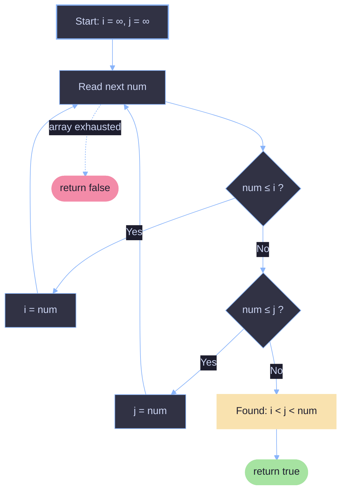

# Increasing Triplet Subsequence

## Problem Statement

Given an integer array `nums`, return `true` if there exists a triple of indices `(i, j, k)` such that `i < j < k` and `nums[i] < nums[j] < nums[k]`. If no such indices exist, return `false`.

**Constraints:**
- The solution must run in `O(n)` time and use `O(1)` extra space.

**Example:**
```
Input:  nums = [1, 2, 3, 4, 5]
Output: true
Explanation: Any triplet where i < j < k is valid, e.g. (1, 2, 3).

Input:  nums = [5, 4, 3, 2, 1]
Output: false
Explanation: No increasing triplet exists.
```

---

## Solution

```java
class Solution {
    public boolean increasingTriplet(int[] nums) {

        int n = nums.length;
        if (n < 3) return false;

        int i = Integer.MAX_VALUE;
        int j = Integer.MAX_VALUE;

        for (int in = 0; in < n; in++) {
            if (nums[in] <= i) i = nums[in];
            else if (nums[in] <= j) j = nums[in];
            else return true;
        }

        return false;
    }
}
```

---

## Core Idea

Instead of tracking actual triplet indices, we track the **smallest first element** and the **smallest second element** of any increasing pair found so far.

- `i` = the smallest value seen so far (best candidate for the *first* number of a triplet).
- `j` = the smallest value seen so far that comes **after** a value smaller than it (best candidate for the *second* number of a triplet).

As soon as we find a number that is strictly greater than `j`, we know there must have been:
1. Some earlier number `≤ i` (the first number),
2. Followed by some later number `≤ j` but `> i` (the second number, which updated `j`),
3. Followed now by the current number `> j` (the third number).

That guarantees an increasing triplet exists — we don't need to know *which* indices they were, only that they exist.

---

## Step-by-Step Walkthrough

Let's trace `nums = [1, 2, 4, 3, 5]`.

Initial state: `i = ∞`, `j = ∞`

| Step | num | Condition check | Action | i | j | Triplet found? |
|------|-----|------------------|--------|---|---|-----------------|
| 1 | 1 | `1 <= i (∞)` → true | `i = 1` | 1 | ∞ | No |
| 2 | 2 | `2 <= i (1)`? No. `2 <= j (∞)`? Yes | `j = 2` | 1 | 2 | No |
| 3 | 4 | `4 <= i (1)`? No. `4 <= j (2)`? No | `return true` | 1 | 2 | **Yes** |

**Result: `true`**

### Why this is correct

At the moment `4` is processed:
- `i = 1` means some number `≤ 1` occurred earlier (index 0, value `1`).
- `j = 2` means some number `≤ 2` (but `> i`) occurred after that (index 1, value `2`), and specifically **after** the number that set `i`.
- `4 > j`, so `4` is a valid third number.

This reconstructs the triplet `(1, 2, 4)` at indices `(0, 1, 2)` — even though the algorithm never stored indices at all.

---

## A Trickier Example (Why Updating `i` Doesn't Break Correctness)

Trace `nums = [5, 1, 5, 5, 2, 5, 4]`.

Initial state: `i = ∞`, `j = ∞`

| Step | num | i before | j before | Action | i after | j after |
|------|-----|----------|----------|--------|---------|---------|
| 1 | 5 | ∞ | ∞ | `5 <= ∞` → `i = 5` | 5 | ∞ |
| 2 | 1 | 5 | ∞ | `1 <= 5` → `i = 1` | 1 | ∞ |
| 3 | 5 | 1 | ∞ | `5 <= 1`? No. `5 <= ∞`? Yes → `j = 5` | 1 | 5 |
| 4 | 5 | 1 | 5 | `5 <= 1`? No. `5 <= 5`? Yes → `j = 5` | 1 | 5 |
| 5 | 2 | 1 | 5 | `2 <= 1`? No. `2 <= 5`? Yes → `j = 2` | 1 | 2 |
| 6 | 5 | 1 | 2 | `5 <= 1`? No. `5 <= 2`? No → **return true** | — | — |

**Result: `true`**, corresponding to the triplet `(1, 2, 5)` found at indices `(1, 4, 5)`.

Notice that `i` was overwritten from `5` to `1` in step 2. This is safe because **once a smaller candidate for the first element appears, it can only make future triplets easier to complete, never harder.** `i` only ever needs to represent *the best possible first element found so far* — not a specific index.

Similarly, `j` can only be updated to a smaller value when a valid "second element" opportunity arises (i.e., something bigger than the current `i`, which proves an increasing pair exists up to that point).

---

## Why `j` Is Never "Falsely" Set

A subtle but important invariant: **`j` is only ever updated when we're in the `else` branch**, meaning the current number is strictly greater than `i`. This guarantees that whenever `j` holds a finite value, there truly was some earlier number smaller than it — so `j` always represents a legitimate "second element" of a real increasing pair, even though the specific pairing may silently change as smaller candidates appear.

---

## Complexity Analysis

| Metric | Complexity | Explanation |
|--------|------------|--------------|
| Time | `O(n)` | Single pass through the array. |
| Space | `O(1)` | Only two extra integer variables (`i`, `j`) are used. |

---

## Visual Summary of the Algorithm



---

## Edge Cases Handled

| Case | Behavior |
|------|----------|
| `nums.length < 3` | Immediately returns `false` — a triplet is impossible. |
| Strictly decreasing array | `i` keeps getting overwritten, `j` never updates, always returns `false`. |
| Duplicate values (`nums[in] <= i` / `<= j` uses `<=`) | Equal values don't count as "greater than," so duplicates never falsely trigger a triplet — this correctly enforces the **strictly increasing** requirement. |
| Triplet at the very end of the array | Still detected, since the loop checks every element including the last. |

---

## Key Takeaways

- This is a classic **greedy + invariant tracking** pattern: maintain the best possible "prefix state" without needing to store full history.
- The trick generalizes to finding an increasing subsequence of length `k` by maintaining `k - 1` running minimums.
- Because `i` and `j` are updated greedily to the smallest possible values, the algorithm never misses a valid triplet — it always keeps its options as open as possible for future elements.