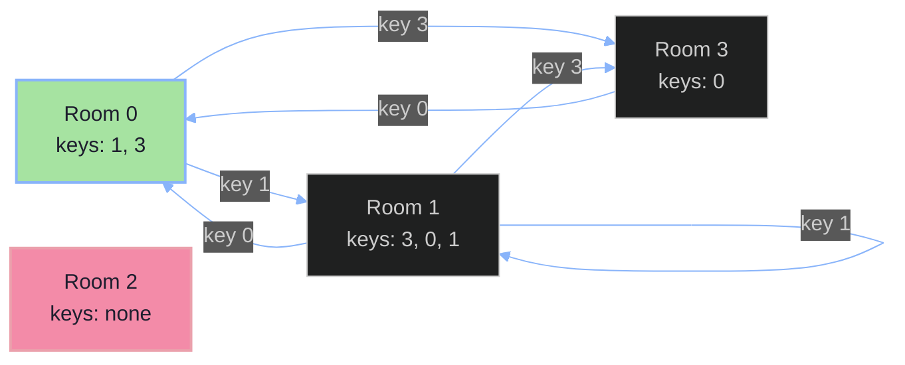

# Keys and Rooms

## Problem

There are `n` rooms labeled `0` to `n - 1`. Room `0` is unlocked and you start there. Every other room is locked, and the only way in is to already hold its key.

`rooms[i]` is the list of keys found *inside* room `i`. Each key `rooms[i][j]` lets you open the room with that number (you can hold a key without visiting that room yet).

**Goal:** Return `true` if you can eventually walk into every single room, `false` otherwise.

## Intuition

Think of the rooms as **nodes** in a graph, and each key inside a room as a **directed edge** pointing to the room it opens. Room `0` is the starting node, since it's the only room you can enter for free.

The question "can I visit every room?" then becomes: **"starting from node 0, can I reach every other node in the graph?"**

That's a textbook graph-traversal question. Once it's framed that way, the algorithm writes itself: explore from room 0, follow every key you find, and keep track of which rooms you've actually managed to open. If you run out of new rooms to explore and some rooms were never opened, they were unreachable — so the answer is `false`.

## Why DFS Works Here

DFS (Depth-First Search) naturally handles the "follow a key to a room, then follow that room's keys" chain:

1. Start in room `0` and mark it visited.
2. Look at every key inside the current room.
3. For each key, if that room hasn't been visited yet, go open it (recurse).
4. If a key points to a room you've already visited, skip it — no need to revisit.

Because rooms can hand out duplicate keys, or keys to rooms you already opened, or even a key back to room `0`, we need the `visited` check to avoid infinite loops. It also makes the algorithm efficient: every room is only ever explored **once**.

After the DFS finishes, `visited` contains exactly the set of rooms we were able to reach. If that set is the same size as the total number of rooms, we opened everything.

## Code Walkthrough

```java
class Solution {

    HashSet<Integer> visited = new HashSet<>();
    public boolean canVisitAllRooms(List<List<Integer>> rooms) {

        dfs(rooms, 0);
        return rooms.size() == visited.size();
    }

    void dfs(List<List<Integer>> rooms, int room) {
        if (visited.contains(room)) return;
        visited.add(room);
        List<Integer> keys = rooms.get(room);
        for(int key : keys) {
            dfs(rooms, key);
        }
    }
}
```

- **`visited`** — a `HashSet<Integer>` recording every room we've successfully entered. A set is used (rather than a list) because membership checks (`contains`) need to be fast, O(1) on average.

- **`canVisitAllRooms(rooms)`** — the entry point:
  - Kicks off the DFS from room `0`, since that's the only room we can enter without a key.
  - After the DFS completes, `visited` holds every room we actually reached. If its size matches `rooms.size()` (the total room count), we visited them all → return `true`. Otherwise some rooms were unreachable → return `false`.

- **`dfs(rooms, room)`** — the recursive explorer:
  - `if (visited.contains(room)) return;` — base case. If we've already been here, stop immediately. This is what prevents infinite recursion when keys loop back on themselves.
  - `visited.add(room);` — mark the current room as opened.
  - `List<Integer> keys = rooms.get(room);` — grab every key sitting inside this room.
  - `for (int key : keys) { dfs(rooms, key); }` — for each key, recursively "walk into" the room it unlocks, repeating the same process there.

## Walking Through an Example

```
rooms = [[1,3], [3,0,1], [2], [0]]
```



- Start at **Room 0** → visited = `{0}`. It has keys to rooms 1 and 3.
- Follow key `1` → **Room 1** → visited = `{0, 1}`. It has keys to 3, 0, 1 — but 0 and 1 are already visited, so only room 3 is new.
- Follow key `3` → **Room 3** → visited = `{0, 1, 3}`. Its only key (`0`) is already visited, so this branch ends.
- Back out of the recursion — no more unexplored keys anywhere.
- Final `visited = {0, 1, 3}`, but `rooms.size() == 4`.
- Room `2` (shown in red above) was never reachable by any key → return `false`.

If room 2 had instead appeared as a key somewhere (say, inside room 1), it would have been picked up during the DFS and the answer would be `true`.

## Complexity

- **Time:** `O(N + K)`, where `N` is the number of rooms and `K` is the total number of keys across all rooms. Each room is visited at most once, and each key is examined at most once.
- **Space:** `O(N)` for the `visited` set, plus `O(N)` for the recursion call stack in the worst case (e.g., a long chain of rooms).

## Key Takeaway

This problem is really just **"is the graph reachable from node 0?"** wearing a room-and-key costume. Recognizing that a key is nothing more than a directed edge is what turns a wordy puzzle into a standard DFS reachability check.