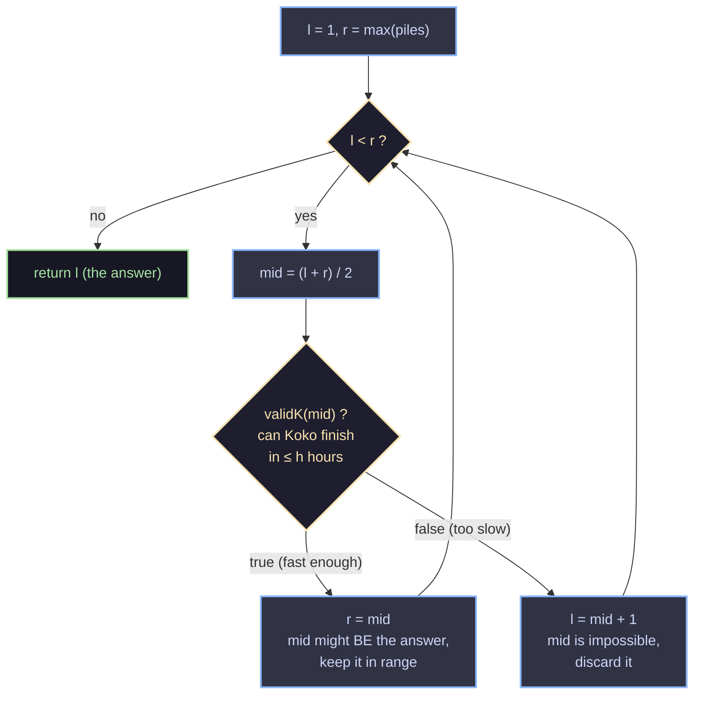

# Koko Eating Bananas — Binary Search on the Answer

This solves **LeetCode 875: Koko Eating Bananas**. Koko has `piles` of bananas
and `h` hours before the guards come back. Each hour she picks one pile and
eats up to `k` bananas from it (if the pile has fewer than `k`, she finishes
it and stops for the hour instead of moving to the next pile). We need the
**minimum integer eating speed `k`** that lets her finish every pile within
`h` hours.

```java
class Solution {
    public int minEatingSpeed(int[] piles, int h) {
        int max = 0;
        for (int p : piles) {
            max = Math.max(max, p);
        }

        int l = 1, r = max;
        while (l < r) {
            int mid = (l + r) / 2;
            if (validK(mid, h, piles)) {
                r = mid;
            } else {
                l = mid + 1;
            }
        }

        return l;
    }

    boolean validK(int k, int h, int[] piles) {
        int time = 0;
        for (int p : piles) {
            time += (p + k - 1) / k;
            if (time > h) return false;
        }
        return time <= h;
    }
}
```

---

## 1. The core idea: don't search the array, search the *answer*

The array `piles` isn't sorted, filtered, or scanned for a target value —
`piles` is just an input to a **checking function**. What we're actually
searching over is the space of possible speeds `k = 1, 2, 3, ..., max(piles)`.

The key observation that unlocks binary search is **monotonicity**:

> If speed `k` is fast enough to finish in time, then any speed `k' > k` is
> also fast enough. If speed `k` is too slow, any speed `k' < k` is also too
> slow.

So if you line up every possible `k` from `1` to `max(piles)` and mark
whether it's "fast enough," you always get a pattern like this:

```
k:        1    2    3    4    5    6    7    8    9
valid?:   F    F    F    F    T    T    T    T    T
                          ^
                   first True = the answer
```

This is a **step function that flips exactly once**, from `false` to `true`.
That's the precise structure binary search is built for — not just "the
array is sorted," but "there's a boolean predicate over an ordered domain
that flips once, and I want the flip point." Here the domain is speeds, and
the predicate is `validK(k)`.

So the algorithm is: binary search over `k` in `[1, max(piles)]`, and for
each candidate `k`, ask `validK(k, h, piles)` — "can Koko finish in `h`
hours or less at this speed?" We want the **smallest `k`** for which the
answer is `true`, i.e. the leftmost `True` in the diagram above.



---

## 2. Why `l = 1` and `r = max(piles)`?

These are the two natural extremes of `k`:

- **`k = max(piles)`** always works: at that speed, Koko clears *any* single
  pile in exactly one hour, so she finishes all `n` piles in at most `n`
  hours. Since the problem guarantees `h >= piles.length`, this is always a
  valid (if possibly wasteful) speed. So `r = max(piles)` is a safe upper
  bound that's guaranteed to be `true`.
- **`k = 1`** is the slowest possible integer speed. It might already be
  valid (if `h` is huge), or it might be the eventual answer, so it's the
  correct lower bound to include.

This guarantees the search window `[l, r]` always contains at least one
valid speed before the loop even starts, which matters for the next
question.

---

## 3. Why `r = mid`, and *not* `r = mid - 1`?

This is the detail that trips people up, and it comes down to one question:

> **When `validK(mid)` is true, is `mid` still a candidate for the final
> answer, or can we be sure the answer is strictly smaller than `mid`?**

`validK(mid) == true` means "speed `mid` finishes in time." But we're
looking for the *minimum* valid speed — and `mid` itself might already be
that minimum! We have no evidence yet that anything smaller than `mid` also
works. All we know is "`mid` works," not "`mid` is not the smallest speed
that works."

So `mid` cannot be thrown away — it's still in the running. That's why we
set `r = mid` instead of `r = mid - 1`: we shrink the search window to
`[l, mid]`, keeping `mid` inside it, and keep looking to the left in case
something even smaller also works.

Compare this to the `false` branch: `validK(mid) == false` means "speed
`mid` does *not* finish in time." That tells us with certainty that `mid`
can never be the answer, so it's safe to exclude it entirely — hence
`l = mid + 1`.

The asymmetry is the whole point:

| Result of `validK(mid)` | What we know for certain | What we do | Why |
|---|---|---|---|
| `true` | `mid` works, but maybe not minimally | `r = mid` | keep `mid` as a candidate |
| `false` | `mid` can never be the answer | `l = mid + 1` | safe to discard `mid` completely |

If you wrote `r = mid - 1` on the `true` branch, you would be discarding a
value (`mid`) that might be the exact answer you're searching for — that's
the classic off-by-one bug in "find the leftmost true" binary search. It
only works with `- 1` on the "true" branch. Using it on `r` is a bug here.

**Why the loop is safe from infinite looping.** Java's `int` division
truncates, so `mid = (l + r) / 2` always rounds *down*, meaning `mid` is
always strictly less than `r` whenever `l < r` (this needs checking, since
if `mid == r` and we set `r = mid`, nothing would shrink). Concretely: if
`l < r`, then `mid = (l + r) / 2 <= (r - 1 + r) / 2 < r`, so `mid < r`
always. That guarantees `r = mid` strictly shrinks the window from the
right, and `l = mid + 1` strictly shrinks it from the left. Since the
window shrinks on every iteration, and the loop condition is `l < r`, it's
guaranteed to terminate with `l == r` — pointing at the exact leftmost
`true`, our answer.

---

## 4. Why `(p + k - 1) / k` computes a ceiling

We need `ceil(p / k)` — the number of hours to clear a pile of `p` bananas
at speed `k` (e.g. `p = 10, k = 3` takes 4 hours: `3 + 3 + 3 + 1`). Java's
integer division truncates toward zero, i.e. it computes `floor(p / k)` for
non-negative operands. `(p + k - 1) / k` is a well-known trick to turn that
`floor` into a `ceil` using only integer arithmetic (no `double`, no
`Math.ceil`, no floating-point rounding surprises).

**Why it works.** Write `p = q*k + rem`, where `q = p / k` (integer, floored)
and `rem = p % k`, with `0 <= rem < k`. There are two cases:

- **`rem == 0`** (`p` divides evenly by `k`): the true ceiling is just `q`.
  Plugging in: `(p + k - 1) / k = (q*k + k - 1) / k = q + (k-1)/k`. Since
  `0 <= (k-1)/k < 1` in integer division, this truncates to exactly `q`. ✅
- **`rem > 0`** (`p` doesn't divide evenly): the true ceiling is `q + 1`,
  because a partial pile still costs a full hour. Plugging in:
  `(p + k - 1) / k = (q*k + rem + k - 1) / k = q + (rem + k - 1)/k`.
  Since `1 <= rem <= k-1`, we get `k <= rem + k - 1 <= 2k - 2`, so
  `(rem + k - 1)/k` truncates to exactly `1` (it's `>= 1` and `< 2`). Total:
  `q + 1`. ✅

Either way, `(p + k - 1) / k` lands exactly on `ceil(p / k)`, matching what
the commented-out `Math.ceil((double) p / k)` line computes — but without
casting to `double`, which is both faster and immune to floating-point
precision bugs at large values of `p` and `k` (e.g. `p` near `10^9`, where
`double` division can occasionally round the wrong way).

| `p` | `k` | `p / k` (floor) | `(p + k - 1) / k` | true `ceil(p/k)` | match? |
|---|---|---|---|---|---|
| 10 | 3 | 3 | 4 | 4 | ✅ |
| 9 | 3 | 3 | 3 | 3 | ✅ |
| 1 | 5 | 0 | 1 | 1 | ✅ |
| 7 | 7 | 1 | 1 | 1 | ✅ |

---

## 5. Worked trace

`piles = [3, 6, 7, 11]`, `h = 8`.

`max = 11`, so we search `k` in `[1, 11]`.

| step | l | r | mid | hours needed at `mid` | `validK`? | action |
|---|---|---|---|---|---|---|
| 1 | 1 | 11 | 6 | `1+1+2+2 = 6` | `6 <= 8` → true | `r = 6` |
| 2 | 1 | 6 | 3 | `1+2+3+4 = 10` | `10 > 8` → false | `l = 4` |
| 3 | 4 | 6 | 5 | `1+2+2+3 = 8` | `8 <= 8` → true | `r = 5` |
| 4 | 4 | 5 | 4 | `1+2+2+3 = 8` | `8 <= 8` → true | `r = 4` |
| — | 4 | 4 | — | loop ends (`l == r`) | — | return `4` |

Answer: `k = 4`. At `k = 3`, 10 hours are needed (too slow); at `k = 4`,
exactly 8 hours are needed, which fits — and no smaller `k` works, so `4`
is minimal.

---

## 6. Complexity

- **Time:** `O(n log m)`, where `n = piles.length` and `m = max(piles)`.
  The binary search runs `O(log m)` iterations, and each iteration's
  `validK` call scans all `n` piles.
- **Space:** `O(1)` extra space — just a handful of counters.
