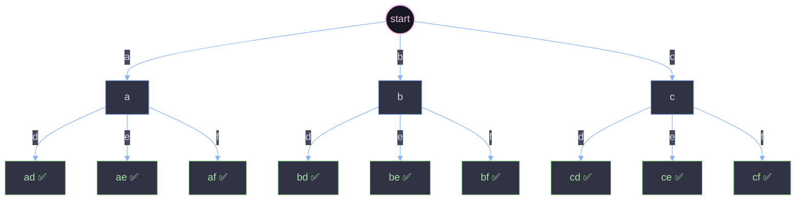

# Letter Combinations of a Phone Number

A backtracking (DFS) solution to the classic "phone keypad" problem, explained from the ground up.

---

## 1. The Problem

Given a string `digits` containing digits from `2` to `9`, return **every possible letter combination** that the number could represent, based on the old telephone keypad mapping:

| Digit | Letters |
|:-----:|:-------:|
| 2 | a, b, c |
| 3 | d, e, f |
| 4 | g, h, i |
| 5 | j, k, l |
| 6 | m, n, o |
| 7 | p, q, r, s |
| 8 | t, u, v |
| 9 | w, x, y, z |

**Example**

```
Input:  digits = "23"
Output: ["ad","ae","af","bd","be","bf","cd","ce","cf"]
```

Each digit contributes one letter to the final string, and we need **all combinations**, in any order.

---

## 2. The Core Idea: Backtracking

The key insight is that this problem has a **choice at every position**:

- Position 0 (digit `2`) → choose one of `{a, b, c}`
- Position 1 (digit `3`) → choose one of `{d, e, f}`
- ...and so on until you run out of digits.

This "make a choice, move to the next position, undo the choice, try the next option" pattern is exactly **backtracking**. It can be visualized as a tree: each level of the tree corresponds to one digit, and each branch at that level is one letter choice for that digit. A full path from the root to a leaf is one complete combination.



Every leaf marked ✅ is one entry in the final result. The DFS in the code is simply **walking this tree, depth-first, left to right**.

---

## 3. Walking Through the Code

```java
class Solution {

    Map<Character, String> numbers = new HashMap<>();
    List<String> res = new ArrayList<>();
    LinkedList<Character> stack = new LinkedList<>();

    public List<String> letterCombinations(String digits) {
        numbers.put('2', "abc");
        numbers.put('3', "def");
        numbers.put('4', "ghi");
        numbers.put('5', "jkl");
        numbers.put('6', "mno");
        numbers.put('7', "pqrs");
        numbers.put('8', "tuv");
        numbers.put('9', "wxyz");

        dfs(0, digits);

        return res;
    }

    void dfs(int i, String digits) {
        if (i == digits.length()) {
            res.add(getCombo());
            return;
        }

        String letters = numbers.get(digits.charAt(i));

        for (int in = 0; in < letters.length(); in++) {
            stack.add(letters.charAt(in));   // choose
            dfs(i + 1, digits);              // explore
            stack.pollLast();                // un-choose (backtrack)
        }
    }

    String getCombo() {
        StringBuilder s = new StringBuilder();
        for (Character c : stack) {
            s.append(c);
        }
        return s.toString();
    }
}
```

### 3.1 The pieces, one at a time

**`numbers` — the keypad lookup table**
A `HashMap<Character, String>` mapping each digit character to its string of letters. This is built once in `letterCombinations` before recursion starts, so `dfs` can do an O(1) lookup for "what letters does this digit represent?"

**`res` — the answer accumulator**
Every time a full combination is built (i.e., we've assigned a letter to every digit), it's appended here. This is the list ultimately returned.

**`stack` — the "current path" / partial combination**
This is the heart of the backtracking mechanism. Think of it as a **whiteboard holding the letters chosen so far**, one per digit already processed. It is a `LinkedList<Character>` used specifically because it supports fast additions and removals at the tail (`add`, `pollLast`), which is exactly what a stack-like "push/pop" needs.

**`dfs(i, digits)` — explore all choices for digit at index `i`**

1. **Base case**: `if (i == digits.length())`. This means we've walked past the last digit — every digit has a letter assigned to it in `stack`. So `stack` currently holds one complete, valid combination. We convert it to a string with `getCombo()` and record it in `res`. Then we `return` — there's nothing more to do at this depth.
2. **Recursive case**: Look up the letters for `digits.charAt(i)`. For each candidate letter:
   - **Choose**: `stack.add(letter)` — tentatively add this letter to the current path.
   - **Explore**: `dfs(i + 1, digits)` — recurse to decide the letter for the *next* digit, assuming this choice is fixed.
   - **Un-choose**: `stack.pollLast()` — remove the letter we just tried. This resets `stack` back to the state it was in *before* we made this choice, so the next iteration of the loop can try a *different* letter with a clean slate.

**`getCombo()` — snapshot the stack as a string**
Iterates `stack` from front to back and concatenates every character. Since `stack` was built by appending letters in digit order (digit 0's letter first, digit 1's letter second, ...), reading it front-to-back reconstructs the combination in the correct order.

---

## 4. Why It Works

### 4.1 Why the "choose → explore → un-choose" pattern is correct

At any recursive call `dfs(i, digits)`, `stack` is guaranteed to hold **exactly** the letters chosen for digits `0` through `i-1`. The invariant is:

> *When `dfs(i, digits)` begins executing, `stack.size() == i`, and it represents one specific, fixed prefix of a combination.*

Given that prefix is fixed, the function's job is simple: try every possible letter for digit `i`, and for each one, let the recursive call handle "everything after this point," treating the prefix as a constant.

The critical detail is the **un-choose step** (`stack.pollLast()`). Without it, letters from an earlier branch of the loop would still be sitting in `stack` when the next iteration starts, corrupting the prefix for every subsequent combination. Removing the letter after exploring it restores the exact invariant above, so the next iteration of the `for` loop starts from a clean, correct prefix. This is what makes it "backtracking" — you *back up* to the state you were in before trying a path, so you can try the next one fairly.

### 4.2 Why the base case produces exactly one valid answer

By the time `i == digits.length()`, the invariant above tells us `stack.size() == digits.length()` — one letter has been chosen for every digit, in order, and no digit is missing or duplicated. That's the definition of a complete, valid combination, so it's safe to record it immediately.

### 4.3 Why every combination gets generated exactly once

Because the algorithm exhaustively loops over **every** letter for **every** digit position, and recursion depth exactly matches `digits.length()`, the recursion tree has:

- One root
- A fan-out at depth `i` equal to `numbers.get(digits.charAt(i)).length()`
- A leaf for every root-to-leaf path

Every root-to-leaf path corresponds to a unique choice at each level, and since the choices are made independently and exhaustively at each level, every possible combination is reached by exactly one path — no duplicates, no omissions.

### 4.4 Why it terminates

Every recursive call increases `i` by exactly `1` (`dfs(i + 1, digits)`), and the base case triggers once `i` reaches `digits.length()` — a fixed, finite number. So the recursion depth is bounded by `digits.length()`, guaranteeing termination.

---

## 5. Step-by-Step Trace: `digits = "23"`

Here's exactly what happens on the call stack, in order:

| Step | Call | `stack` before | Action | `stack` after | `res` after |
|:---:|:---|:---|:---|:---|:---|
| 1 | `dfs(0, "23")` | `[]` | letters for `'2'` = `"abc"`, loop `in=0` → `'a'` | | |
| 2 | ↳ push `'a'` | `[]` | `stack.add('a')` | `[a]` | |
| 3 | ↳ `dfs(1, "23")` | `[a]` | letters for `'3'` = `"def"`, loop `in=0` → `'d'` | | |
| 4 | ↳↳ push `'d'` | `[a]` | `stack.add('d')` | `[a,d]` | |
| 5 | ↳↳ `dfs(2, "23")` | `[a,d]` | `i == 2 == digits.length()` → base case | `[a,d]` | `["ad"]` |
| 6 | ↳↳ pop `'d'` | `[a,d]` | `stack.pollLast()` | `[a]` | `["ad"]` |
| 7 | ↳ loop `in=1` → `'e'`, push | `[a]` | `stack.add('e')` | `[a,e]` | `["ad"]` |
| 8 | ↳ `dfs(2, "23")` → base case | `[a,e]` | record `"ae"` | `[a,e]` | `["ad","ae"]` |
| 9 | ↳ pop `'e'` | `[a,e]` | `stack.pollLast()` | `[a]` | `["ad","ae"]` |
| 10 | ↳ loop `in=2` → `'f'`, push | `[a]` | `stack.add('f')` | `[a,f]` | `["ad","ae"]` |
| 11 | ↳ `dfs(2, "23")` → base case | `[a,f]` | record `"af"` | `[a,f]` | `["ad","ae","af"]` |
| 12 | ↳ pop `'f'`, loop for digit `'3'` ends | `[a,f]` | `stack.pollLast()` | `[a]` | `["ad","ae","af"]` |
| 13 | pop `'a'`, loop for digit `'2'` continues with `'b'` | `[a]` | `stack.pollLast()` | `[]` | `["ad","ae","af"]` |
| ... | (repeat the same `'d'/'e'/'f'` pattern for `'b'`, then `'c'`) | | | | `["ad","ae","af","bd","be","bf","cd","ce","cf"]` |

Notice the shape: for every letter chosen at depth 0, **all** letters at depth 1 are fully explored before backtracking to try the next letter at depth 0. That's depth-first search in action.

---

## 6. Complexity Analysis

Let `n = digits.length()`, and let `k` be the maximum number of letters any single digit maps to (`k = 4`, for digits `7` and `9`; all others map to `3`).

### Time Complexity: `O(k^n · n)`

- The recursion tree has at most `k^n` leaves (one per combination), since each of the `n` levels branches up to `k` ways.
- The total number of nodes in the tree (internal + leaf) is bounded by the same order, `O(k^n)`.
- At each leaf, `getCombo()` does `O(n)` work to build the result string.
- Total: `O(k^n · n)`.

### Space Complexity: `O(n)` (excluding the output)

- `stack` never holds more than `n` characters at once (one per digit), since a character is always removed before backtracking further.
- The recursion call stack also has depth at most `n`.
- The `numbers` map is `O(1)` — a fixed 8 entries regardless of input.
- (The `res` list itself takes `O(k^n · n)` space to hold all output strings, but that's typically not counted against the algorithm's *extra* space since it's the required output.)

---
