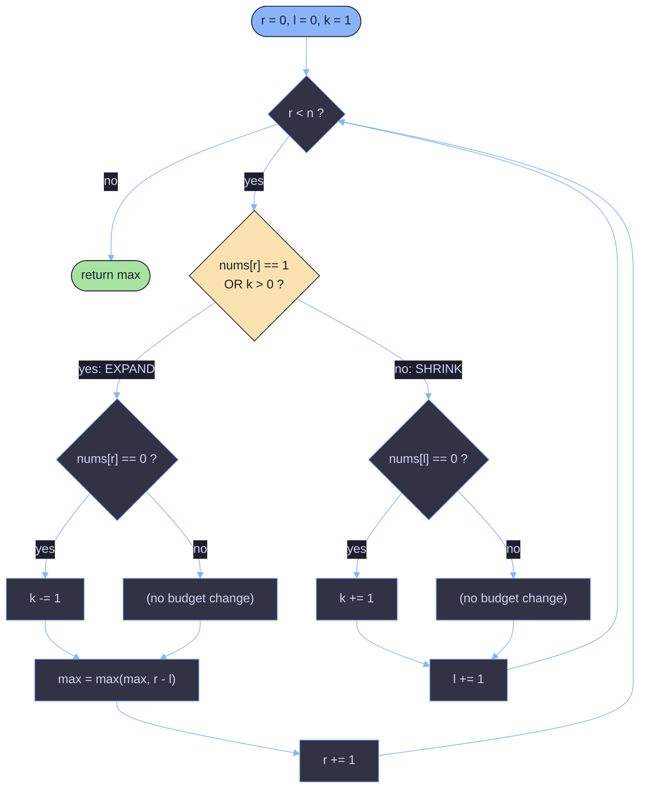

# Longest Subarray of 1's After Deleting One Element

A walkthrough of a sliding-window solution to **LeetCode 1493**: given a binary array `nums`, find the length of the longest subarray containing only `1`s **after deleting exactly one element** from the array.

```java
class Solution {
    public int longestSubarray(int[] nums) {
        int k = 1;
        int l = 0, r = 0;
        int max = 0;
        while (r < nums.length) {
            if (nums[r] == 1 || k > 0) {
                if (nums[r] == 0) k--;
                max = Math.max(max, r - l);
                r++;
            } else {
                if (nums[l] == 0) k++;
                l++;
            }
        }
        return max;
    }
}
```

---

## 1. Problem Restatement

Given a binary array `nums`, you must delete **exactly one** element (it can be a `0` or a `1`). After deleting it, return the length of the longest contiguous run of `1`s remaining.

Example: `nums = [1,1,0,1]` → delete the `0` → `[1,1,1]` → answer `3`.

This is a disguised version of a much simpler problem:

> **Find the longest subarray that contains at most one `0`.**

Why are these the same problem? Because "at most one `0`" describes a window you could turn into "all `1`s" by deleting that single `0` (or, if the window happens to have zero `0`s already, by deleting any one of its `1`s — the problem forces a deletion even when it isn't strictly needed). Either way, the answer is:

```
(length of the longest window with at most one 0) - 1
```

The `-1` accounts for the mandatory deletion. The code below builds that window with a **sliding window / two-pointer** technique and bakes the `-1` directly into how it measures the window, so you won't see an explicit `- 1` anywhere in the code.

---

## 2. Core Idea: Sliding Window with a "Budget"

Think of `k` as a **budget of zeros you're still allowed to include** in the current window. Here `k` starts at `1` — you're allowed exactly one zero inside the window at any time (that zero is the one you'll conceptually "delete").

Two pointers, `l` (left) and `r` (right), define the current window `[l, r)` — `r` is **exclusive**, i.e. it points to the *next* candidate element, not yet included.

The window only ever does two things:

- **Expand** (`r++`) when the incoming element is affordable — it's a `1`, or it's a `0` but you still have budget (`k > 0`).
- **Shrink** (`l++`) when the incoming element is a `0` and you have no budget left — you pay back one unit of budget as you shrink past a `0`.

This is the classic "at most one zero" sliding window pattern: the window **never shrinks below its best-ever size** — it only grows or slides, so `r` and `l` each move forward at most `n` times total. That's what makes it linear time.

---

## 3. Line-by-Line Walkthrough

```java
int k = 1;      // budget: how many zeros we can still tolerate in the window
int l = 0, r = 0; // window is nums[l..r), i.e. r is one-past-the-end
int max = 0;
```

```java
while (r < nums.length) {
    if (nums[r] == 1 || k > 0) {
```
This is the **"can we afford to include `nums[r]`?"** check:
- `nums[r] == 1` → always affordable, doesn't touch the budget.
- `k > 0` → `nums[r]` might be a `0`, but we still have budget left, so it's affordable too.

```java
        if (nums[r] == 0) k--;
```
If we just included a `0`, spend one unit of budget.

```java
        max = Math.max(max, r - l);
        r++;
    }
```
Update `max` **before** incrementing `r`. At this point the window is `[l, r]` inclusive (length `r - l + 1`), but the code records `r - l` (length **minus 1**). That "minus 1" is exactly the mandatory deletion from Section 1 — it's folded into the measurement instead of being subtracted at the end. Then the window expands: `r++`.

```java
    else {
        if (nums[l] == 0) k++;
        l++;
    }
}
```
If `nums[r]` is a `0` and the budget is already exhausted (`k == 0`), the window can't grow — it must shrink from the left instead. As `l` slides past a `0`, that `0` leaves the window, so the budget is refunded (`k++`). Note `r` does **not** advance in this branch — the loop simply re-tries the same `nums[r]` against the now-smaller (and possibly refunded) window on the next iteration.

```java
return max;
```

---

## 4. Why the Window Never Needs to Shrink Below Its Best Size

A key property of this pattern: once the window grows to some size, it **only ever grows again or holds steady** — it never needs to record a `max` with a smaller window than before. That's because:

- The window shrinks (`l++`) *only* to restore the "at most one `0`" invariant after a disallowed `0` shows up.
- `max` is only updated in the "affordable" branch, i.e. exactly when the window is valid — so every recorded window length already satisfies "at most one `0`".
- Because `l` only ever moves forward (never resets backward), and the window's size is monotonically non-decreasing at the moments `max` is recorded, a single left-to-right sweep is enough to find the global optimum. There's no need to reconsider earlier starting points.

This is what qualifies it as a true **sliding window** (both pointers monotonic, `O(n)` total movement) rather than a brute-force re-scan.

---

## 5. Trace Table

`nums = [1, 1, 0, 0, 1, 1, 1, 0, 1]` (indices 0–8)

| r | nums[r] | k before | Action | k after | max | l after |
|---|---------|----------|--------|---------|-----|---------|
| 0 | 1 | 1 | include (r-l=0-0=0) | 1 | 0 | 0 |
| 1 | 1 | 1 | include (r-l=1-0=1) | 1 | 1 | 0 |
| 2 | 0 | 1 | include, k-- (r-l=2-0=2) | 0 | 2 | 0 |
| 3 | 0 | 0 | **can't afford** → shrink: nums[l]=nums[0]=1, l=1 | 0 | 2 | 1 |
| 3 | 0 | 0 | **can't afford** → shrink: nums[l]=nums[1]=1, l=2 | 0 | 2 | 2 |
| 3 | 0 | 0 | **can't afford** → shrink: nums[l]=nums[2]=0, k++, l=3 | 1 | 2 | 3 |
| 3 | 0 | 1 | include, k-- (r-l=3-3=0) | 0 | 2 | 3 |
| 4 | 1 | 0 | include (r-l=4-3=1) | 0 | 2 | 3 |
| 5 | 1 | 0 | include (r-l=5-3=2) | 0 | 2 | 3 |
| 6 | 1 | 0 | include (r-l=6-3=3) | 0 | 3 | 3 |
| 7 | 0 | 0 | **can't afford** → shrink: nums[l]=nums[3]=0, k++, l=4 | 1 | 3 | 4 |
| 7 | 0 | 1 | include, k-- (r-l=7-4=3) | 0 | 3 | 4 |
| 8 | 1 | 0 | include (r-l=8-4=4) | 0 | 4 | 4 |

**Result: `max = 4`.**

Check by hand: the run `1,1,1,0,1` at indices `4..8` has one zero; delete it and you get `1,1,1,1` — length `4`. ✅

---

## 6. Edge Cases

| Case | Example | Behavior |
|---|---|---|
| All `1`s | `[1,1,1]` | The `0` never triggers, so `k` never drops to `0`. The window grows to cover the whole array, but `max` records `r - l` (length `- 1`), correctly forcing a deletion even though there's no zero to remove. |
| All `0`s | `[0,0]` | Window can hold one `0` (`k: 1→0`) before being forced to shrink. `max` stabilizes at `0` — after deleting the one allowed zero, no `1`s remain. |
| Single element | `[1]` or `[0]` | Loop runs once; `max` stays `0` since `r - l = 0` on the only iteration — matches the requirement that exactly one element must be deleted, leaving nothing. |
| One zero total | `[1,0,1]` | The whole array fits in budget; `max = r - l = 2`, i.e. delete the single `0` and keep both `1`s. |

---

## 7. Sliding Window State Machine



---

## 8. Complexity Analysis

**Time: `O(n)`**
`r` advances at most `n` times total (once per loop iteration where the "expand" branch fires). `l` advances at most `n` times total across the whole run (once per "shrink" branch firing), since `l` never exceeds `r`. Every loop iteration does `O(1)` work, so the total work across all iterations is `O(n) + O(n) = O(n)`.

**Space: `O(1)`**
Only a constant number of scalar variables (`k`, `l`, `r`, `max`) are used — no auxiliary arrays or data structures.

---

## 9. Generalizing Beyond `k = 1`

Nothing in the loop logic is specific to `k = 1` — it's written as a general "at most `k` zeros" sliding window (this is the same skeleton behind LeetCode 1004, *Max Consecutive Ones III*). Setting `k` to any non-negative integer answers: "what's the longest subarray with at most `k` zeros?" For **this** problem, `k = 1` combined with measuring `r - l` (instead of `r - l + 1`) is what encodes "at most one zero, and exactly one deletion is mandatory" in a single pass.