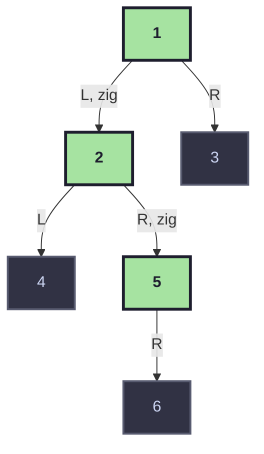

# Longest ZigZag Path in a Binary Tree

A deep dive into a recursive DFS solution for **LeetCode 1372 — Longest ZigZag Path in a Binary Tree**, explaining not just *what* the code does, but *why* it works.

---

## 1. Problem Statement

Given the root of a binary tree, a **zigzag path** is defined as:

- Choose any node as the starting point.
- From that node, you may move to a child that is **either** left or right.
- After the first move, every subsequent move must alternate direction: if you just moved **left**, the next move must be **right**, and vice versa.
- Moving in the same direction twice in a row **breaks** the zigzag — a *new* zigzag path effectively restarts from that point.

The **length** of a zigzag path is the number of edges (moves) travelled. Return the length of the **longest** zigzag path contained anywhere in the tree.

```
Example tree:

          1
           \
            1
           / \
          1   1
         /     \
        1       1
             \
              1
```

Here the longest zigzag path has length `3` (e.g. `right → left → right`).

---

## 2. Core Intuition

Think of standing at any node and asking two questions simultaneously:

1. **"If I keep going, treating myself as having just arrived via a LEFT move, how far can I zigzag?"**
2. **"If I keep going, treating myself as having just arrived via a RIGHT move, how far can I zigzag?"**

Every single node in the tree is a potential **starting point** of a fresh zigzag path. So rather than only extending one long path, the algorithm treats **every node as two possible pivot points**:

- Start fresh going **left**, then alternate.
- Start fresh going **right**, then alternate.

This is why the recursive function is called with a `left` flag — it tracks *"the direction I would need to move in next to continue the zigzag."*

### Why alternating forces a "flip"

If you just moved **right** to get to the current node, the *only* way to continue the zigzag is to move **left** next. If you instead moved left again, that's not a continuation of the same zigzag — it's the start of a **brand new** zigzag path (length reset to 1), because a single left-then-left is not alternating.

This gives the key recursive idea:

> At every node, one child **continues** the current zigzag (accumulator + 1), and the other child **starts a brand new** zigzag (accumulator resets to 1).

---

## 3. Annotated Code

```java
class Solution {
    int max = 0;

    public int longestZigZag(TreeNode root) {
        dfs(root, true, 0);
        return max;
    }

    public void dfs(TreeNode root, boolean left, int accumul) {
        if (root == null) {
            max = Math.max(accumul - 1, max);
            return;
        }

        // Continue the current zigzag by flipping direction
        if (left == false) dfs(root.right, true, accumul + 1);
        else dfs(root.left, false, accumul + 1);

        // Start a brand new zigzag path from this node
        if (left == false) dfs(root.left, false, 1);
        else dfs(root.right, true, 1);

        return;
    }
}
```

### What each piece means

| Element | Meaning |
|---|---|
| `left` (boolean) | The direction the **next** move must be, to keep the current zigzag alive. `true` means "next move should go left", `false` means "next move should go right". |
| `accumul` | The running edge-count of the zigzag path we are currently extending. |
| `root == null` | We've fallen off the tree — the path that was being built has just ended. Record `accumul - 1` as a candidate answer. |
| First `dfs(...)` call | **Continue** the zigzag: move in the required alternating direction, increment `accumul`. |
| Second `dfs(...)` call | **Restart** a new zigzag: move in the *same* direction we'd continue with next (but this call itself represents "starting over"), reset `accumul` to `1`. |

---

## 4. Why `accumul - 1` at the Base Case?

This is the trickiest part of the code, so let's unpack it carefully.

`accumul` is **incremented before** the recursive call is made — i.e., it represents *"the length of the path if this next node exists and we successfully move into it."*

But the base case triggers when `root == null`, meaning **we did NOT actually move anywhere** — the child we tried to visit doesn't exist. So the `accumul` value passed into this failed call is **one edge too many** (it already counted a move that didn't happen). Subtracting `1` corrects for this over-count.

### Concrete walkthrough

Say we're at some node `A`, we're continuing a zigzag, and `accumul = 3` going in. We call:

```
dfs(A.left, false, accumul + 1)   // accumul + 1 = 4
```

- **If `A.left` exists**: the recursion proceeds deeper with `accumul = 4` (correct — we really did take 4 edges so far).
- **If `A.left` is `null`**: the very same call receives `root == null` with `accumul = 4`. But we never actually took that 4th edge (there was no node to land on!) — the *real* longest path achieved by this branch was `4 - 1 = 3` edges. Hence `max = Math.max(accumul - 1, max)`.

This "increment then correct" pattern is a common trick: it lets the increment happen once, right before the call, rather than needing a separate check of "does the child exist?" before deciding whether to add 1.

---

## 5. Why the Two Recursive Calls Are Necessary

At every node, we don't know in advance which choice (continue vs. restart) leads to the longest path anywhere in the subtree. So the algorithm doesn't choose — it explores **both**, unconditionally, for every node:

1. **Continue the zigzag** — flip direction, `accumul + 1`.
2. **Restart the zigzag from this node** — treat this node as if it's a brand-new starting point, `accumul` reset to `1`.

Because `max` is a running global maximum updated at *every* leaf-fall-off (`root == null`), the longest path anywhere in the entire tree is guaranteed to be captured by *one* of these many parallel explorations — even if it doesn't include the original root at all.

> This is what makes the solution correct: it does not assume the longest zigzag starts at the root. Every node effectively gets a chance to be the starting point of its own zigzag, via the "restart" branch.

---

## 6. Step-by-Step Trace

Consider this small tree:

```
        1
       / \
      2   3
     / \
    4   5
         \
          6
```

Call `dfs(1, true, 0)` (the initial call always claims "the next move should be left", but with `accumul = 0` this is just a bootstrap — the first move in either direction is always valid).

| Call | Node | `left` | `accumul` | Action |
|---|---|---|---|---|
| 1 | `1` | `true` | `0` | Not null → recurse: continue via `dfs(1.left=2, false, 1)`, then restart via `dfs(1.right=3, true, 1)` |
| 2 | `2` | `false` | `1` | Not null → continue via `dfs(2.right=5, true, 2)`, restart via `dfs(2.left=4, false, 1)` |
| 3 | `5` | `true` | `2` | Not null → continue via `dfs(5.left=null, false, 3)`, restart via `dfs(5.right=6, true, 1)` |
| 4 | `null` (5.left) | `false` | `3` | Base case → `max = max(3-1, max) = 2` |
| 5 | `6` | `true` | `1` | Not null → continue via `dfs(6.left=null, false, 2)`, restart via `dfs(6.right=null, true, 1)` |
| 6 | `null` (6.left) | `false` | `2` | Base case → `max = max(2-1, max) = 2` |
| 7 | `null` (6.right) | `true` | `1` | Base case → `max = max(1-1, max) = 2` |
| 8 | `4` | `false` | `1` | Not null → continue via `dfs(4.right=null, true, 2)`, restart via `dfs(4.left=null, false, 1)` |
| 9 | `null` (4.right) | `true` | `2` | Base case → `max = max(2-1, max) = 2` |
| 10 | `null` (4.left) | `false` | `1` | Base case → `max = max(1-1, max) = 2` |
| 11 | `3` | `true` | `1` | Not null → continue via `dfs(3.left=null, false, 2)`, restart via `dfs(3.right=null, true, 1)` |
| ... | `null` × 2 | — | — | Both base cases give `max(1, 0) → max` stays `2` |

**Final answer: `max = 2`**, corresponding to the path `1 → 2 (left) → 5 (right)`.

### Visualizing the winning zigzag path



The highlighted path `1 → 2 → 5` alternates **left, right** — exactly `2` edges, matching our traced answer.

---

## 7. Complexity Analysis

| Aspect | Complexity | Reasoning |
|---|---|---|
| **Time** | `O(N)` | Each node is visited by exactly **two** recursive calls total across the whole traversal (one as a "continue" target, one as a "restart" target) from its parent, so total work is linear in the number of nodes `N`. Even though `dfs` is called twice per node, this is still a constant factor, not a blow-up (it is **not** exponential — see note below). |
| **Space** | `O(H)` | Where `H` is the height of the tree, due to the recursion call stack. Worst case `O(N)` for a completely skewed (linked-list-like) tree; `O(log N)` for a balanced tree. |