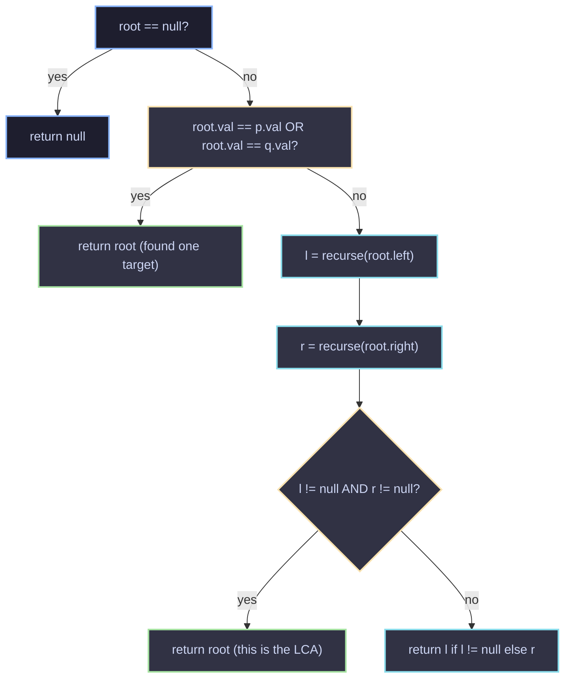

# Lowest Common Ancestor of a Binary Tree

## Problem

Given a binary tree and two nodes `p` and `q` that exist in the tree, find their **Lowest Common Ancestor (LCA)** — the deepest node that has both `p` and `q` as descendants (a node is allowed to be a descendant of itself).

```java
class Solution {
    public TreeNode lowestCommonAncestor(TreeNode root, TreeNode p, TreeNode q) {
        if (root == null) return null;

        if (root.val == q.val || root.val == p.val) return root;
        TreeNode l = lowestCommonAncestor(root.left, p, q);
        TreeNode r = lowestCommonAncestor(root.right, p, q);
        if (l != null && r != null) return root;
        return l != null ? l : r;
    }
}
```

---

## Intuition — think of it like search parties

Imagine you send a search party down the left subtree and another down the right subtree, each looking for `p` or `q`.

- If **both** parties come back with something, it means `p` was found on one side and `q` on the other. The only node that "sees" both is the one standing right where the two search parties split off — the current `root`. That makes `root` the LCA.
- If **only one** party finds something, it means either both `p` and `q` are on that same side (so the answer is buried deeper in that subtree), or that party simply stumbled onto one of the two targets on its way down — either way, whatever it returns is passed straight up, unchanged.
- If **neither** finds anything, this branch is a dead end, so we return `null`.

The trick that makes this work without extra bookkeeping is the base case:

```java
if (root.val == q.val || root.val == p.val) return root;
```

The moment recursion reaches `p` or `q`, it stops digging and reports "found it" upward immediately. It does **not** check whether the *other* node is somewhere below — and that's fine, because of a neat property explained below.

---

## Why it works

### Case 1: `p` and `q` are on different sides of some node
That node is exactly the LCA, since it's the lowest point where the paths to `p` and `q` diverge. When we recurse into its children, the left call will surface `p` (or `q`), and the right call will surface the other one. Both `l` and `r` become non-null at that node, so:

```java
if (l != null && r != null) return root;
```

correctly identifies it as the LCA and returns it.

### Case 2: One node is an ancestor of the other
Say `p` is an ancestor of `q`. Recursion reaches `p` first (since it's higher up) and returns it *immediately*, without descending further to check for `q`. That's actually correct: `p` itself qualifies as the LCA in this scenario, because "a node can be a descendant of itself." So stopping early doesn't cause a wrong answer — it happens to already be the right one.

### Case 3: The rest of the tree
For every node that isn't `p`, `q`, or their LCA, at most one side of it can contain a "found" result (or neither side does). So it simply relays whichever non-null result it received (or `null`) upward, unchanged:

```java
return l != null ? l : r;
```

This is why the same three lines of logic correctly handle all cases — the "return immediately on match" behavior and the "combine children" behavior work together without needing a separate flag for "found both."

---

## Walking through an example

```
        3
       / \
      5   1
     / \ / \
    6  2 0  8
      / \
     7   4
```

Finding LCA of `5` and `1`:

1. At `3`: neither matches, so recurse left (`5` subtree) and right (`1` subtree).
2. Left call on `5` immediately matches `5.val == p.val` → returns node `5`.
3. Right call on `1` immediately matches `1.val == q.val` → returns node `1`.
4. Back at `3`: both `l` (`5`) and `r` (`1`) are non-null → `3` is the LCA. ✅

Finding LCA of `6` and `4`:

1. At `3`: recurse left into `5`'s subtree, right into `1`'s subtree.
2. Right subtree (`1`) finds nothing → returns `null`.
3. Left subtree (`5`): matches `5`? No. Recurse left → finds `6` directly, returns `6`. Recurse right (`2`'s subtree) → eventually finds `4`, bubbles it up.
4. At node `5`: `l = 6`, `r = 4`, both non-null → `5` is the LCA. It bubbles up as the final answer since `3`'s right side was `null`. ✅

---

## Diagram of the recursive flow



---

## Complexity

| | Complexity | Why |
|---|---|---|
| **Time** | `O(n)` | In the worst case, every node in the tree is visited once. |
| **Space** | `O(h)` | `h` is the height of the tree, which is the depth of the recursion call stack. Worst case `O(n)` for a skewed tree, `O(log n)` for a balanced one. |

---

## Key takeaway

The elegance of this solution comes from letting the recursion do double duty:
- **Searching** (finding `p` or `q` and reporting it upward), and
- **Merging** (recognizing when a node is the meeting point of both searches).

No extra data structures, no parent pointers, no path storage — just a single pass down the tree and the natural way return values combine on the way back up.