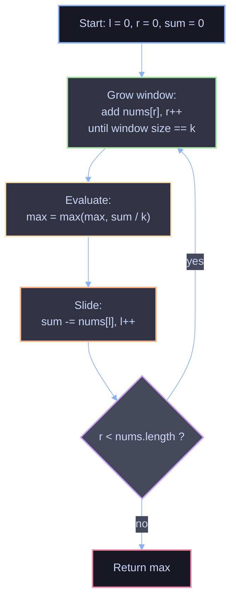

# Maximum Average Subarray I — Sliding Window Solution

## Problem

Given an integer array `nums` and an integer `k`, find a contiguous subarray of length `k` whose average value is maximum. Return that maximum average.

```java
class Solution {
    public static double findMaxAverage(int[] nums, int k) {
        double max = -Double.MAX_VALUE;
        double sum = 0;
        int l = 0, r = 0;
        while (r < nums.length) {
            while (r - l < k)
                sum += nums[r++];
            max = Math.max(max, sum / k);
            sum -= nums[l];
            l++;
        }

        return max;
    }
}
```

## Core Idea: Fixed-Size Sliding Window

The naive approach — recomputing the sum of every length-`k` window from scratch — does redundant work. Each time the window shifts by one position, it loses exactly one element on the left and gains exactly one element on the right; the elements in between don't change at all.

The sliding window technique exploits that overlap: maintain a running `sum` for the current window, and update it incrementally in O(1) as the window slides, instead of re-summing O(k) elements every time.

```
nums:  [1, 12, -5, -6, 50, 3],  k = 4

Window 1: [1, 12, -5, -6]                sum = 2
Window 2:    [12, -5, -6, 50]            sum = 2 - 1 + 50 = 51
Window 3:        [-5, -6, 50, 3]         sum = 51 - 12 + 3 = 42
```

Each transition costs one subtraction and one addition — not a full re-sum.

## How the Code Works

**Variables**
- `l`, `r` — left and right boundaries of the window (`r` is exclusive/next-to-add, `l` is the element about to leave).
- `sum` — the running total of the current window `nums[l..r-1]`.
- `max` — the best average found so far, initialized to the smallest possible double so any real average overwrites it.

**Step-by-step loop**

1. **Grow the window to size `k`.**
   The inner `while (r - l < k) sum += nums[r++];` expands the right edge, adding elements to `sum` until the window holds exactly `k` elements.

2. **Evaluate the window.**
   Once the window has `k` elements, `sum / k` is a valid candidate average. Compare it against `max`.

3. **Slide the window forward by one.**
   `sum -= nums[l]; l++;` removes the leftmost element from the running sum and advances `l`. This shrinks the window back to `k - 1` elements.

4. **Repeat.**
   The outer `while (r < nums.length)` loop re-enters, the inner `while` adds exactly one new element (`nums[r]`) to bring the window back to size `k`, and the cycle continues.

Because step 1's inner loop only ever adds **one** element per outer iteration (after the very first pass), the whole algorithm still does a single left-to-right sweep over `nums` — each index enters `sum` exactly once and leaves it exactly once.

## Why It Works

- **Correctness of the running sum:** `sum` always represents the exact total of `nums[l..r-1]`. It's built by addition (`sum += nums[r++]`) when the window grows and corrected by subtraction (`sum -= nums[l]`) when the window shrinks from the left — so at every point where it's read (`sum / k`), it reflects precisely the current `k` elements, no more and no less.
- **Every window of size `k` is checked exactly once:** the left boundary advances by exactly one each outer iteration, and the right boundary advances by exactly one to compensate — so the algorithm visits every valid window `[0..k-1], [1..k], [2..k+1], ...` in order, without skipping or repeating any.
- **Taking the max as you go finds the global max:** since every candidate window's average is compared against `max` before moving on, by the time the loop ends `max` has been checked against every possible window average, so it must hold the true maximum.

## Complexity

| | Complexity | Reasoning |
|---|---|---|
| Time | O(n) | `r` moves from `0` to `n` exactly once across the whole run; `l` does the same. No element is added or removed from `sum` more than once. |
| Space | O(1) | Only a fixed handful of scalar variables (`sum`, `max`, `l`, `r`) — no auxiliary array or map. |

This is a strict improvement over the brute-force O(n·k) approach (recomputing each window's sum independently).

## Visualizing the Slide



## Worked Example

```
nums = [1, 12, -5, -6, 50, 3], k = 4

l=0, r=0, sum=0
  grow: add 1, 12, -5, -6  -> sum = 2, r = 4
  eval: max = max(-inf, 2/4)   = 0.5
  slide: sum -= nums[0]=1 -> sum = 1, l = 1

  grow: add nums[4]=50 -> sum = 51, r = 5
  eval: max = max(0.5, 51/4)   = 12.75
  slide: sum -= nums[1]=12 -> sum = 39, l = 2

  grow: add nums[5]=3 -> sum = 42, r = 6
  eval: max = max(12.75, 42/4) = 12.75
  slide: sum -= nums[2]=-5 -> sum = 47, l = 3

r == nums.length -> loop ends
return max = 12.75
```

The maximum-average window is `[12, -5, -6, 50]`, averaging `12.75`.

## Edge Cases Handled

- **`k == nums.length`:** the window grows to cover the entire array once, is evaluated, and the loop terminates — correctly returning the average of the whole array.
- **Negative numbers:** `max` is initialized to `-Double.MAX_VALUE` rather than `0`, so an array of all-negative numbers still produces a correct (negative) result instead of being masked by a bad default.
- **Single valid window (`k == 1`):** each element is its own window; the algorithm degenerates naturally to finding the maximum single element.