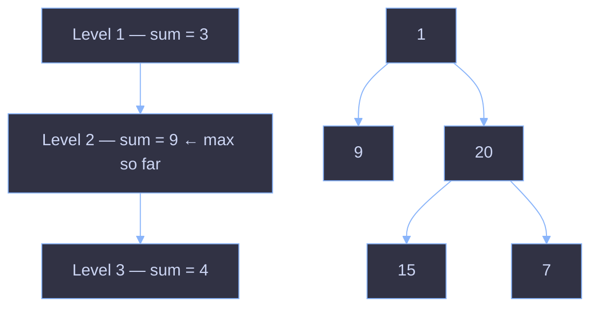

# Maximum Level Sum of a Binary Tree

## Problem

Given the `root` of a binary tree, the **level** of the root is `1`, the level of its children is `2`, and so on.

Return the **smallest level `x`** such that the sum of all the values of nodes at level `x` is **maximal**.

## Intuition

The problem is really asking two things at once:

1. Group the tree's nodes by depth (level).
2. Add up each group and find which group has the biggest total.

A binary tree doesn't naturally hand you nodes "by level" — you have to walk it that way. The cleanest way to visit a tree level-by-level is **Breadth-First Search (BFS)**, using a queue. BFS processes nodes in the exact order they appear from top to bottom, and — crucially — it lets you process one full level at a time before moving to the next, simply by tracking how many nodes are currently in the queue at the start of each round.

That's the whole trick: **snapshot the queue size before the loop, then only process that many nodes.** Anything added during the loop (the next level's children) waits for the next round.

## How the code works, step by step

```java
int res = 0;
int level = 1;
int maxSum = Integer.MIN_VALUE;
LinkedList<TreeNode> queue = new LinkedList<>();
queue.add(root);
```

- `res` will hold the answer — the level number with the largest sum.
- `level` starts at `1` (root is level 1, per the problem's definition) and increases by one each time we finish processing a level.
- `maxSum` starts as low as possible so the very first level's sum is guaranteed to beat it.
- The `queue` is the engine of the BFS. It starts with just the root node.

```java
while (!queue.isEmpty()){
    int size = queue.size();
    int sum = 0;
```

Each pass through this loop handles **exactly one level** of the tree.

- `size = queue.size()` is the key line. At this exact moment, the queue contains *only* the nodes belonging to the current level — nothing from the next level has been added yet. Capturing this number locks in "how many nodes am I responsible for this round."
- `sum` will accumulate the values of just this level's nodes.

```java
    for(int i = 0; i < size; i++) {
        TreeNode currNode = queue.pop();
        if (currNode.left != null) queue.add(currNode.left);
        if (currNode.right != null) queue.add(currNode.right);
        sum += currNode.val;
    }
```

This inner loop runs `size` times — no more, no less — so it processes precisely the nodes that were in the queue when the level started:

- Pop a node off the front of the queue.
- Push its non-null children onto the back of the queue. These children belong to the *next* level, so they'll simply wait there until this loop finishes and the outer `while` loop starts a new round.
- Add the popped node's value to `sum`.

Because children are added to the *back* of the queue while we're still popping from the *front*, they can never accidentally get processed in the same round — that's what keeps the levels cleanly separated using nothing but the `size` snapshot.

```java
    if (sum > maxSum) {
        res = level;
        maxSum = sum;
    }
    level++;
}
return res;
```

Once the inner loop finishes, `sum` holds the total for the entire level that was just processed.

- If it's strictly greater than the best sum seen so far, update `maxSum` and record `res = level`. Using strict `>` (not `>=`) is what naturally gives you the *smallest* level in case of a tie — an equal-or-lower sum at a later level simply won't pass the check, so the earliest max-achieving level sticks.
- Increment `level` to move on, and let the `while` loop check whether the queue (now full of next-level nodes) is still non-empty.

When the queue finally empties, every level has been visited, and `res` holds the level with the maximum sum.

## Visualizing the level-by-level sweep



The queue snapshot trick is what turns this tree into three clean horizontal "sum buckets": `[1]`, `[9, 20]`, `[15, 7]` — one sum computed per bucket, largest wins.

## Complexity

| | Complexity | Why |
|---|---|---|
| **Time** | `O(n)` | Every node is pushed and popped from the queue exactly once. |
| **Space** | `O(n)` | In the worst case (a very wide, shallow tree), the queue can hold up to roughly half the nodes at once — still bounded by the total number of nodes, `n`. |

## Why this approach (and not something else)

- **DFS with a level parameter** could also solve this — recursing down while tracking depth and accumulating sums into an array indexed by level. It works, but it's less intuitive here because "sum per level" is fundamentally a breadth-first concept; BFS gives it to you for free via the queue-size trick, with no extra bookkeeping array required.
- **BFS without the size snapshot** would break the level boundaries — you'd end up mixing nodes from different depths into the same "batch," since the queue keeps growing as you pop and push in the same loop.

The queue-size snapshot is the one idea that makes this whole solution work: it's what converts a generic "visit every node" traversal into a "visit exactly one level at a time" traversal.