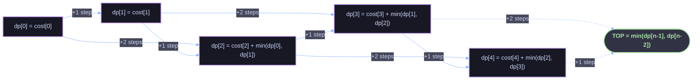

# Min Cost Climbing Stairs — Solution Walkthrough

## 1. Problem Statement

You're given an integer array `cost` where `cost[i]` is the cost of stepping **on** stair `i`. Once you pay the cost for a step, you can climb either **one** or **two** steps.

You can start your climb from step index `0` **or** step index `1`, and your goal is to reach the **top** of the staircase — which is one step *past* the last index (i.e., index `n`).

**Return the minimum cost to reach the top.**

### Example

```
cost = [10, 15, 20]

Option A: start at index 0 → pay 10 → jump 2 steps → land past index 2 (top)   = 10
Option B: start at index 1 → pay 15 → jump 2 steps → land past index 2 (top)   = 15

Minimum = 15
```

```
cost = [1, 100, 1, 1, 1, 100, 1, 1, 100, 1]
Minimum = 6
```

---

## 2. Core Idea: Dynamic Programming

The key observation is that **the cost of reaching any stair `i` depends only on the cost of reaching the two stairs immediately before it** (`i - 1` and `i - 2`), because from either of those you can take a 1-step or 2-step jump to land on `i`.

This "optimal answer depends on optimal answers to smaller subproblems" property is the hallmark of dynamic programming. If we define:

```
dp[i] = minimum total cost required to STAND on stair i
```

then, to stand on stair `i`, we must have arrived from stair `i-1` or stair `i-2`, and we must pay `cost[i]` once we're standing there. So:

```
dp[i] = cost[i] + min(dp[i - 1], dp[i - 2])
```

This recurrence is exactly what the code implements.

### Why it works (proof of correctness)

- **Optimal substructure**: The cheapest way to stand on stair `i` is built entirely from the cheapest ways to stand on stair `i-1` and stair `i-2` — there is no scenario where using a *suboptimal* path to `i-1` or `i-2` could ever produce a cheaper path to `i`. Since `cost[i]` is a fixed cost paid regardless of which of the two stairs you came from, minimizing the "arrival cost" independently minimizes the total.
- **No overlapping-choice ambiguity**: Every stair can only be reached from exactly two predecessors (`i-1`, `i-2`), so the recurrence covers *all* possible ways to arrive — nothing is missed.
- **Base cases are trivial**: `dp[0] = cost[0]` and `dp[1] = cost[1]` because you're allowed to *start* on either stair 0 or stair 1 for free (no prior cost) — the only cost incurred is stepping onto that stair itself.
- **The "top" isn't a real stair**: The top of the staircase is index `n` (one past the array), which has no cost. To reach it, you take a final 1-step or 2-step jump from either the last stair (`n-1`) or the second-to-last stair (`n-2`). So the final answer is `min(dp[n-1], dp[n-2])` — we never add a `cost[n]` because it doesn't exist.

---

## 3. Code Walkthrough

```java
class Solution {
    public int minCostClimbingStairs(int[] cost) {
        int n = cost.length;
        int[] dp = new int[n];
        dp[0] = cost[0];
        dp[1] = cost[1];
        for (int i = 2; i < n; i++) {
            dp[i] = cost[i] + Math.min(dp[i - 1], dp[i - 2]);
        }
        return Math.min(dp[n - 1], dp[n - 2]);
    }
}
```

| Line | What it does |
|---|---|
| `int n = cost.length;` | Number of physical stairs. |
| `dp[0] = cost[0];` | Base case — cost to stand on stair 0 is just its own cost. |
| `dp[1] = cost[1];` | Base case — cost to stand on stair 1 is just its own cost (you can start here directly). |
| `for (i = 2; i < n; i++)` | Build up every remaining stair's cheapest arrival cost from the two before it. |
| `dp[i] = cost[i] + Math.min(dp[i-1], dp[i-2]);` | The recurrence: pay to stand here, plus the cheaper of the two ways to have gotten here. |
| `return Math.min(dp[n-1], dp[n-2]);` | The top has no cost of its own — take the cheaper of the two possible final jumps. |

---

## 4. Step-by-Step Trace

Using `cost = [10, 15, 20]` (`n = 3`):

| Step | `i` | Computation | `dp[i]` |
|---|---|---|---|
| Base | 0 | given | `dp[0] = 10` |
| Base | 1 | given | `dp[1] = 15` |
| Loop | 2 | `20 + min(dp[1], dp[0])` = `20 + min(15, 10)` | `dp[2] = 30` |

Final answer: `min(dp[2], dp[1])` = `min(30, 15)` = **15** ✅

A longer trace with `cost = [1, 100, 1, 1, 1, 100, 1, 1, 100, 1]` (`n = 10`):

| `i` | `cost[i]` | `dp[i-1]` | `dp[i-2]` | `dp[i] = cost[i] + min(...)` |
|---|---|---|---|---|
| 0 | 1   | –   | –   | **1** (base) |
| 1 | 100 | –   | –   | **100** (base) |
| 2 | 1   | 100 | 1   | 1 + 1 = **2** |
| 3 | 1   | 2   | 100 | 1 + 2 = **3** |
| 4 | 1   | 3   | 2   | 1 + 2 = **3** |
| 5 | 100 | 3   | 3   | 100 + 3 = **103** |
| 6 | 1   | 103 | 3   | 1 + 3 = **4** |
| 7 | 1   | 4   | 103 | 1 + 4 = **5** |
| 8 | 100 | 5   | 4   | 100 + 4 = **104** |
| 9 | 1   | 104 | 5   | 1 + 5 = **6** |

Final answer: `min(dp[9], dp[8])` = `min(6, 104)` = **6** ✅ (matches the expected output)

---

## 5. Visualizing the Dependency Flow

Each stair's minimum cost depends on only its two immediate predecessors — forming a simple, acyclic chain of dependencies:



Every node only ever reads from the two nodes directly behind it — there's no need to look further back, and nothing later ever changes an earlier `dp[i]`. That's what makes a single forward pass sufficient.

---

## 6. Complexity Analysis

| Resource | Complexity | Reasoning |
|---|---|---|
| **Time** | `O(n)` | Single pass through the array; each `dp[i]` is computed once in `O(1)`. |
| **Space** | `O(n)` | The `dp` array stores one entry per stair. |

### Space-optimized variant

Since `dp[i]` only ever depends on the **last two** values, the full array is unnecessary — you can collapse it to two rolling variables and get `O(1)` space:

```java
class Solution {
    public int minCostClimbingStairs(int[] cost) {
        int n = cost.length;
        int prev2 = cost[0]; // dp[i-2]
        int prev1 = cost[1]; // dp[i-1]
        for (int i = 2; i < n; i++) {
            int curr = cost[i] + Math.min(prev1, prev2);
            prev2 = prev1;
            prev1 = curr;
        }
        return Math.min(prev1, prev2);
    }
}
```

This is a common follow-up optimization once the array-based DP is understood — same recurrence, same correctness argument, just without materializing the whole history.
