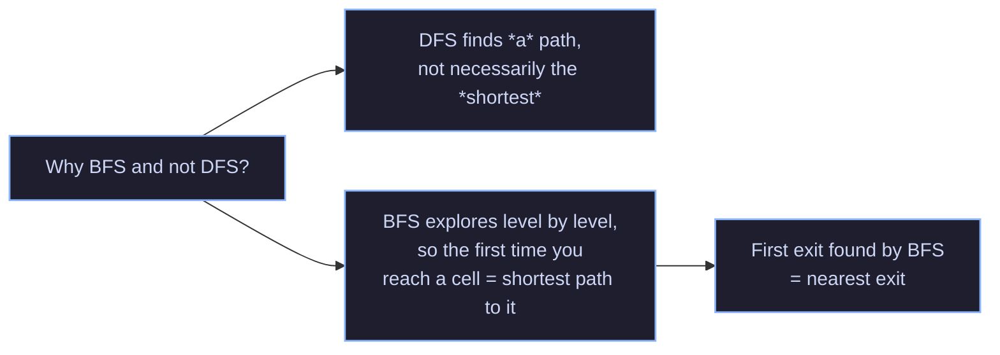
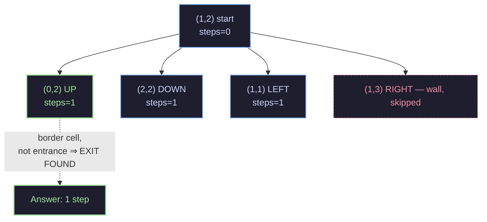
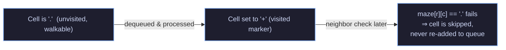

# Nearest Exit from Entrance in Maze — BFS Solution

## 1. Problem Statement

You're given a `rows x cols` maze grid, `maze`, where:

- `'.'` represents an **empty cell** you can walk through
- `'+'` represents a **wall** you cannot walk through

You start at the **entrance** cell `e = [entrance_row, entrance_col]`. In one step, you can move up, down, left, or right to an adjacent empty cell. An **exit** is defined as any empty cell that lies on the **border** of the maze (row `0`, row `rows-1`, col `0`, or col `cols-1`) — as long as it is **not** the entrance cell itself.

Return the **minimum number of steps** to reach the nearest exit, or `-1` if no exit is reachable.

---

## 2. Core Idea — Why BFS?

This is a **shortest path in an unweighted graph** problem. Every empty cell is a "node," and every move to an adjacent empty cell is an "edge" of weight `1`.

Whenever you need the *shortest* path where every edge costs the same amount, **Breadth-First Search (BFS)** is the right tool — not DFS, not backtracking.



**The key guarantee of BFS:** because it explores the maze in expanding "rings" — all cells 1 step away, then all cells 2 steps away, then 3, and so on — the *very first* border cell it discovers is guaranteed to be the *closest* one. There's no need to check every possible exit and compare; the first one found wins.

---

## 3. Walking Through the Code

```java
class Solution {

    public int nearestExit(char[][] maze, int[] e) {

        LinkedList<int[]> queue = new LinkedList<>();
        int rows = maze.length, cols = maze[0].length;

        queue.add(new int[]{e[0], e[1], 0});

        while (!queue.isEmpty()) {
            int[] cords = queue.pop();
            int r = cords[0], c = cords[1], steps = cords[2];

            if (r < rows && r >= 0 && c < cols && c >= 0 && maze[r][c] == '.') {
                if ((r == 0 || r == rows - 1 || c == 0 || c == cols - 1) && !(r == e[0] && c == e[1])) return steps;

                maze[r][c] = '+';
                queue.add(new int[]{r - 1, c, steps + 1});
                queue.add(new int[]{r + 1, c, steps + 1});
                queue.add(new int[]{r, c - 1, steps + 1});
                queue.add(new int[]{r, c + 1, steps + 1});
            }
        }

        return -1;
    }
}
```

### 3.1 Setup

```java
LinkedList<int[]> queue = new LinkedList<>();
int rows = maze.length, cols = maze[0].length;
queue.add(new int[]{e[0], e[1], 0});
```

- `queue` is the BFS frontier. Each element is `{row, col, steps}` — a position plus how many moves it took to get there.
- `rows` / `cols` cache the maze dimensions so we don't recompute `.length` repeatedly.
- The entrance is pushed in first, with `steps = 0` (we haven't moved yet).

> `LinkedList` is used here as a **FIFO queue**: `add()` appends to the tail, `pop()` (which is actually `removeFirst()` on a `LinkedList`, inherited from `Deque`) removes from the head. That FIFO order is what makes this BFS instead of DFS — cells are processed in the order they were discovered, oldest first.

### 3.2 The Main Loop

```java
while (!queue.isEmpty()) {
    int[] cords = queue.pop();
    int r = cords[0], c = cords[1], steps = cords[2];
```

Pull the oldest entry off the queue. This is the cell currently being visited.

### 3.3 Bounds + Wall Check (the "is this cell valid?" gate)

```java
if (r < rows && r >= 0 && c < cols && c >= 0 && maze[r][c] == '.') {
```

Before doing anything with `(r, c)`, this line checks **four conditions**, all of which must be true:

| Condition | Meaning |
|---|---|
| `r >= 0 && r < rows` | row is inside the grid |
| `c >= 0 && c < cols` | column is inside the grid |
| `maze[r][c] == '.'` | the cell is walkable (not a wall, and not already visited — see §3.5) |

If any condition fails, the whole `if` block is skipped — that neighbor is simply discarded. This one line does double duty as both the **boundary check** and the **"can I step here" check**.

### 3.4 Exit Check

```java
if ((r == 0 || r == rows - 1 || c == 0 || c == cols - 1) && !(r == e[0] && c == e[1])) return steps;
```

Once we know `(r, c)` is a valid, walkable, in-bounds cell, we check:

1. **Is it on the border?** — `r == 0` (top row), `r == rows-1` (bottom row), `c == 0` (left col), or `c == cols-1` (right col).
2. **Is it *not* the entrance?** — `!(r == e[0] && c == e[1])`. This matters because the entrance itself might sit on the border, but it doesn't count as an exit.

If both are true, we've found the nearest exit — and because BFS processes cells in increasing distance order, `steps` is guaranteed to be the minimum. Return immediately.

### 3.5 Marking Visited + Expanding

```java
maze[r][c] = '+';
queue.add(new int[]{r - 1, c, steps + 1});
queue.add(new int[]{r + 1, c, steps + 1});
queue.add(new int[]{r, c - 1, steps + 1});
queue.add(new int[]{r, c + 1, steps + 1});
```

- `maze[r][c] = '+'` overwrites the cell to look like a wall. This is a classic **in-place visited marker** — instead of allocating a separate `boolean[][] visited` array, the maze itself is reused. Once a cell is marked `'+'`, it will fail the `maze[r][c] == '.'` check in §3.3 forever after, so it can never be re-queued. This is what prevents infinite loops and redundant work.
- The four neighbors (up, down, left, right) are pushed onto the queue with `steps + 1`, to be processed later.

### 3.6 No Exit Found

```java
return -1;
```

If the queue empties out without ever hitting the exit condition, every reachable cell has been explored and none of them qualified — so there's no path to any exit.

---

## 4. Full Trace Example

Consider this 4x4 maze, entrance at `[1, 2]` (marked `S`), `'.'` = open, `'+'` = wall:

```
+ + . +
. . . +
+ + . .   <- S is here at (1,2)... wait, let's index it properly
+ + + +
```

To keep it concrete, use this exact grid (0-indexed):

```
Row 0: + + . +
Row 1: . . . +
Row 2: + + . .
Row 3: + + + +
```

Entrance `e = [1, 2]`.

| Step # popped | (r, c) | Is border? | Is entrance? | Result |
|---|---|---|---|---|
| 0 | (1, 2) | No (row 1, col 2 — interior) | Yes | Mark visited, enqueue 4 neighbors at steps=1 |
| 1 | (0, 2) | **Yes** (row 0) | No | `maze[0][2] == '.'`? Yes → **return 1** |

**Trace of the queue contents (simplified, `.` cells only):**



`(0, 2)` is popped right after the entrance's neighbors are generated, it's on row `0` (the border), and it isn't the entrance — so the function returns `1`. That matches intuition: from `(1,2)`, one step up lands you at `(0,2)`, which is on the edge of the maze.

---

## 5. Why the In-Place Wall Marking Is Safe

A common worry: "Doesn't overwriting the maze destroy data we might need later?"

No — because BFS only needs to know, for each cell, **whether it's still open to visit**. Once a cell has been dequeued and expanded, we never need to "re-read" its original value; we only ever needed to know it *was* `'.'`. Turning it into `'+'` after processing is equivalent to marking it `visited = true`, just without extra memory.



This avoids double-processing and guarantees the algorithm terminates — each cell enters the queue **at most once**.

---

## 6. Complexity Analysis

Let `m = rows`, `n = cols`, and `N = m * n` be the total number of cells.

### Time Complexity: `O(m * n)`

- Each cell is enqueued **at most once** (because it's immediately marked `'+'` after being scheduled for expansion — well, more precisely, right when it's dequeued and validated).
- Each cell, when dequeued, does O(1) work (bounds check, border check, enqueue 4 neighbors).
- Total work: `O(m * n)`.

### Space Complexity: `O(m * n)`

- In the worst case (e.g., an open maze with no walls), the queue can hold a large fraction of all cells at once — proportional to the size of the BFS frontier, which is bounded by `O(m * n)`.
- No extra visited array is used (the maze itself serves that purpose), which saves memory compared to a naive BFS implementation.

---
