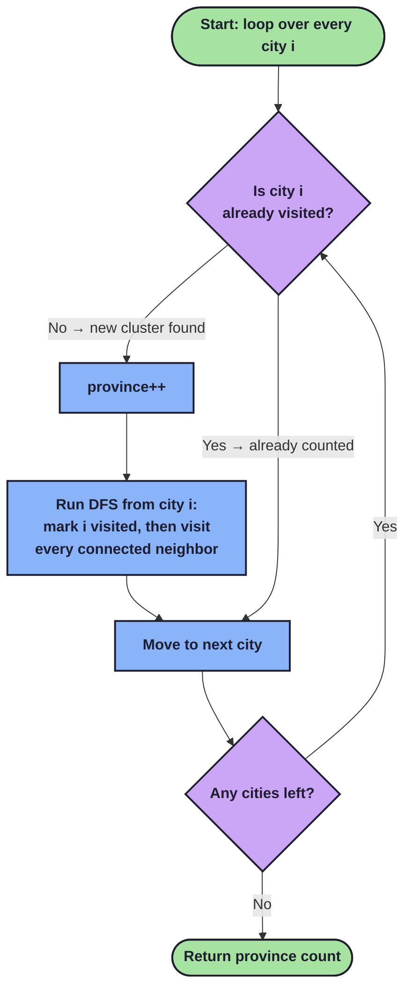

# Number of Provinces — DFS Solution

## The Problem

You're given `isConnected`, an `n x n` matrix where `isConnected[i][j] = 1` means city `i` and city `j` are directly connected, and `0` means they aren't. A **province** is a group of cities that are connected directly or indirectly — think of it as a friend group where everyone can reach everyone else through some chain of connections.

**Goal:** count how many separate provinces (groups) exist.

This is really just **"count the number of connected components in a graph"**, dressed up as a cities problem. The matrix is an adjacency matrix, and each city is a node.

## The Core Idea

Imagine each city as a dot, and a line between two dots if they're connected. Some dots form clusters, and other clusters are completely isolated from each other (no lines between clusters). We want to count the clusters.

The strategy:
1. Walk through every city, one by one.
2. If a city hasn't been visited yet, it means we've found a **new** province — increment our counter.
3. From that city, explore *everything* reachable from it (its direct connections, their connections, and so on) using **DFS (Depth-First Search)**, marking each one as visited along the way.
4. Once DFS finishes, every city in that entire cluster is marked visited, so we won't recount it.
5. Keep going until every city has been visited.

This works because DFS guarantees that once you start at a city, you will touch *every* city reachable from it before you stop — so an entire province gets "claimed" (marked visited) in one DFS call.



## Walking Through the Code

```java
class Solution {
    HashSet<Integer> visited = new HashSet<>();
    public int findCircleNum(int[][] isConnected) {
        int province = 0;
        for(int i = 0; i < isConnected.length; i++) {
            if (!visited.contains(i)) {
                province++;
                dfs(i, isConnected);
            }
        }
        return province;
    }
    ...
```

- **`visited`** is a `HashSet<Integer>` that remembers which cities we've already explored, so we never process the same city twice.
- We loop over every city index `i` from `0` to `n-1`.
- If `i` is **not** in `visited`, that means we've stumbled onto a city belonging to a province we haven't discovered yet. So:
  - We increment `province` (found one more group).
  - We call `dfs(i, isConnected)`, which will mark `i` and every city reachable from `i` as visited.
- If `i` **is** already visited, it means some earlier DFS call already swept it up into a province we already counted — so we just skip it.

By the time the loop finishes, `province` holds the total number of clusters.

```java
    void dfs(int city, int[][] isConnected) {
        if (visited.contains(city)) return;
        visited.add(city);

        int[] connections = isConnected[city];
        for(int i = 0; i < connections.length; i++) {
            if (connections[i] == 1 && !visited.contains(i))
                dfs(i, isConnected);
        }
    }
}
```

This is a standard **recursive DFS**:

- **Base case / safety check:** if `city` is already visited, stop immediately — this prevents infinite loops (since the graph can have cycles, e.g. city A connects to B and B connects back to A).
- **Mark it visited:** `visited.add(city)` — claim this city as part of the current province.
- **Look at its row in the matrix:** `isConnected[city]` is the list of 0s and 1s showing which cities `city` is directly connected to.
- **Recurse into every unvisited neighbor:** for each `i` where `connections[i] == 1` (a direct connection) and `i` hasn't been visited yet, we call `dfs(i, ...)`. This is what lets us "chain" through indirect connections — if city 0 connects to city 1, and city 1 connects to city 2, this recursion naturally walks 0 → 1 → 2 and marks all three as part of the same province, even though 0 and 2 aren't directly connected.

## Why It Works

- Every city belongs to **exactly one** province, so as soon as we discover an unvisited city, running DFS from it will mark *its entire province* as visited — no more, no less — because DFS only follows actual edges (1s in the matrix).
- The outer loop only increments `province` when it finds a city that hasn't been "claimed" by a previous DFS. This guarantees we count each province exactly once, since the DFS from any starting point inside a province is guaranteed to reach every other city in that same province.
- The `visited` set acts as our "already counted" memory across the whole algorithm, not just within a single DFS call — that's why it's declared as an instance field rather than reset for each city.

## Complexity

- **Time:** `O(n²)` — for each city, DFS may scan its entire row of the matrix (`n` entries), and there are `n` cities.
- **Space:** `O(n)` — for the `visited` set and the recursion call stack in the worst case (a single long chain of connections).

## Example

```
isConnected = [
  [1, 1, 0],
  [1, 1, 0],
  [0, 0, 1]
]
```

- Start at city `0`: not visited → `province = 1`. DFS marks `0` and `1` visited (since they're connected).
- Move to city `1`: already visited → skip.
- Move to city `2`: not visited → `province = 2`. DFS marks `2` visited (it has no connections besides itself).
- Loop ends. **Answer: 2 provinces** — `{0, 1}` and `{2}`.