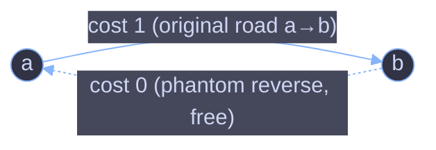
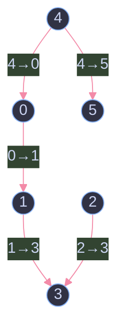

# Reorder Routes to Make All Paths Lead to the City Zero

**LeetCode 1466** — Solution walkthrough: intuition, proof of correctness, step-by-step trace, and complexity analysis.

---

## 1. Problem Statement

There are `n` cities numbered from `0` to `n - 1`, connected by `n - 1` roads. Because there are exactly `n - 1` roads connecting `n` nodes with every city reachable from every other city, **the road network forms a tree** (no cycles).

Each road is given as a **directed** edge `[a, b]`, meaning the road was originally built to go **from city `a` to city `b`**. You want every city to be able to reach city `0`. Roads are one-directional, so any road that currently points *away* from city `0` needs to be reversed.

> Return the **minimum number of roads that must be reversed** so that every city can travel to city `0`.

**Example**

```
Input:  n = 6, connections = [[0,1],[1,3],[2,3],[4,0],[4,5]]
Output: 3
```

---

## 2. Core Intuition

Two key observations make this problem tractable:

1. **It's a tree, not a general graph.** With `n - 1` edges and full connectivity, there is exactly **one unique path** between any two cities and **zero cycles**. That means a simple traversal (DFS or BFS) from city `0` can visit every node exactly once — no need to worry about revisiting or choosing between multiple paths.

2. **Direction is just a label we can flip.** If we forget direction and treat the tree as undirected, we can walk from `0` outward to every other city. For each undirected edge we cross during that walk, we ask: *"Does this edge already point toward `0` (good), or away from `0` (needs flipping)?"*

   - An edge `[a, b]` (built as `a → b`) is "wrong" whenever our walk goes **from `a` to `b`** — because that means, in the original tree, the road pushes traffic *away* from `0`, deeper into the tree. We'd need to reverse it so it instead goes `b → a`, pulling traffic back **toward** `0`.
   - If our walk instead goes **from `b` to `a`** along that same road, the road already points toward `0`. No fix needed.

So the whole problem reduces to: **do a DFS from node `0` over the tree treated as undirected, and count how many edges we traverse in their "wrong" (originally-built) direction.**

---

## 3. Why the Solution Works (Proof Sketch)

- Because the graph is a **tree**, DFS from `0` reaches every node via **exactly one** simple path — there is no alternative route to consider, so the DFS traversal *is* the final routing structure. This guarantees the DFS visits every edge exactly once and never needs to "undo" a decision.
- Reversing a road only affects that single edge; it doesn't create or remove any other path, since the tree has no cycles. So the total number of reversals is simply the count of edges that were traversed against the direction we need (i.e., against "toward `0`").
- Since DFS visits **every** edge in the tree exactly once (each edge connects a parent to exactly one child in the DFS tree), summing up "was this edge in the wrong direction?" over the whole traversal gives the **exact minimum** — you can't do better, because every misdirected edge on the unique path to `0` *must* be reversed, and none of the correctly-directed edges need to be touched.

**The clever trick in the code**: instead of storing directions and checking them explicitly, the code builds **two entries per road** in the adjacency list:

- `a → b` with **cost `1`** (this is the *original* direction — if DFS uses this edge to go from `a` to `b`, it means we walked the "wrong way," so it costs 1 reversal).
- `b → a` with **cost `0`** (this is the *reverse* — a "phantom" edge added only so DFS can walk from `b` back to `a` without cost, representing "this direction is already correct, no reversal needed").

When DFS moves from a city to its neighbor, it simply **adds the edge's cost** to the running total. This elegantly folds the direction-check logic into a single `count += n.cost` line.

---

## 4. Visualizing the Trick



Both directions exist in the adjacency list, but only one of them is "expensive." DFS will naturally choose whichever edge leads to an unvisited node — and whichever one it picks tells us, via its cost, whether that road needs reversing.

---

## 5. Worked Example, Step by Step

Using the sample input:

```
n = 6
connections = [[0,1], [1,3], [2,3], [4,0], [4,5]]
```

**Step 1 — Build the tree (undirected shape):**



Arrows show the **original** direction each road was built in. We need every city to be able to reach `0`.

**Step 2 — Adjacency list built by the code** (for each road `a→b`, add `a→b` cost 1 and `b→a` cost 0):

| From | To | Cost | Meaning |
|------|----|----|---------|
| 0 | 1 | 1 | original direction (wrong way if used) |
| 1 | 0 | 0 | reverse (correct way, free) |
| 1 | 3 | 1 | original direction |
| 3 | 1 | 0 | reverse |
| 2 | 3 | 1 | original direction |
| 3 | 2 | 0 | reverse |
| 4 | 0 | 1 | original direction |
| 0 | 4 | 0 | reverse |
| 4 | 5 | 1 | original direction |
| 5 | 4 | 0 | reverse |

**Step 3 — DFS from city `0`, tracing `visited`, `count`, and the call stack:**

| Call | City | Action | Edge used | Cost added | Running `count` |
|------|------|--------|-----------|-------------|------------------|
| 1 | `dfs(0)` | visit 0 | — | — | 0 |
| 2 | ↳ neighbor `1` (via edge `0→1`, cost 1) | 0's original road points *away* from 0 → wrong way | `0→1` | +1 | **1** |
| 3 | `dfs(1)` | visit 1 | — | — | 1 |
| 4 | ↳ neighbor `0`: already visited, skip | `1→0` (cost 0) | skip | — | 1 |
| 5 | ↳ neighbor `3` (via edge `1→3`, cost 1) | road points away from 0 → wrong way | `1→3` | +1 | **2** |
| 6 | `dfs(3)` | visit 3 | — | — | 2 |
| 7 | ↳ neighbor `1`: visited, skip | — | skip | — | 2 |
| 8 | ↳ neighbor `2` (via edge `3→2`, cost 0) | this is the *reverse* entry — original road `2→3` already points toward 0 → correct! | `3→2` | +0 | 2 |
| 9 | `dfs(2)` | visit 2 | — | — | 2 |
| 10 | ↳ neighbor `3`: visited, skip | — | skip | — | 2 |
| 11 | back to `dfs(0)` ↳ neighbor `4` (via edge `0→4`, cost 0) | reverse entry — original road `4→0` already points toward 0 → correct! | `0→4` | +0 | 2 |
| 12 | `dfs(4)` | visit 4 | — | — | 2 |
| 13 | ↳ neighbor `0`: visited, skip | — | skip | — | 2 |
| 14 | ↳ neighbor `5` (via edge `4→5`, cost 1) | road points away from 0 → wrong way | `4→5` | +1 | **3** |
| 15 | `dfs(5)` | visit 5, no unvisited neighbors | — | — | 3 |

**Final answer: `count = 3`** ✅ — matches the expected output.

**Interpreting the result:** roads `0→1`, `1→3`, and `4→5` all point *away* from city `0` in the original layout, so they must be reversed to `1→0`, `3→1`, and `5→4`. After flipping those three, every city has a directed path to `0`.

---

## 6. Annotated Code Walkthrough

```java
class Solution {

    public class Pair {
        int neighbor;
        int cost;

        Pair(int n, int cost) {
            this.neighbor = n;
            this.cost = cost;
        }
    }

    boolean[] visited;
    List<List<Pair>> adjList;
    int count = 0;

    public int minReorder(int n, int[][] connections) {

        adjList = new ArrayList<>();
        visited = new boolean[n];

        for (int i = 0; i < n; i++) {
            adjList.add(new ArrayList<>());
        }

        // For every road a -> b:
        //   store a -> b with cost 1 (original direction; using it means "wrong way")
        //   store b -> a with cost 0 (reverse direction; using it means "already correct")
        for (int[] con : connections) {
            int a = con[0], b = con[1];

            adjList.get(a).add(new Pair(b, 1));
            adjList.get(b).add(new Pair(a, 0));
        }

        dfs(0); // start the walk from city 0 — the tree guarantees one unique path to every node

        return count;
    }

    void dfs(int city) {
        visited[city] = true;

        for (Pair n : adjList.get(city)) {
            if (!visited[n.neighbor]) {
                count += n.cost; // add 1 if we're traversing an original (wrong-way) road, 0 otherwise
                dfs(n.neighbor);
            }
        }
    }
}
```

**Why `Pair` carries a cost instead of a boolean "needs-flip" flag:** it lets the DFS accumulate the answer in one line (`count += n.cost`) without any branching (`if (isOriginalDirection) count++`). Functionally identical, but slightly terser.

---

## 7. Complexity Analysis

| Resource | Complexity | Explanation |
|---|---|---|
| **Time** | `O(n)` | Each of the `n` cities is visited exactly once (`visited[]` guard), and each of the `2(n-1)` adjacency-list entries is examined exactly once across the whole DFS, since it's a tree with `n - 1` edges. |
| **Space (adjacency list)** | `O(n)` | `2(n-1)` `Pair` objects total — two per road. |
| **Space (recursion stack)** | `O(n)` worst case | A skewed tree (essentially a linked list) makes DFS recurse `n` levels deep. |
