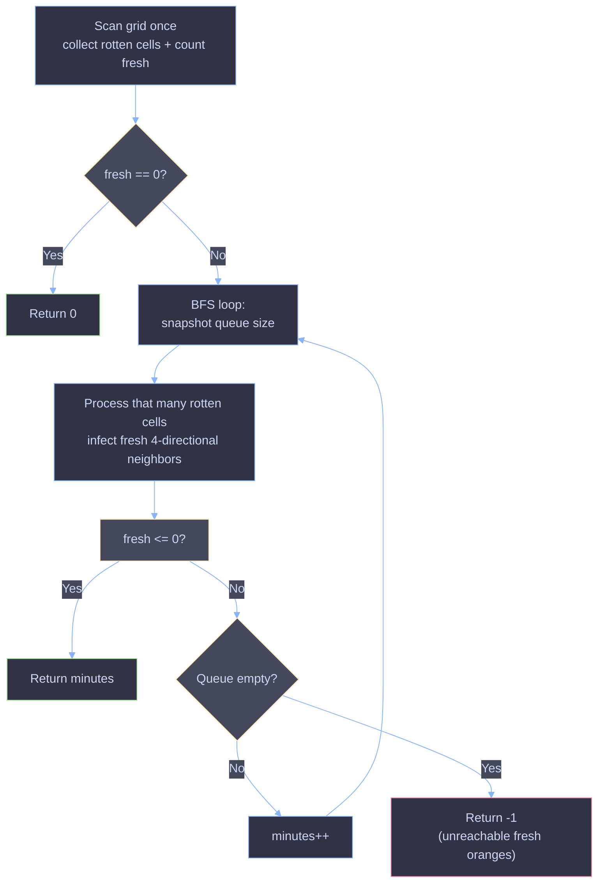

# Rotting Oranges — Multi-Source BFS

## Problem Statement

You're given an `m x n` grid where each cell can have one of three values:

- `0` — an empty cell
- `1` — a fresh orange
- `2` — a rotten orange

Every minute, any fresh orange that is **4-directionally adjacent** to a rotten orange also becomes rotten.

Return the **minimum number of minutes** that must elapse until **no cell has a fresh orange**. If this is impossible, return `-1`.

---

## Core Idea

This is a classic **multi-source Breadth-First Search (BFS)** problem in disguise.

The key insight: rot doesn't spread from one orange — it spreads from *all* rotten oranges *at the same time*, one layer per minute. That "spreading in layers, all at once" behavior is exactly what BFS does when you seed the queue with **every** rotten orange before you start, instead of just one starting point.

Think of it like ripples in water: if you drop 5 stones into a pond simultaneously, the ripples expand together, minute by minute, until they've covered everything they can reach.

---

## Why BFS (and not DFS)?

DFS explores one path as deep as possible before backtracking — it doesn't naturally understand "minutes" or "layers."

BFS explores level by level. If we process **all currently rotten oranges together** in one round, then every fresh orange that turns rotten in that round is *exactly* one minute away from the nearest rotten orange. That's precisely what the problem asks us to compute.

---

## Step-by-Step Walkthrough

### 1. Scan the grid once

```java
for(int i = 0; i < rows; i++) {
    for(int j = 0; j < cols; j++) {
        if (grid[i][j] == 2) rotten.add(new int[]{i, j});
        if (grid[i][j] == 1) fresh++;
    }
}
```

We do a single pass to:
- Collect the coordinates of **every** rotten orange into a queue (these are our BFS starting points).
- Count how many **fresh** oranges exist. This count doubles as our "are we done yet?" signal.

**Why track `fresh`?** Instead of re-scanning the grid at the end to check whether any `1`s remain, we decrement a counter every time an orange rots. When it hits `0`, we know instantly — no second scan needed.

### 2. Handle the trivial case

```java
if (fresh == 0) return 0;
```

If there were no fresh oranges to begin with, no time needs to pass. This also protects us from an edge case later (see below).

### 3. BFS, level by level

```java
while (!rotten.isEmpty() && fresh > 0) {
    int size = rotten.size();
    minutes++;
    for(int i = 0; i < size; i++) {
        ...
    }
}
```

This is the heart of the algorithm. The trick is `int size = rotten.size();` taken **before** the inner loop starts.

- `size` freezes a snapshot of exactly how many oranges were rotten *at the start of this minute*.
- The inner `for` loop processes exactly that many oranges — even though new (freshly-rotted) oranges are being pushed into the same queue during the loop.
- Any orange added *during* this round won't be touched until the *next* round, because the inner loop only runs `size` times.

This is what makes the queue naturally partition itself into clean "minute 1 oranges," "minute 2 oranges," "minute 3 oranges," etc. Each full pass through the `while` loop = one minute elapsed, so we increment `minutes` once per round.

### 4. Spread the rot in 4 directions

```java
int[] cords = rotten.pop();
int r = cords[0], c = cords[1];
if (r - 1 >= 0 && grid[r - 1][c] == 1) { ... }
if (r + 1 < rows && grid[r + 1][c] == 1) { ... }
if (c - 1 >= 0 && grid[r][c - 1] == 1) { ... }
if (c + 1 < cols && grid[r][c + 1] == 1) { ... }
```

For each rotten orange popped from the queue, we check its 4 neighbors (up, down, left, right). For each neighbor that:
1. Is inside the grid bounds, **and**
2. Currently holds a fresh orange (`1`),

...we:
- Mark it rotten (`grid[r][c] = 2`) — this also prevents it from being processed twice.
- Decrement `fresh`.
- Push its coordinates into the queue so it spreads rot to *its* neighbors on the *next* round.

### 5. Early exit

```java
if (fresh <= 0) return minutes;
```

The moment the fresh count hits zero, there's no reason to keep looping — every orange that can rot has rotted, and we already know how many minutes it took. Returning immediately avoids unnecessary extra iterations.

### 6. Final result

```java
return fresh <= 0 ? minutes : -1;
```

If the loop ends naturally (queue empties) and `fresh` is still greater than `0`, it means some fresh oranges were unreachable — isolated by empty cells or grid boundaries — so it's impossible for them to ever rot. We return `-1`.

Otherwise, all oranges rotted successfully, and `minutes` holds the answer.

---

## Visual Walkthrough



---

## Worked Example

```
Grid:
2 1 1
1 1 0
0 1 1
```

**Minute 0:** Rotten queue = `[(0,0)]`, fresh = 6

**Minute 1:** Process `(0,0)`. Its right neighbor `(0,1)` and bottom neighbor `(1,0)` are fresh → both rot.
Queue becomes `[(0,1), (1,0)]`, fresh = 4

**Minute 2:** Process `(0,1)` and `(1,0)`.
- `(0,1)` rots `(0,2)` and `(1,1)`.
- `(1,0)` has no new fresh neighbors (its only fresh neighbor `(1,1)` may already be claimed this round).

Queue becomes `[(0,2), (1,1)]`, fresh = 2

**Minute 3:** Process `(0,2)` and `(1,1)`.
- `(1,1)` rots `(2,1)`.

Queue becomes `[(2,1)]`, fresh = 1

**Minute 4:** Process `(2,1)`.
- Rots `(2,2)`.

fresh = 0 → **return 4**

---

## Complexity Analysis

| Aspect | Complexity | Explanation |
|---|---|---|
| **Time** | `O(rows × cols)` | Every cell is visited a constant number of times: once during the initial scan, and at most once when it transitions from fresh to rotten. |
| **Space** | `O(rows × cols)` | Worst case, the queue could hold nearly every cell in the grid (e.g., a checkerboard-like pattern of initial rotten oranges). |

---

## Why This Solution Is Correct

1. **All rotten oranges start simultaneously** — seeding the queue with every initial `2` (not just one) ensures the BFS models "rot spreads from every source in parallel," matching the problem's real-world behavior.
2. **Level-by-level processing** (via the `size` snapshot trick) guarantees that all oranges rotted in the same round are recorded as taking the same number of minutes — which is exactly the semantics BFS layers provide.
3. **Marking cells rotten immediately** (`grid[r][c] = 2`) when they're discovered, rather than when they're processed, prevents the same cell from being added to the queue multiple times, avoiding redundant work and double-counting.
4. **The `fresh` counter** gives an O(1) way to detect completion, and the final check (`fresh <= 0 ? minutes : -1`) correctly distinguishes "everything rotted" from "some oranges were permanently unreachable."

---

## Key Takeaways

- Whenever a problem involves something spreading from **multiple starting points simultaneously** (fire, infection, rot, flooding), think **multi-source BFS**: seed the queue with *all* sources before the first iteration.
- The "snapshot the queue size before the inner loop" pattern is the standard way to make BFS layer-aware, which is essential whenever you need to count **steps/minutes/levels**, not just reachability.
- Mutate state (mark visited/rotten) at **insertion time**, not processing time, to avoid duplicate queue entries.