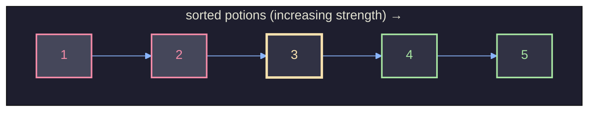
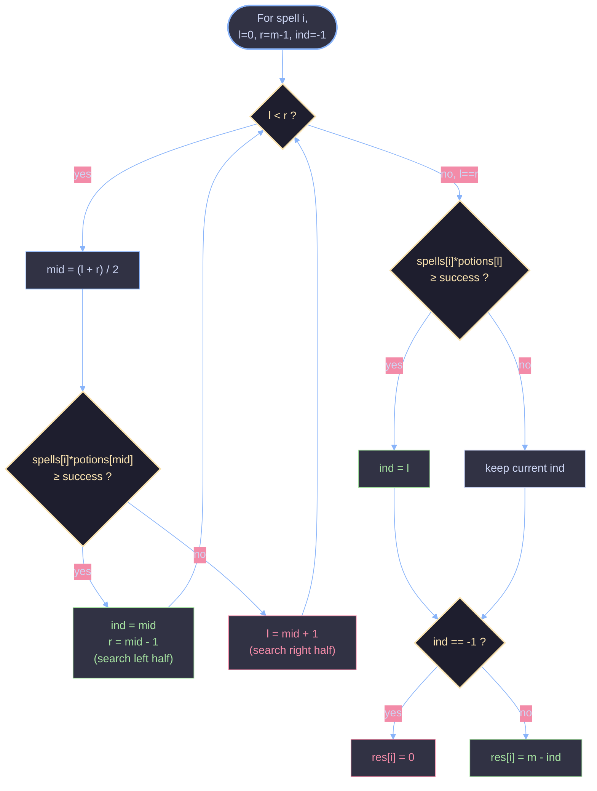

# Successful Pairs of Spells and Potions

A binary-search solution to LeetCode's [2300. Successful Pairs of Spells and Potions](https://leetcode.com/problems/successful-pairs-of-spells-and-potions/), with a full walkthrough of *why* the approach works, not just *how*.

---

## 1. Problem Statement

You are given:
- `spells[i]` — the strength of the `i`-th spell
- `potions[j]` — the strength of the `j`-th potion
- `success` — a threshold (as a `long`, since it can exceed `int` range)

A spell-potion pair `(i, j)` is **successful** if:

```
spells[i] * potions[j] >= success
```

For **each spell**, return the number of potions that form a successful pair with it.

**Example**

```
spells  = [5, 1, 3]
potions = [1, 2, 3, 4, 5]
success = 7

pairs for spell 5: 5*1=5, 5*2=10, 5*3=15, 5*4=20, 5*5=25 → 4 succeed (all but 5*1)
pairs for spell 1: 1*1=1, 1*2=2, 1*3=3, 1*4=4, 1*5=5  → 0 succeed
pairs for spell 3: 3*1=3, 3*2=6, 3*3=9, 3*4=12,3*5=15 → 3 succeed

answer = [4, 0, 3]
```

---

## 2. Core Idea

**Brute force** checks every `(spell, potion)` pair: `O(n * m)`. With up to `10^5` spells and potions, that's `10^10` operations — far too slow.

The key insight: **fix a spell, and the condition `spells[i] * potions[j] >= success` becomes purely a function of `potions[j]`.**

Since `spells[i]` is a positive constant for a given `i`, multiplying it by an increasing sequence of potions produces an increasing sequence of products. That means: **if we sort `potions`, the pass/fail pattern for a fixed spell is monotonic** — all failing potions come first, all succeeding potions come after. There's a single "boundary" index where it flips from fail to pass.



Once we sort `potions` once (`O(m log m)`), we can find that boundary for **each spell** with **binary search** (`O(log m)` per spell) instead of scanning linearly (`O(m)` per spell).

This is the classic **"sort once, binary-search many times"** pattern — turns `O(n·m)` into `O((n + m) log m)`.

---

## 3. Why Binary Search Applies Here (the "why it works" part)

Binary search is only valid on a **monotonic predicate** — a boolean condition that is `false` for a prefix of the array and `true` for the rest (or vice versa), with no oscillation in between.

For a fixed spell `s`, define:

```
f(j) = (s * potions[j] >= success)
```

Because `potions` is sorted ascending and `s > 0`:

```
potions[0] <= potions[1] <= ... <= potions[m-1]
   ⇒  s*potions[0] <= s*potions[1] <= ... <= s*potions[m-1]
```

Multiplying a sorted sequence by a fixed positive constant **preserves order**. So `f(j)` is `false, false, ..., false, true, true, ..., true` — exactly the shape binary search needs. We are not searching for a *value*, we are searching for the **first index where `f(j)` flips from false to true** (the "lower bound" of success). Everything from that index to the end of the array is a successful potion.

Once that boundary index `ind` is found:

```
count of successful potions = m - ind
```

because every potion at or after `ind` is a hit.

---

## 4. Line-by-Line Walkthrough

```java
class Solution {
    public int[] successfulPairs(int[] spells, int[] potions, long success) {
        int n = spells.length, m = potions.length;
        int[] res = new int[n];
        Arrays.sort(potions);                       // (1) sort once, O(m log m)

        for (int i = 0; i < n; i++) {                // (2) for every spell...
            int l = 0, r = m - 1;
            int ind = -1;

            while (l < r) {                          // (3) binary search the boundary
                int mid = (l + r) / 2;
                long prod = (long) spells[i] * potions[mid];
                if (prod >= success) {
                    ind = mid;                        // candidate boundary found
                    r = mid - 1;                       // look further left for an earlier one
                } else {
                    l = mid + 1;                        // boundary must be to the right
                }
            }
            if ((long) spells[i] * potions[l] >= success)  // (4) check the final l
                ind = l;

            if (ind != -1) res[i] = m - ind;           // (5) count everything from ind..m-1
            else res[i] = 0;                            // no potion ever succeeds
        }

        return res;
    }
}
```

### (1) Sorting potions
Sorting is what makes the products monotonic for any fixed spell (see §3). This is done **once**, not per spell — that's where the efficiency comes from.

### (2) Looping over spells
Each spell is independent — its own binary search, its own boundary.

### (3) The binary search loop
This is a **"leftmost true" / lower-bound** binary search:
- `l, r` bracket the search space `[0, m-1]`.
- `mid` is tested. If `spells[i]*potions[mid] >= success`, `mid` is a *valid* boundary candidate, so it's recorded in `ind`, and the search continues **left** (`r = mid - 1`) to see if an even earlier index also succeeds.
- Otherwise `mid` fails, so the true boundary must be strictly to the right (`l = mid + 1`).
- The loop ends when `l == r` — a single candidate index remains, and it hasn't been tested yet.

### (4) The post-loop check
The loop condition is `l < r`, so it exits **without evaluating `l` itself** in the case where `l == r` is reached mid-search. This final check tests that last remaining index directly and updates `ind` if it succeeds. This is a common (if slightly unusual) way to write lower-bound binary search — an equivalent, more standard version is shown in §6.

### (5) Converting boundary → count
If `ind` was never set, `-1`, meaning **no** potion ever crosses the threshold with this spell → `0`. Otherwise, every index from `ind` to `m - 1` inclusive succeeds, which is `m - ind` potions.

### Casting to `long`
`spells[i] * potions[mid]` is cast to `long` **before** multiplying (`(long) spells[i] * potions[mid]`). Since both `spells[i]` and `potions[j]` can be up to `10^5`, their product can be up to `10^10`, which overflows a 32-bit `int` (max ~2.1×10^9). Casting one operand promotes the whole expression to `long` arithmetic.

---

## 5. Full Trace Example

Using `spells = [5, 1, 3]`, sorted `potions = [1, 2, 3, 4, 5]`, `success = 7`:

**Spell = 5** (target: first index where `5 * potions[j] >= 7`)

| l | r | mid | potions[mid] | 5×potions[mid] | ≥7? | action        | ind |
|---|---|-----|---------------|-----------------|-----|---------------|-----|
| 0 | 4 | 2   | 3             | 15              | yes | ind=2, r=1    | 2   |
| 0 | 1 | 0   | 1             | 5               | no  | l=1           | 2   |
| 1 | 1 | —   | loop ends (l==r) |              |     |               | 2   |

Post-loop check: `5 * potions[1] = 5*2 = 10 >= 7` → `ind = 1`.
Result: `m - ind = 5 - 1 = 4` ✓ (matches: 5×2,5×3,5×4,5×5 all succeed)

**Spell = 1** (target: first index where `1 * potions[j] >= 7`) — no potion reaches 7 (max is `1*5=5`).
`ind` stays `-1` throughout → `res[1] = 0` ✓

**Spell = 3** (target: first index where `3 * potions[j] >= 7`)

| l | r | mid | potions[mid] | 3×potions[mid] | ≥7? | action     | ind |
|---|---|-----|---------------|-----------------|-----|------------|-----|
| 0 | 4 | 2   | 3             | 9               | yes | ind=2, r=1 | 2   |
| 0 | 1 | 0   | 1             | 3               | no  | l=1        | 2   |
| 1 | 1 | —   | loop ends     |                 |     |            | 2   |

Post-loop check: `3 * potions[1] = 3*2 = 6 >= 7`? No → `ind` stays `2`.
Result: `m - ind = 5 - 2 = 3` ✓ (matches: 3×3,3×4,3×5 succeed)

**Final answer: `[4, 0, 3]`** ✓ matches expected output.

---

## 6. Binary Search Flow (Diagram)



---

## 7. Complexity Analysis

| Aspect | Cost | Reason |
|---|---|---|
| Sorting `potions` | `O(m log m)` | Standard comparison sort, done once |
| Binary search per spell | `O(log m)` | Halves search space each iteration |
| All spells | `O(n log m)` | One binary search per spell |
| **Total time** | **`O((n + m) log m)`** | Sort + all searches |
| **Space** | **`O(1)` extra** (excluding output array and sort's internal space) | Only a handful of scalar variables per spell |

For `n, m ≤ 10^5`, this is roughly `10^5 × 17 ≈ 1.7 × 10^6` operations — comfortably fast, versus `10^10` for brute force.

---