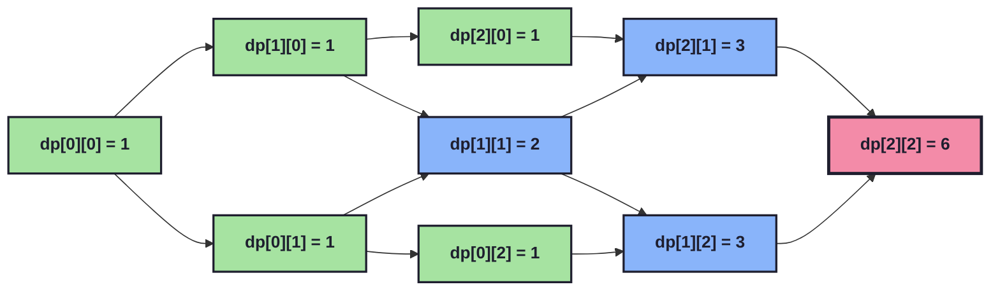

# Unique Paths — Dynamic Programming Solution

## 1. Problem Statement

A robot is placed on the **top-left corner** of an `m x n` grid. It can only move **down** or **right** at any point in time. The robot is trying to reach the **bottom-right corner** of the grid.

**Question:** How many possible unique paths are there?

```
Start (0,0) ──────────────► (0, n-1)
   │
   │
   │
   ▼
(m-1, 0) ──────────────► Finish (m-1, n-1)
```

**Constraints (typical for this LeetCode problem):**
- `1 <= m, n <= 100`
- The answer is guaranteed to fit in a 32-bit integer

---

## 2. The Core Insight

This problem *looks* like a grid/graph traversal problem, but it is really a **counting problem** hiding a simple recurrence relation.

The key observation is:

> **To reach any cell `(i, j)`, the robot must have arrived either from the cell directly above it `(i-1, j)`, or from the cell directly to its left `(i, j-1)`.**

Since the robot can *only* move right or down, there is no other way to enter cell `(i, j)`. That means:

```
number of ways to reach (i, j) = (ways to reach the cell above) + (ways to reach the cell to the left)
```

This is exactly the definition of a **Dynamic Programming (DP)** recurrence: the answer to a bigger subproblem (reaching `(i, j)`) is built directly from the answers to smaller subproblems (reaching `(i-1, j)` and `(i, j-1)`).

---

## 3. Why the First Row and First Column Are Always `1`

Before we can apply the recurrence, we need a **base case**.

- Every cell in **row 0** can only be reached by moving **right** repeatedly from `(0,0)`. There is no "cell above" to come from (it's off the grid). So there is exactly **one** way to reach any cell in row 0.
- Every cell in **column 0** can only be reached by moving **down** repeatedly from `(0,0)`. There is no "cell to the left". So there is exactly **one** way to reach any cell in column 0.

```
Row 0:     (0,0) → (0,1) → (0,2) → (0,3)     all reachable only by moving right → 1 way each
Column 0:  (0,0) → (1,0) → (2,0) → (3,0)     all reachable only by moving down  → 1 way each
```

This matches exactly what the code does:

```java
for(int i = 0; i < m; i++) {
    for(int j = 0; j < n; j++) {
        dp[i][j] = 1;
    }
}
```

At first glance this loop fills the **entire** grid with `1`s, not just the borders. That's intentional and harmless — the next nested loop starts at `i = 1, j = 1`, so it **overwrites** every interior cell. Only the values in row `0` and column `0` are ever "kept" from this initialization step. It is a slightly wasteful but perfectly correct way to set up the base case in one pass.

---

## 4. The Recurrence Step

```java
for(int i = 1; i < m; i++) {
    for(int j = 1; j < n; j++) {
        dp[i][j] = dp[i][j - 1] + dp[i - 1][j];
    }
}
```

For every interior cell `(i, j)` (i.e. not in row 0 or column 0), we apply:

```
dp[i][j] = dp[i][j-1]  +  dp[i-1][j]
           (from left)    (from above)
```

Because we iterate `i` from `1` to `m-1` and, within each `i`, `j` from `1` to `n-1`, by the time we compute `dp[i][j]`:

- `dp[i][j-1]` (the cell to the left) has **already been computed**, because `j-1 < j` and we go left-to-right.
- `dp[i-1][j]` (the cell above) has **already been computed**, because `i-1 < i` and we go top-to-bottom.

This ordering guarantee is what makes the "bottom-up" DP approach work: we never ask for a value that hasn't been filled in yet.

---

## 5. Full Step-by-Step Trace (Example: `m = 3`, `n = 3`)

Let's trace the algorithm by hand for a `3x3` grid.

### Step 1 — Initialize everything to 1

| i \ j | 0 | 1 | 2 |
|---|---|---|---|
| **0** | 1 | 1 | 1 |
| **1** | 1 | 1 | 1 |
| **2** | 1 | 1 | 1 |

### Step 2 — Apply recurrence for `i = 1`

- `dp[1][1] = dp[1][0] + dp[0][1] = 1 + 1 = 2`
- `dp[1][2] = dp[1][1] + dp[0][2] = 2 + 1 = 3`

| i \ j | 0 | 1 | 2 |
|---|---|---|---|
| **0** | 1 | 1 | 1 |
| **1** | 1 | **2** | **3** |
| **2** | 1 | 1 | 1 |

### Step 3 — Apply recurrence for `i = 2`

- `dp[2][1] = dp[2][0] + dp[1][1] = 1 + 2 = 3`
- `dp[2][2] = dp[2][1] + dp[1][2] = 3 + 3 = 6`

| i \ j | 0 | 1 | 2 |
|---|---|---|---|
| **0** | 1 | 1 | 1 |
| **1** | 1 | 2 | 3 |
| **2** | 1 | 3 | **6** |

### Final Answer

```
dp[m-1][n-1] = dp[2][2] = 6
```

There are **6 unique paths** from the top-left to the bottom-right of a 3x3 grid. You can sanity-check this by hand-drawing all 6 right/down paths — it works out.

---

## 6. Visualizing the Dependency Flow

Each cell only ever depends on the cell above it and the cell to its left. This diagram shows that dependency for a small grid:



**How to read this:** an arrow `X → Y` means "the value of `X` is used to compute the value of `Y`". Notice the red node is the final answer, and every value flows forward from the green base cases — nothing is ever computed twice, and nothing is ever needed before it's ready.

---

## 7. Why This Approach Works (Formal Justification)

This solution is correct because it satisfies the two properties required for Dynamic Programming to apply:

1. **Optimal / Correct Substructure** — The number of paths to `(i, j)` can be expressed purely in terms of the number of paths to `(i-1, j)` and `(i, j-1)`. This is not an approximation — it is an *exact* combinatorial identity, since the last move into `(i, j)` was either "down" or "right", and these two cases are mutually exclusive and collectively exhaustive.

2. **Overlapping Subproblems** — Without DP, a naive recursive solution would recompute `pathsTo(i-1, j)` and `pathsTo(i, j-1)` many times (their subproblems overlap heavily — e.g. `pathsTo(1,1)` is needed by both `pathsTo(1,2)` and `pathsTo(2,1)`). By storing each result in the `dp` table exactly once, we compute every cell **exactly once**, in O(1) time per cell.

### Connection to Combinatorics

This problem also has a closed-form solution using combinations, which is a nice way to double-check the DP result. Reaching `(m-1, n-1)` from `(0,0)` requires exactly `(m-1)` down-moves and `(n-1)` right-moves, in any order, for a total of `(m-1)+(n-1)` moves. The number of ways to arrange them is:

```
C(m+n-2, m-1)  =  (m+n-2)! / ((m-1)! * (n-1)!)
```

For `m = 3, n = 3`: `C(4, 2) = 6` — matching our DP trace above. The DP approach essentially builds Pascal's Triangle sideways, since each `dp[i][j]` value corresponds to a binomial coefficient.

---

## 8. Complexity Analysis

| Metric | Complexity | Explanation |
|---|---|---|
| **Time** | `O(m * n)` | Two nested loops each fill the grid once; every cell does O(1) work. |
| **Space** | `O(m * n)` | The full 2D `dp` array is stored. |
| **Optimized Space** | `O(n)` (possible improvement) | Since `dp[i][j]` only ever needs the *previous row* and the *current row so far*, you can collapse the 2D array into a single 1D array of size `n` and update it in place. See section 10. |

